# Smart Ambulance Routing & Emergency Bed Allocation System

# `appflow.md`

> Master application flow specification covering user journeys, screen navigation, system states, decision flows, real-time updates, failure flows, demo flows, and role-specific interactions.

---

# 1. Purpose of This Document

This document defines exactly how the application should behave from the moment an emergency is created until the patient reaches a treatment-ready hospital.

It is intended to be used by:

- frontend developers;
- backend developers;
- UI/UX designers;
- AI/ML developers;
- GIS/routing developers;
- QA engineers;
- demo/presentation team.

This document defines:

- application roles;
- navigation;
- screens;
- user actions;
- system responses;
- backend interactions;
- state transitions;
- real-time events;
- error states;
- decision flows;
- emergency workflows;
- demo scenarios.

This document must be treated as the **application behavior specification**.

---

# 2. Core Product Flow

The entire application revolves around one primary emergency journey:

```text
🚨 EMERGENCY
      ↓
👤 PATIENT REQUIREMENTS
      ↓
🚑 SUITABLE AMBULANCE
      ↓
🛣 RELIABLE ROUTE
      ↓
🏥 SUITABLE HOSPITAL
      ↓
✅ HOSPITAL ACCEPTANCE
      ↓
🛏 RESOURCE RESERVATION
      ↓
🟢 HOSPITAL PREPARATION
      ↓
📍 LIVE AMBULANCE TRACKING
      ↓
🔄 CONTINUOUS REASSESSMENT
      ↓
🏥 PATIENT ARRIVAL
      ↓
🤝 EMERGENCY HANDOVER
```

The application must never drift into being merely:

```text
SOS App
+
GPS Tracker
+
Map
```

The central purpose is **emergency coordination**.

---

# 3. Application Roles

The application supports the following primary roles.

| Role | Primary Interface | Main Responsibility |
|---|---|---|
| Dispatcher | Command Center | Coordinate the emergency |
| Ambulance / EMT | Ambulance Console | Execute assigned mission |
| Hospital Staff | Hospital Console | Accept, prepare and receive patient |
| Hospital Admin | Hospital Management | Manage capability/resources |
| System Admin | Admin Console | Manage platform |
| Demo Controller | Demo Console | Trigger controlled scenario events |

---

# 4. Role-Based Application Entry

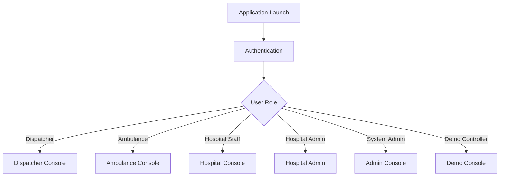

---

# 5. Global Application Structure

```text
APPLICATION
│
├── Authentication
│
├── Dispatcher Console
│   ├── Overview
│   ├── Active Emergencies
│   ├── Emergency Detail
│   ├── Ambulance Fleet
│   ├── Hospital Network
│   ├── Live Mission
│   ├── Alerts
│   └── History
│
├── Ambulance Console
│   ├── Current Mission
│   ├── Navigation
│   ├── Patient Requirements
│   ├── Hospital Information
│   ├── Resource Confirmation
│   └── Mission Completion
│
├── Hospital Console
│   ├── Incoming Emergencies
│   ├── Emergency Detail
│   ├── Resources
│   ├── Acceptance
│   ├── Preparation
│   └── Handover
│
├── Admin Console
│   ├── Users
│   ├── Ambulances
│   ├── Hospitals
│   ├── Resources
│   ├── Configuration
│   └── Audit Logs
│
└── Demo Console
    ├── Scenario Selection
    ├── Simulation Controls
    ├── Traffic Events
    ├── Hospital Events
    ├── Ambulance Events
    └── Reset
```

---

# 6. Global Navigation

## 6.1 Dispatcher Navigation

```text
Dashboard
Emergencies
Ambulances
Hospitals
Live Missions
Alerts
History
```

## 6.2 Ambulance Navigation

```text
Current Mission
Navigation
Patient
Hospital
Mission
```

The ambulance interface should intentionally have fewer controls.

## 6.3 Hospital Navigation

```text
Incoming
Active Cases
Resources
Preparation
History
```

## 6.4 Admin Navigation

```text
Overview
Users
Ambulances
Hospitals
Resources
Configuration
Audit
```

---

# 7. Global UI States

The application should use consistent operational states.

```text
ACTIVE
PENDING
CONFIRMED
WARNING
STALE
UNAVAILABLE
FAILED
REQUIRES_ACTION
COMPLETED
CANCELLED
UNKNOWN
```

---

# 8. Global Status Semantics

| State | Meaning |
|---|---|
| 🟢 Confirmed | Verified/accepted |
| 🔵 Active | Currently happening |
| 🟡 Pending | Waiting for action |
| 🟠 Warning | Requires attention |
| 🔴 Critical | Immediate intervention required |
| ⚪ Unknown | Data unavailable |
| ⚫ Inactive | No longer active |

Text labels must accompany colors.

---

# 9. Authentication Flow

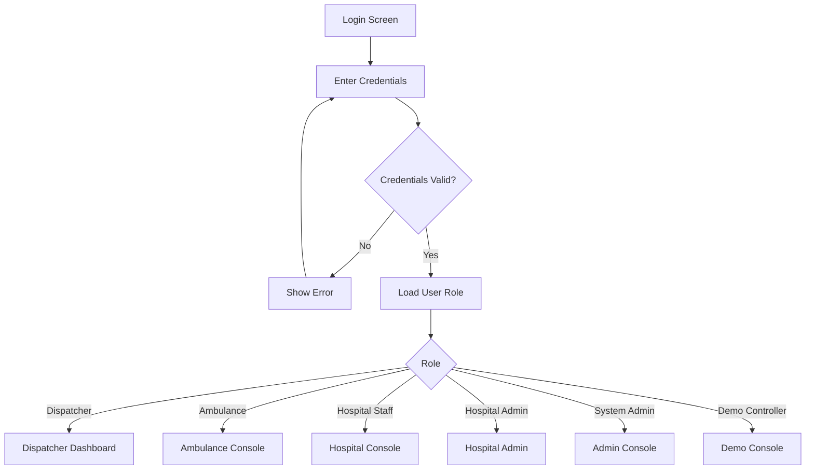

---

# 10. Login Screen

## UI

```text
┌─────────────────────────────────┐
│     SMART EMERGENCY NETWORK     │
│                                 │
│ Email                           │
│ [________________________]      │
│                                 │
│ Password                        │
│ [________________________]      │
│                                 │
│        [ SIGN IN ]              │
│                                 │
│ Demo Mode [Optional]            │
└─────────────────────────────────┘
```

## Behavior

On successful authentication:

1. Fetch current user.
2. Fetch role.
3. Load role-specific navigation.
4. Redirect to role dashboard.
5. Establish WebSocket connection.

---

# 11. Dispatcher Application Flow

The dispatcher workflow is the central workflow.

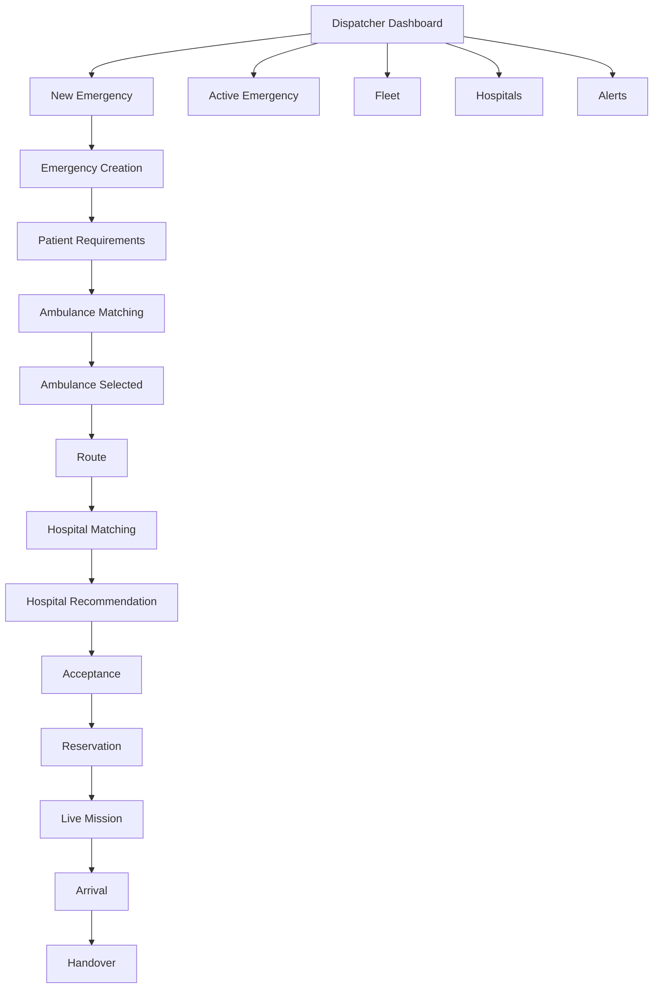

---

# 12. Dispatcher Dashboard

## 12.1 Purpose

Provide one command-center view answering:

```text
WHAT HAPPENED?
WHO IS RESPONDING?
WHERE ARE THEY?
WHICH HOSPITAL?
CAN THEY ACCEPT?
IS THE RESOURCE RESERVED?
IS THE HOSPITAL READY?
```

## 12.2 Layout

```text
┌─────────────────────────────────────────────────────────────────┐
│ SMART EMERGENCY COMMAND CENTER                         ● ONLINE │
├─────────────────────────────────────────────────────────────────┤
│ Active: 04 │ Ambulances: 18 │ Hospitals: 12 │ Alerts: 03       │
├───────────────────────────────┬─────────────────────────────────┤
│                               │ ACTIVE EMERGENCY                 │
│                               │                                 │
│                               │ #INC-001                         │
│           LIVE MAP            │ CRITICAL TRAUMA                  │
│                               │                                 │
│     🚑 ---------> 🏥          │ ICU ✓                            │
│                               │ Trauma ✓                         │
│                               │ Ventilator ✓                     │
│                               │ Surgery ✓                        │
│                               │                                 │
│                               │ Ambulance B — 7 min             │
│                               │ Hospital C — 10 min             │
├───────────────────────────────┼─────────────────────────────────┤
│ AMBULANCES                    │ HOSPITAL                         │
│                               │                                 │
│ B  ✓ Assigned                 │ C ✓ Accepted                    │
│ A  Available                  │ ICU Reserved ✓                  │
│ C  On Mission                 │ Ready in 8 min                  │
├───────────────────────────────┴─────────────────────────────────┤
│ TIMELINE                                                        │
│ 12:01 Emergency → 12:02 Ambulance → 12:03 Acceptance           │
│ 12:04 ICU Reserved → 12:05 En Route                             │
└─────────────────────────────────────────────────────────────────┘
```

---

# 13. New Emergency Flow

Dispatcher selects:

> **+ NEW EMERGENCY**

Flow:

```text
New Emergency
      ↓
Incident Location
      ↓
Emergency Type
      ↓
Severity
      ↓
Patient Requirements
      ↓
Review
      ↓
Create Incident
```

---

# 14. Emergency Creation Screen

## Required Fields

```text
Incident Type
Severity
Location
Patient Requirement
Number of Patients
```

Optional:

```text
Notes
Hazard Information
Caller Information
```

## Example

```text
NEW EMERGENCY

Incident Type
[ Road Traffic Trauma ▼ ]

Severity
[ CRITICAL ]

Location
[ Use Current Location ]

Patient Requirements

[x] Trauma
[x] ICU
[x] Ventilator
[x] Emergency Surgery
[ ] Cardiology
[ ] Neurology

Patients
[ 1 ]

                [ CREATE EMERGENCY ]
```

---

# 15. Location Selection Flow

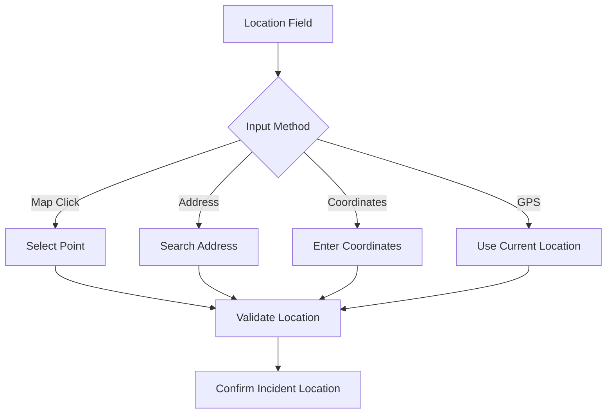

---

# 16. Emergency Creation Validation

Before creating:

```text
✓ Location valid
✓ Emergency type selected
✓ Severity selected
✓ Patient requirements valid
✓ At least one requirement or emergency category
```

If invalid:

```text
Cannot create emergency.

Missing:
- Location
- Severity
```

---

# 17. Emergency Created State

Immediately after creation:

```text
STATUS:
NEW

SYSTEM:
Analyzing emergency...

STEP 1:
Evaluating ambulance fleet...
```

This should transition automatically.

---

# 18. Ambulance Matching Flow

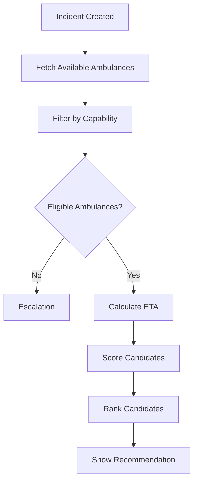

---

# 19. Ambulance Comparison Screen

```text
SELECT AMBULANCE

┌──────────────────────────────────────────────────────────────┐
│ Candidate A                                                  │
│ ETA: 4 min                                                   │
│ Distance: 2.1 km                                             │
│ Ventilator: ❌                                               │
│ Trauma: ✅                                                    │
│ STATUS: INELIGIBLE                                           │
├──────────────────────────────────────────────────────────────┤
│ Candidate B ⭐ RECOMMENDED                                   │
│ ETA: 7 min                                                   │
│ Ventilator: ✅                                               │
│ Trauma: ✅                                                    │
│ ALS: ✅                                                       │
│ Confidence: High                                             │
│ [ SELECT ]                                                   │
├──────────────────────────────────────────────────────────────┤
│ Candidate C                                                  │
│ ETA: 6 min                                                   │
│ Ventilator: ✅                                               │
│ Current Mission: ACTIVE                                      │
│ STATUS: UNAVAILABLE                                          │
└──────────────────────────────────────────────────────────────┘
```

---

# 20. Ambulance Recommendation Explanation

The recommendation must show:

```text
WHY AMBULANCE B?

✓ Required equipment
✓ Required capability
✓ Available
✓ Suitable crew
✓ Feasible ETA
```

Never show only:

```text
AI Score: 91.4
```

---

# 21. Ambulance Assignment Confirmation

Dispatcher sees:

```text
ASSIGN AMBULANCE B?

ETA TO PATIENT:
7 minutes

CAPABILITY:
ALS + Trauma + Ventilator

CURRENT STATUS:
AVAILABLE

[ ASSIGN ]
[ CANCEL ]
```

After assignment:

```text
AMBULANCE B ASSIGNED ✓
```

---

# 22. Ambulance-Side Assignment Flow

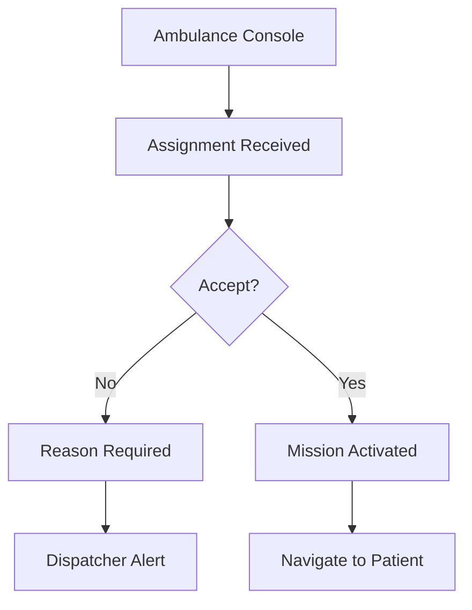

---

# 23. Ambulance Mission Screen

```text
┌──────────────────────────────────────┐
│ 🚨 EMERGENCY MISSION                 │
│                                      │
│ TRAUMA — CRITICAL                    │
│                                      │
│ PATIENT REQUIREMENTS                  │
│ ✓ ICU                                │
│ ✓ Ventilator                         │
│ ✓ Trauma                             │
│ ✓ Emergency Surgery                  │
│                                      │
│ PATIENT LOCATION                     │
│ 2.8 km away                          │
│ ETA: 07:10                           │
│                                      │
│ [ START NAVIGATION ]                 │
└──────────────────────────────────────┘
```

---

# 24. Navigation Flow

```text
Assignment Accepted
        ↓
Navigate to Patient
        ↓
Live GPS
        ↓
ETA Updates
        ↓
Patient Reached
        ↓
Confirm Pickup
        ↓
Navigate to Hospital
```

---

# 25. Patient Pickup Flow

When ambulance arrives:

```text
ARRIVED AT INCIDENT

[ CONFIRM PATIENT PICKUP ]
```

After confirmation:

```text
Mission State:
PATIENT ON BOARD

Next:
Hospital Destination
```

The system should automatically switch to hospital-navigation state.

---

# 26. Hospital Candidate Flow

After ambulance selection:

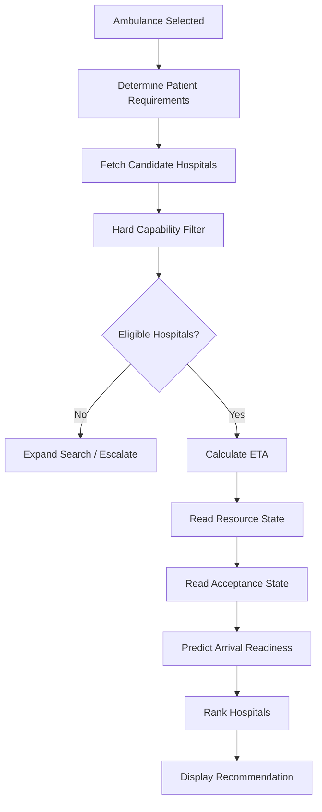

---

# 27. Hospital Ranking Screen

```text
HOSPITAL DESTINATION

Hospital A
ETA: 5 min
ICU: ❌
STATUS: INELIGIBLE

Hospital B
ETA: 8 min
ICU: ✅
Trauma: ❌
STATUS: INELIGIBLE

Hospital C ⭐
ETA: 10 min
ICU: ✅
Trauma: ✅
Ventilator: ✅
Emergency Surgery: ✅
Acceptance: CONFIRMED
Predicted Readiness: HIGH

Hospital D
ETA: 12 min
ICU: ✅
Trauma: ✅
Acceptance: PENDING
```

---

# 28. Hospital Recommendation Card

```text
┌────────────────────────────────────┐
│ ⭐ HOSPITAL C — RECOMMENDED        │
├────────────────────────────────────┤
│ ETA                  10 min        │
│ Trauma               ✓             │
│ ICU                  ✓             │
│ Ventilator           ✓             │
│ Surgery              ✓             │
│ Acceptance           CONFIRMED     │
│ Resource readiness   HIGH          │
│ Data freshness       32 sec        │
├────────────────────────────────────┤
│ WHY?                               │
│ ✓ All mandatory capabilities      │
│ ✓ Acceptance confirmed            │
│ ✓ Resource available              │
│ ✓ Reliable ETA                   │
│ ✓ High arrival readiness         │
├────────────────────────────────────┤
│ [ SELECT HOSPITAL ]               │
└────────────────────────────────────┘
```

---

# 29. Hospital Selection Rules

The system must follow:

```text
FIRST:
Hard constraints

THEN:
Optimization

THEN:
Acceptance

THEN:
Resource reservation

THEN:
Final destination confirmation
```

A hospital cannot be selected simply because it has the lowest ETA.

---

# 30. Hospital Acceptance Flow

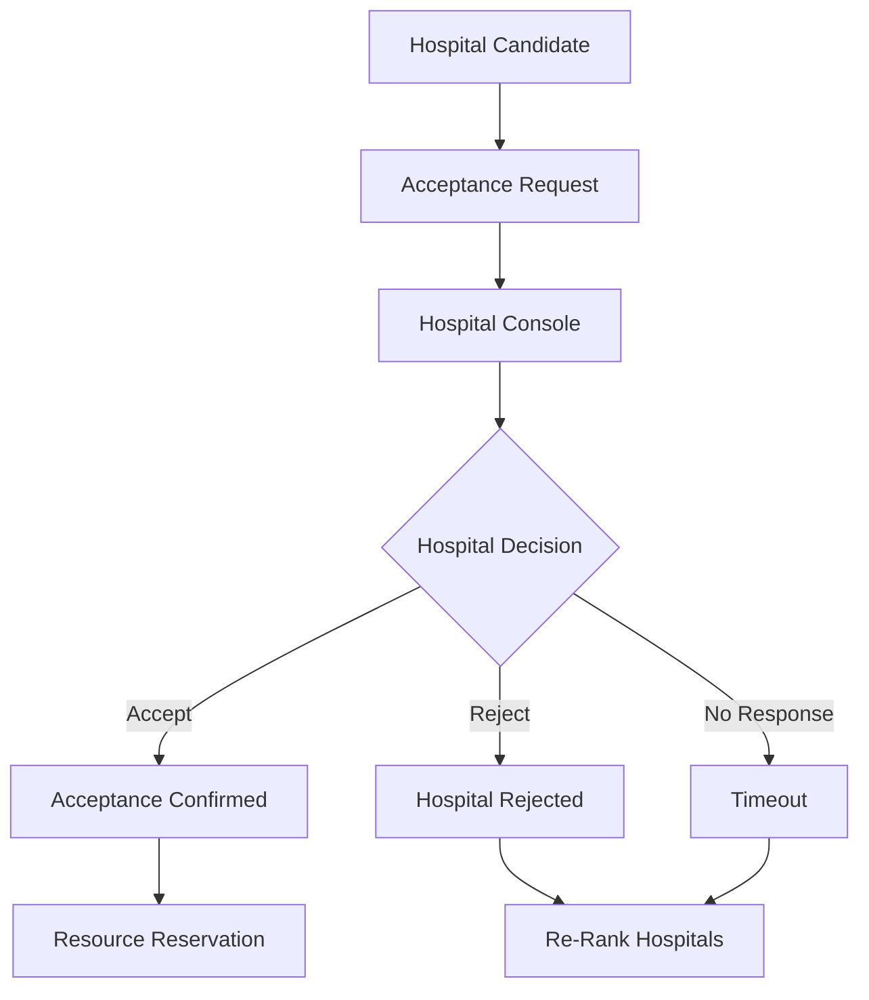

---

# 31. Hospital Incoming Emergency Screen

```text
INCOMING EMERGENCY

Incident:
#INC-001

Severity:
CRITICAL

ETA:
10 MINUTES

Requirements:

✓ Trauma
✓ ICU
✓ Ventilator
✓ Emergency Surgery

Current Resources:

ICU:
1 available

Ventilator:
1 available

Emergency Surgery:
Available

        [ ACCEPT CASE ]

        [ REJECT CASE ]
```

---

# 32. Hospital Acceptance Confirmation

After clicking Accept:

```text
CONFIRM ACCEPTANCE

You are accepting:

Critical trauma case
ETA: 10 min

Required:
ICU
Ventilator
Trauma
Emergency surgery

[ CONFIRM ACCEPTANCE ]
```

After confirmation:

```text
CASE ACCEPTED ✓
```

---

# 33. Hospital Rejection Flow

Hospital selects:

```text
[ REJECT CASE ]
```

Reason options:

```text
ICU unavailable
Emergency department overloaded
Required specialty unavailable
Surgery unavailable
Ventilator unavailable
Other
```

The rejection is immediately sent to:

- dispatcher;
- decision engine;
- ambulance if destination had already been assigned.

---

# 34. Automatic Re-Ranking After Rejection

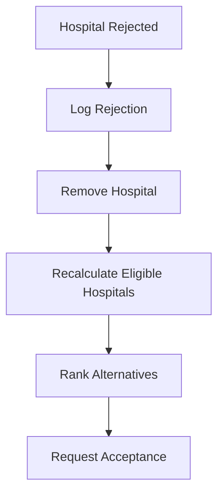

---

# 35. Resource Reservation Flow

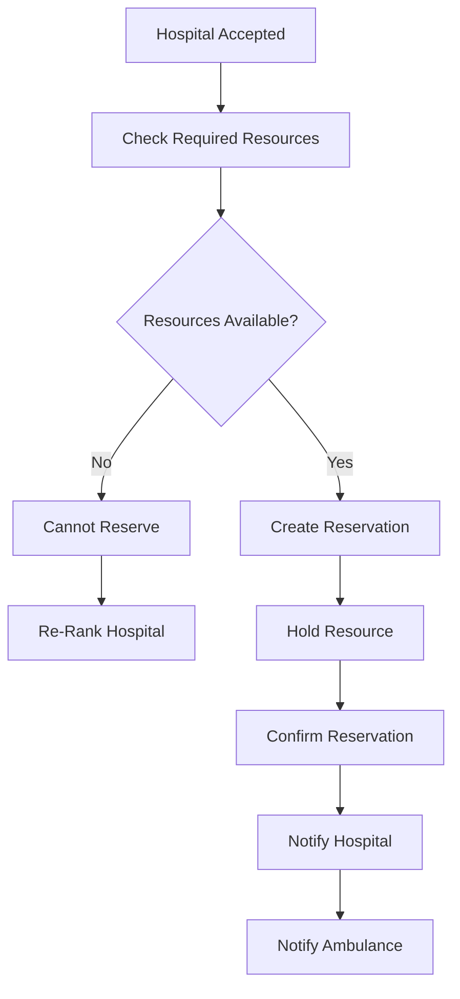

---

# 36. Reservation Screen

```text
RESOURCE RESERVATION

Hospital C

Required Resources:

ICU              ✓ RESERVED
Ventilator       ✓ RESERVED
Trauma Team      ✓ PREPARING
Emergency OR     ✓ AVAILABLE

Reservation ID:
RES-00391

Status:
CONFIRMED

[ VIEW HOSPITAL READINESS ]
```

---

# 37. Resource State

```text
AVAILABLE
    ↓
HELD
    ↓
CONFIRMED
    ↓
IN_USE
    ↓
RELEASED
```

Failure:

```text
CONFIRMED
    ↓
RESOURCE_LOST
    ↓
REASSESS
```

---

# 38. Hospital Readiness Flow

After reservation:

```text
RESOURCE RESERVED
        ↓
TEAM NOTIFIED
        ↓
ROOM / RESOURCE PREPARED
        ↓
HOSPITAL READY
```

Hospital screen:

```text
CASE #INC-001

Ambulance ETA:
08 min

ICU:
RESERVED ✓

Trauma Team:
NOTIFIED ✓

Ventilator:
READY ✓

Emergency Surgery:
READY ✓

Overall:
🟢 READY
```

---

# 39. Ambulance Destination Confirmation

Ambulance console:

```text
DESTINATION CONFIRMED

Hospital C

Acceptance:
✓ CONFIRMED

ICU:
✓ RESERVED

ETA:
09 min

[ START NAVIGATION ]
```

---

# 40. Live Mission Flow

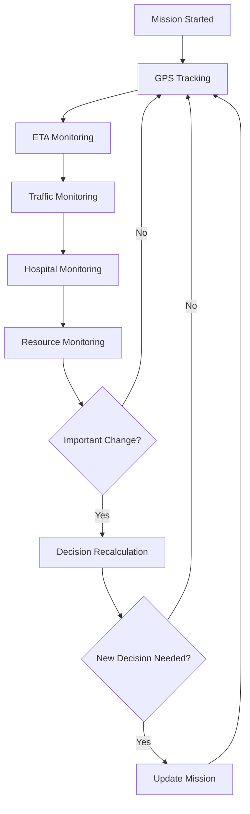

---

# 41. Live Mission Screen

Dispatcher:

```text
ACTIVE MISSION #INC-001

🚑 Ambulance B
Status:
EN ROUTE

Current ETA:
08:32

Hospital C
Acceptance:
CONFIRMED

ICU:
RESERVED

Route:
Route 2

Traffic:
MODERATE

Mission Timeline:
✓ Emergency
✓ Ambulance Assigned
✓ Pickup
✓ Hospital Accepted
✓ Resource Reserved
● En Route
○ Arrival
○ Handover
```

---

# 42. Live Map Behaviour

The map should show:

```text
Emergency location
Ambulance
Selected hospital
Route
Alternative route
Traffic state
Other relevant hospitals
```

Do not overcrowd the map.

Only show information relevant to the active decision.

---

# 43. GPS Update Flow

Every location update:

```text
GPS UPDATE
    ↓
Validate Coordinates
    ↓
Calculate Distance Remaining
    ↓
Update ETA
    ↓
Update Map
    ↓
Check Route Deviation
    ↓
Check Significant ETA Change
```

---

# 44. GPS Failure Flow

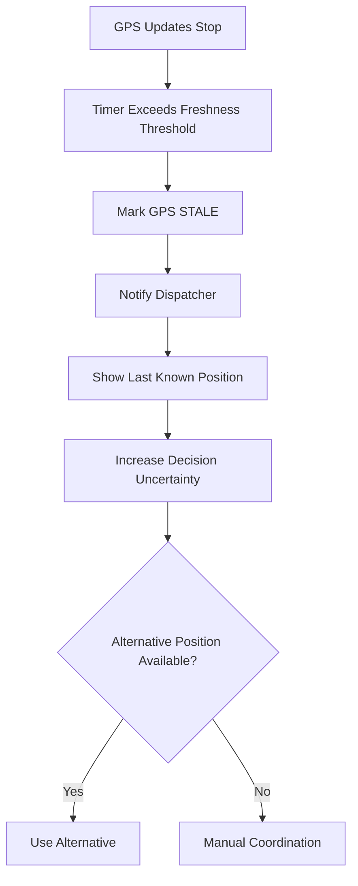

---

# 45. Traffic Change Flow

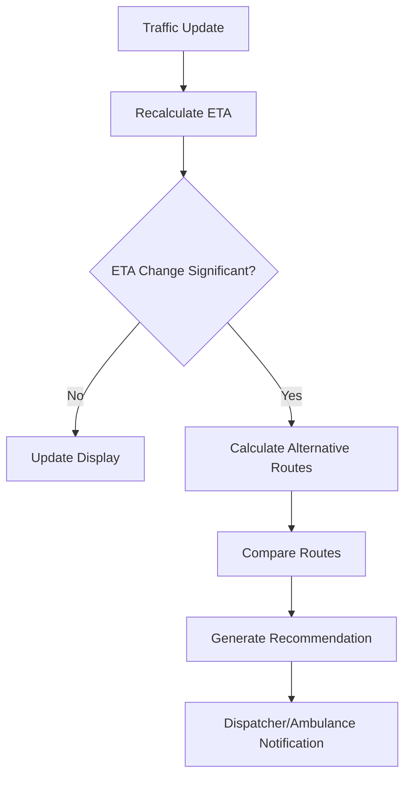

---

# 46. Traffic Change UI

```text
⚠ ROUTE CHANGE DETECTED

Current Route:
ETA 14 min

Alternative Route:
ETA 10 min

Traffic:
HEAVY AHEAD

Recommendation:
Switch to Alternative Route

[ REROUTE ]
[ KEEP CURRENT ROUTE ]
```

---

# 47. High-Impact Voice Interaction

Driver:

> "Reroute."

System:

> "Alternative route reduces ETA by three minutes. Reroute?"

Driver:

> "Yes."

System:

> "Rerouting now."

Voice must never silently make high-impact changes.

---

# 48. Hospital Resource Failure Flow

This is one of the most important application flows.

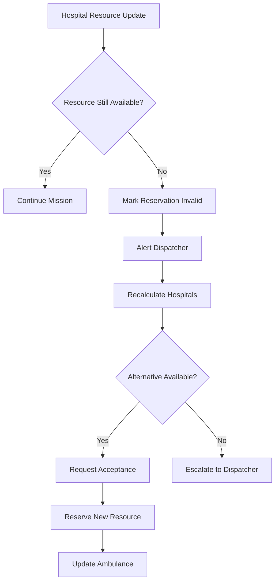

---

# 49. ICU Failure Demo

Before:

```text
Hospital C

ICU:
1 Available
Reservation:
INC-001
```

Event:

```text
ICU:
1 → 0
```

System response:

```text
⚠ CRITICAL RESOURCE CHANGE

Hospital C ICU unavailable.

Reservation invalidated.

Re-evaluating hospitals...
```

Then:

```text
Hospital D:
Eligible ✓
ICU ✓
Trauma ✓
Acceptance Pending
```

After acceptance:

```text
Hospital D selected.
ICU reserved.
Ambulance destination updated.
```

---

# 50. Hospital Rejection During Travel

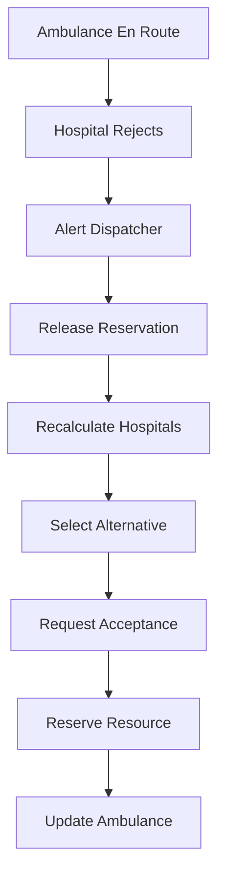

---

# 51. Ambulance Failure During Mission

```text
AMBULANCE B

Status:
⚠ UNAVAILABLE
```

System:

```text
Current mission reassignment required.
```

Flow:

```text
Ambulance Failure
      ↓
Lock Existing Mission State
      ↓
Find Suitable Ambulances
      ↓
Calculate ETAs
      ↓
Select Replacement
      ↓
Notify Dispatcher
      ↓
Notify Hospital
      ↓
Update Mission
```

---

# 52. Patient Severity Change

Authorized user changes:

```text
Severity:
HIGH → CRITICAL
```

Requirements become:

```text
ICU Required
Ventilator Required
Surgery Required
```

System:

```text
Requirements Changed
      ↓
Revalidate Ambulance
      ↓
Revalidate Hospital
      ↓
Recalculate Route
      ↓
Recalculate Resource
```

---

# 53. No Suitable Ambulance Flow

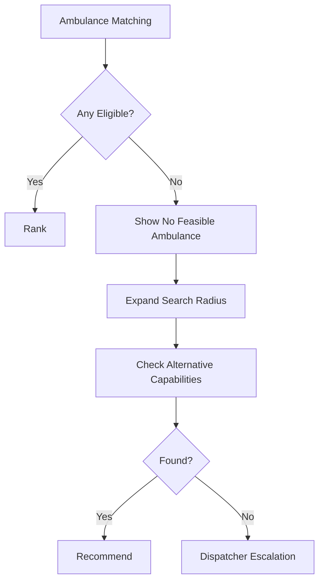

UI:

```text
🔴 NO FEASIBLE AMBULANCE

No currently available ambulance
matches all mandatory requirements.

Options:
[ EXPAND SEARCH ]
[ DISPATCHER OVERRIDE ]
[ CONTACT EMERGENCY NETWORK ]
```

---

# 54. No Suitable Hospital Flow

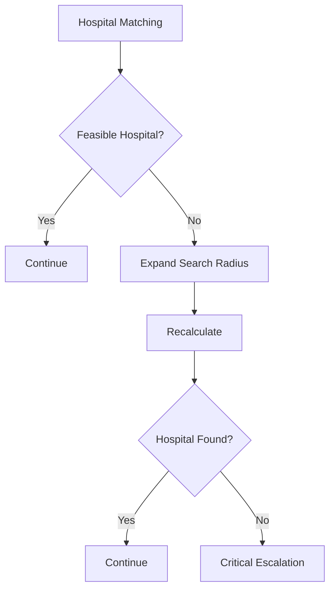

The system must never silently select an unsuitable hospital just because it is nearby.

---

# 55. Stale Hospital Data Flow

```text
Hospital C ICU

Value:
1

Last Updated:
23 minutes ago

Status:
⚠ STALE
```

System:

```text
Do not treat stale state as fully trusted.
Reduce recommendation confidence.
Show warning.
```

Policy threshold must be configurable.

---

# 56. Hospital Data Unknown Flow

```text
ICU:
UNKNOWN
```

This is different from:

```text
ICU:
0
```

Meaning:

```text
0 = confirmed unavailable
UNKNOWN = insufficient information
```

The UI must preserve this distinction.

---

# 57. Route Provider Failure

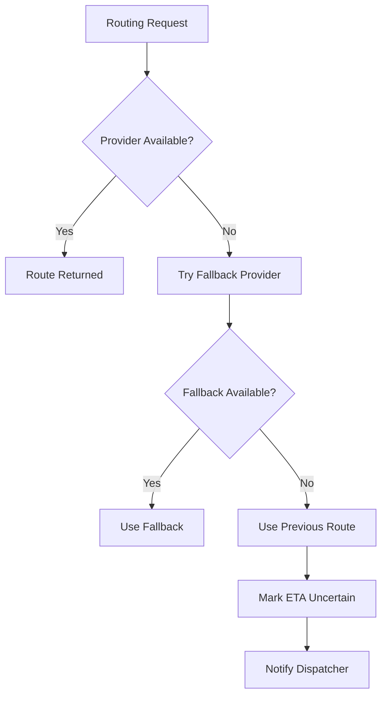

---

# 58. ML Failure Flow

```text
Prediction Service
       ↓
FAILURE
       ↓
Use deterministic baseline
       ↓
Mark ML unavailable
       ↓
Continue emergency coordination
```

The application must never stop emergency coordination merely because the ML service is unavailable.

---

# 59. Decision Engine Failure

If the decision engine fails:

```text
⚠ AUTOMATED DECISION UNAVAILABLE

Cause:
Decision service unavailable.

Fallback:
Manual dispatcher selection.

[ SELECT MANUALLY ]
```

The application must remain operational in a limited manual mode.

---

# 60. Network Failure

## Dispatcher

Show:

```text
OFFLINE / RECONNECTING
```

## Ambulance

Keep current mission data locally cached.

Display:

```text
Connection lost.
Last confirmed destination:
Hospital C
Last update:
18 sec ago
```

## Hospital

Keep current acceptance/resource state locally.

When connection returns:

```text
SYNCING...
```

---

# 61. Mission State Machine

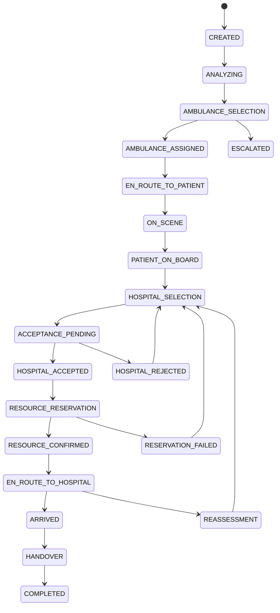

---

# 62. Emergency Lifecycle

```text
CREATED
  ↓
ANALYZING
  ↓
DISPATCHED
  ↓
PICKUP
  ↓
HOSPITAL_SELECTED
  ↓
ACCEPTED
  ↓
RESOURCE_RESERVED
  ↓
IN_TRANSIT
  ↓
ARRIVED
  ↓
HANDOVER
  ↓
COMPLETED
```

Alternative terminal states:

```text
CANCELLED
FAILED
ESCALATED
```

---

# 63. Timeline Component

Every active emergency should have a timeline.

```text
12:01  🚨 Emergency Created
12:01  🧠 Requirements Identified
12:02  🚑 Ambulance B Selected
12:02  🛣 Route Calculated
12:03  🏥 Hospital C Requested
12:03  ✅ Hospital C Accepted
12:04  🛏 ICU Reserved
12:05  📍 Ambulance En Route
12:07  ⚠ Traffic Changed
12:07  🔄 Route Recalculated
12:14  🏥 Hospital Arrived
12:15  🤝 Handover Complete
```

---

# 64. Dispatcher Alert Center

Alerts should be ranked.

```text
🔴 CRITICAL
Hospital C ICU unavailable

🟠 HIGH
ETA increased by 5 minutes

🟡 WARNING
Hospital D data stale

🔵 INFO
Ambulance B arrived at incident
```

Selecting an alert should open the relevant emergency context.

---

# 65. Emergency Detail Page

```text
EMERGENCY #INC-001

Status:
IN TRANSIT

PATIENT
Critical Trauma

REQUIREMENTS
✓ ICU
✓ Trauma
✓ Ventilator
✓ Surgery

AMBULANCE
B
ETA 08 min

HOSPITAL
C
ETA 10 min
Accepted ✓
ICU Reserved ✓

ROUTE
Current Route
Traffic Moderate

EXPLANATION
Hospital C is currently selected because:
✓ All mandatory capabilities
✓ Acceptance confirmed
✓ Resource reserved
✓ Reliable ETA
```

---

# 66. Hospital Network View

Show hospitals as:

```text
🟢 Ready
🟡 Limited
🟠 Warning
🔴 Unavailable
⚪ Unknown
```

Each hospital card:

```text
Hospital C
Emergency ✓
ICU 1
Ventilator 1
Trauma ✓
Surgery ✓
Acceptance Available
Last Updated 20 sec
```

---

# 67. Ambulance Fleet View

Each ambulance:

```text
AMB-002

STATUS:
AVAILABLE

TYPE:
ALS

EQUIPMENT:
Ventilator ✓
Defibrillator ✓
Oxygen ✓

LOCATION:
2.1 km away

GPS:
Fresh
```

---

# 68. Ambulance Mission Completion

When arriving:

```text
ARRIVED AT HOSPITAL

[ CONFIRM ARRIVAL ]
```

Then:

```text
PATIENT HANDOVER

Requirements:
ICU
Trauma
Ventilator
Surgery

Handover:
[ CONFIRM HANDOVER ]
```

After confirmation:

```text
MISSION COMPLETED ✓
```

Ambulance status:

```text
AVAILABLE
```

Resource state:

```text
IN_USE
```

---

# 69. Hospital Handover

Hospital staff sees:

```text
PATIENT ARRIVED

Incident:
#INC-001

Ambulance:
AMB-002

Arrival:
12:14

Reserved Resource:
ICU

[ CONFIRM HANDOVER ]
```

After confirmation:

```text
CASE HANDED OVER ✓
```

Mission becomes completed.

---

# 70. Mission Completion Flow

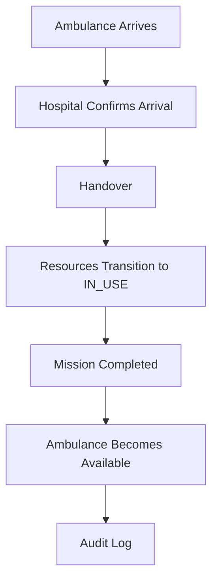

---

# 71. Dispatcher Manual Override Flow

Dispatcher selects:

> **Override Recommendation**

System shows:

```text
MANUAL OVERRIDE

Current:
Hospital C

Choose:
Hospital D

Reason:
[ Clinical specialist requested ]

[ CONFIRM OVERRIDE ]
```

The override must be logged.

---

# 72. Manual Mode

If automated decision-making becomes unavailable:

```text
MANUAL COORDINATION MODE
```

Dispatcher can:

- select ambulance;
- select route;
- select hospital;
- request acceptance;
- request reservation.

System continues recording events.

---

# 73. Demo Console

The Demo Console exists specifically for controlled demonstrations.

## Navigation

```text
Scenario Library
Live Simulation
Traffic
Hospital Events
Ambulance Events
Reset
```

---

# 74. Demo Controller Screen

```text
DEMO CONTROL CENTER

Scenario:
[ Critical Trauma ▼ ]

[ START SCENARIO ]

LIVE EVENTS

[ Traffic Increase ]
[ ICU Failure ]
[ Hospital Reject ]
[ Ambulance Failure ]
[ Severity Increase ]

[ RESET DEMO ]
```

---

# 75. Demo Scenario Flow

```mermaid
flowchart TD
    A[Select Scenario] --> B[Load Demo Dataset]
    B --> C[Reset System]
    C --> D[Create Emergency]
    D --> E[Start Mission]
    E --> F[Run Timeline]
    F --> G[Trigger Events]
    G --> H[Observe Recalculation]
    H --> I[Complete Scenario]
```

---

# 76. Demo Scenario 1 — Normal Emergency

```text
Start
 ↓
Create trauma emergency
 ↓
Select suitable ambulance
 ↓
Calculate route
 ↓
Select hospital
 ↓
Hospital accepts
 ↓
ICU reserved
 ↓
Ambulance travels
 ↓
Hospital ready
 ↓
Arrival
 ↓
Handover
```

Purpose:

> Prove complete end-to-end flow.

---

# 77. Demo Scenario 2 — Traffic Congestion

```text
Emergency
 ↓
Ambulance selected
 ↓
Route A selected
 ↓
Traffic spike
 ↓
ETA increases
 ↓
Alternative routes calculated
 ↓
Route B recommended
 ↓
Ambulance confirms
 ↓
Continue
```

Purpose:

> Prove dynamic routing.

---

# 78. Demo Scenario 3 — Hospital Rejection

```text
Hospital C selected
 ↓
Acceptance requested
 ↓
Hospital C rejects
 ↓
Hospital C removed
 ↓
Hospital D evaluated
 ↓
Hospital D accepts
 ↓
Resource reserved
 ↓
Mission continues
```

Purpose:

> Prove hospital coordination.

---

# 79. Demo Scenario 4 — ICU Failure

```text
Hospital C selected
 ↓
ICU reserved
 ↓
Ambulance travelling
 ↓
ICU becomes unavailable
 ↓
Reservation invalidated
 ↓
Hospital C removed
 ↓
Alternative hospital selected
 ↓
Acceptance
 ↓
New reservation
 ↓
Ambulance rerouted
```

Purpose:

> Prove the strongest innovation: dynamic end-to-end re-coordination.

---

# 80. Judge Interaction Flow

During a live demo, the judge may say:

> "What if Hospital C suddenly loses the ICU?"

The operator should:

```text
Open Demo Console
        ↓
Click ICU Failure
        ↓
System event triggered
        ↓
Dispatcher screen updates
        ↓
Hospital C becomes unavailable
        ↓
Decision engine reruns
        ↓
Hospital D recommended
        ↓
Acceptance
        ↓
Reservation
        ↓
Ambulance destination updated
```

The complete interaction should happen visibly.

---

# 81. Decision Explanation Flow

Whenever a candidate is selected:

```mermaid
flowchart TD
    A[Decision Made] --> B[Collect Decision Factors]
    B --> C[Generate Explanation]
    C --> D[Show Human-readable Reasons]
    D --> E[Store Decision Trace]
```

Example:

```text
WHY HOSPITAL C?

✓ Mandatory capabilities satisfied
✓ Hospital accepted patient
✓ ICU available
✓ Ventilator available
✓ Emergency surgery available
✓ Reliable route
✓ Highest feasible score
```

---

# 82. Decision Confidence UI

Example:

```text
RECOMMENDATION CONFIDENCE

HIGH

Data freshness:
✓ 20 sec

Acceptance:
✓ Confirmed

Resource:
✓ Confirmed

ETA prediction:
✓ High confidence
```

Low-confidence state:

```text
⚠ LOW CONFIDENCE

Hospital resource data is stale.

Recommended action:
Dispatcher verification.
```

---

# 83. Data Freshness Interaction

Hospital card:

```text
ICU
1 Available

Updated:
24 sec ago

● FRESH
```

If stale:

```text
ICU
Unknown

Updated:
18 min ago

⚠ STALE
```

If unavailable:

```text
ICU
0 Available

● CONFIRMED UNAVAILABLE
```

---

# 84. Search and Filtering Flow

Dispatcher can filter:

```text
Severity
Status
Ambulance Type
Hospital Capability
Resource
Distance
ETA
```

Filters must never bypass mandatory safety constraints.

---

# 85. Emergency Search

Search by:

```text
Incident ID
Status
Location
Hospital
Ambulance
Date
```

---

# 86. History Flow

Completed emergency:

```text
History
 ↓
Select Incident
 ↓
View Timeline
 ↓
View Decisions
 ↓
View Overrides
 ↓
View Resource Reservations
 ↓
View Final Outcome
```

Example:

```text
Decision Trace
-------------
Ambulance A → rejected
Ambulance B → selected

Hospital A → rejected
Hospital B → rejected
Hospital C → selected

Hospital C ICU → reserved

Route 1 → selected
Route 1 → congestion
Route 2 → selected
```

---

# 87. Audit Flow

System Admin:

```text
Audit Logs
 ↓
Filter Incident
 ↓
Filter User
 ↓
Filter Event
 ↓
Inspect Event
```

Example:

```text
12:03
DISPATCHER
SELECT_HOSPITAL

Incident:
INC-001

Hospital:
H03

Reason:
Manual override

Comment:
Specialist availability
```

---

# 88. Admin Flow

```mermaid
flowchart TD
    A[Admin Console]
    A --> B[Users]
    A --> C[Ambulances]
    A --> D[Hospitals]
    A --> E[Resources]
    A --> F[Configuration]
    A --> G[Audit]
```

---

# 89. Ambulance Administration

Admin can:

- add ambulance;
- deactivate ambulance;
- configure equipment;
- update capabilities;
- assign crew;
- review status.

Example:

```text
AMB-002

Type:
ALS

Equipment:
✓ Ventilator
✓ Oxygen
✓ Defibrillator

Crew:
Paramedic
EMT

Status:
ACTIVE
```

---

# 90. Hospital Administration

Admin can:

- add hospital;
- configure capabilities;
- configure resource types;
- update resource capacity;
- update emergency availability.

---

# 91. Resource Administration

Example:

```text
Hospital C

ICU
Total: 10
Occupied: 7
Reserved: 2
Available: 1

Ventilator
Total: 8
Occupied: 5
Reserved: 1
Available: 2
```

---

# 92. System Settings

Configurable:

```text
ETA thresholds
Data freshness thresholds
Decision weights
Reservation timeout
Acceptance timeout
GPS stale threshold
Reroute threshold
Demo speed
```

Changing a configuration should create an audit record.

---

# 93. API-to-UI Flow

Example emergency creation:

```mermaid
sequenceDiagram
    participant D as Dispatcher UI
    participant API as Backend API
    participant DB as Database
    participant DEC as Decision Engine

    D->>API: POST /incidents
    API->>DB: Create incident
    DB-->>API: Incident
    API->>DEC: Trigger analysis
    DEC->>DB: Fetch ambulances
    DEC-->>API: Initial decision
    API-->>D: Incident + recommendation
```

---

# 94. Ambulance Assignment Sequence

```mermaid
sequenceDiagram
    participant D as Dispatcher
    participant API as Backend
    participant DEC as Decision Engine
    participant A as Ambulance

    D->>API: Create/confirm assignment
    API->>DEC: Validate assignment
    DEC-->>API: Assignment valid
    API->>A: Mission notification
    A-->>API: Accept
    API-->>D: Assignment confirmed
```

---

# 95. Hospital Acceptance Sequence

```mermaid
sequenceDiagram
    participant API as Coordination API
    participant H as Hospital
    participant RES as Reservation Service
    participant D as Dispatcher

    API->>H: Acceptance request
    H->>API: Accept
    API->>RES: Reserve required resources
    RES->>RES: Transactional reservation
    RES-->>API: Reservation confirmed
    API-->>D: Hospital accepted + resource reserved
```

---

# 96. Resource Failure Sequence

```mermaid
sequenceDiagram
    participant H as Hospital
    participant API as Backend
    participant DEC as Decision Engine
    participant D as Dispatcher
    participant A as Ambulance

    H->>API: ICU unavailable
    API->>DEC: Trigger reassessment
    DEC->>DEC: Recalculate hospitals
    DEC-->>API: New recommendation
    API-->>D: Critical alert
    API-->>A: Destination change
```

---

# 97. Event-Driven UI Updates

The frontend should not continuously poll every endpoint unnecessarily.

Use WebSockets for active mission state.

Example:

```json
{
  "event": "ETA_UPDATED",
  "incident_id": "INC-001",
  "ambulance_id": "AMB-002",
  "eta_seconds": 512
}
```

UI updates:

```text
ETA
08:55 → 08:32
```

---

# 98. Reconnection Flow

```mermaid
flowchart TD
    A[WebSocket Connection] --> B{Connected?}

    B -->|Yes| C[Receive Events]
    B -->|No| D[Reconnect Attempt]

    D --> E{Success?}
    E -->|Yes| C
    E -->|No| F[Exponential Backoff]

    F --> D
```

After reconnection:

```text
RESYNCING MISSION STATE...
```

---

# 99. Optimistic vs Confirmed State

Critical actions should use confirmed server state.

Example:

Click:

> Accept Hospital

UI may show:

```text
PROCESSING...
```

Only after backend confirmation:

```text
ACCEPTED ✓
```

Do not display critical resources as confirmed before transaction completion.

---

# 100. Loading States

Every network-dependent screen needs:

```text
INITIAL_LOADING
PARTIAL_LOADING
REFRESHING
SUBMITTING
PROCESSING_DECISION
```

Avoid blank screens.

Example:

```text
Analyzing available ambulances...

✓ 18 ambulances scanned
✓ 6 capability-compatible
⏳ Calculating ETA...
```

This is especially useful for demonstrating intelligence during the demo.

---

# 101. Empty States

Example:

```text
NO ACTIVE EMERGENCIES

All emergency incidents are currently resolved.
```

Ambulance:

```text
NO ACTIVE MISSION

You are available for dispatch.
```

Hospital:

```text
NO INCOMING EMERGENCIES

Emergency queue is clear.
```

---

# 102. Error States

Errors should always include:

```text
What happened?
Why?
What can the user do?
```

Example:

```text
ROUTING SERVICE UNAVAILABLE

We could not calculate a fresh route.

Last known route:
Route 2

[ RETRY ]
[ USE LAST ROUTE ]
[ MANUAL MODE ]
```

---

# 103. Critical Alert Design

Critical alerts should:

- remain visible;
- not disappear automatically;
- require acknowledgement where appropriate;
- contain action;
- link directly to affected incident.

Example:

```text
🔴 CRITICAL

Hospital C ICU is no longer available.

Incident:
INC-001

Recommended action:
Switch destination to Hospital D.

[ REVIEW ]
```

---

# 104. Notification Flow

```mermaid
flowchart TD
    A[System Event] --> B[Classify Severity]
    B --> C[Create Notification]
    C --> D[Target Users]
    D --> E[Push via WebSocket]
    E --> F[UI Alert]
    F --> G[User Acknowledgement]
    G --> H[Audit Log]
```

---

# 105. Dispatcher-to-Hospital Communication

The platform should expose structured communication rather than unrestricted chat.

Examples:

```text
CASE ACCEPTED
RESOURCE RESERVED
ETA UPDATED
PATIENT REQUIREMENTS UPDATED
DESTINATION CHANGED
```

A generic chatbot is not required.

---

# 106. Dispatcher-to-Ambulance Communication

Prioritize:

```text
Destination
ETA
Route
Hospital acceptance
Resource status
Critical alerts
```

Avoid verbose messages while driving.

---

# 107. Voice Command Flow

```mermaid
flowchart TD
    A[Voice Input] --> B[Speech-to-Text]
    B --> C[Intent]
    C --> D{Command Type}

    D -->|Informational| E[Answer]
    D -->|Low Risk| F[Execute]
    D -->|High Impact| G[Confirm]
    G --> H{Confirmed?}

    H -->|Yes| I[Execute]
    H -->|No| J[Cancel]
```

---

# 108. Voice Informational Commands

Examples:

```text
"What is my ETA?"
"Is the ICU confirmed?"
"Has the hospital accepted?"
"Repeat destination."
```

No confirmation required.

---

# 109. Voice High-Impact Commands

Examples:

```text
"Reroute."
"Change hospital."
"Cancel mission."
```

Require confirmation.

---

# 110. Voice Failure

If speech cannot be interpreted:

```text
I didn't understand that command.

You can say:
"What is my ETA?"
"Is ICU confirmed?"
"Reroute."

[ USE BUTTONS ]
```

---

# 111. Accessibility

All critical actions should support:

- keyboard navigation;
- readable text;
- sufficient contrast;
- text labels;
- non-color status indicators;
- scalable font;
- screen-reader-friendly components where practical.

---

# 112. Mobile/Responsive Flow

## Dispatcher

Primary target:

```text
Desktop / Laptop
```

## Ambulance

Primary target:

```text
Mobile / Tablet
```

## Hospital

Primary target:

```text
Desktop / Tablet
```

---

# 113. Ambulance Mobile Layout

```text
┌──────────────────────┐
│ CRITICAL MISSION     │
├──────────────────────┤
│ Hospital C           │
│ ETA 09:12            │
│                      │
│ [ MAP ]              │
│                      │
├──────────────────────┤
│ ICU RESERVED ✓       │
│ ACCEPTED ✓           │
├──────────────────────┤
│ [ NAVIGATE ]         │
│ [ VOICE ]            │
└──────────────────────┘
```

---

# 114. Offline/Low Connectivity Ambulance Behaviour

Cache:

- current mission;
- hospital destination;
- last known route;
- acceptance status;
- resource reservation state;
- emergency contact information.

Display:

```text
CONNECTION DEGRADED

Last confirmed:
Hospital C
ICU Reserved
ETA 09 min
```

---

# 115. Screen-to-Screen Master Flow

```mermaid
flowchart TD
    A[LOGIN] --> B[ROLE DASHBOARD]

    B --> C[NEW EMERGENCY]
    C --> D[PATIENT REQUIREMENTS]
    D --> E[AMBULANCE MATCHING]
    E --> F[AMBULANCE ASSIGNMENT]
    F --> G[ROUTE]

    G --> H[HOSPITAL MATCHING]
    H --> I[HOSPITAL ACCEPTANCE]
    I --> J[RESOURCE RESERVATION]
    J --> K[HOSPITAL READINESS]

    K --> L[LIVE MISSION]
    L --> M{EVENT}

    M -->|Traffic Change| N[REROUTE]
    M -->|Resource Failure| O[HOSPITAL RE-RANK]
    M -->|Hospital Rejection| P[ALTERNATIVE HOSPITAL]
    M -->|Ambulance Failure| Q[REASSIGN AMBULANCE]
    M -->|No Change| L

    N --> L
    O --> I
    P --> I
    Q --> F

    L --> R[ARRIVAL]
    R --> S[HANDOVER]
    S --> T[COMPLETED]
```

---

# 116. First-Time User Journey

## Dispatcher

```text
Login
 ↓
Dashboard
 ↓
New Emergency
 ↓
Create Incident
 ↓
Review Recommendation
 ↓
Confirm Assignment
 ↓
Monitor Mission
```

The system should not require the dispatcher to understand the underlying algorithm.

---

# 117. Core User Journey Summary

## Dispatcher

```text
Detect
→ Assess
→ Assign
→ Monitor
→ Intervene
→ Complete
```

## Ambulance

```text
Receive
→ Accept
→ Navigate
→ Pickup
→ Transport
→ Arrive
→ Handover
```

## Hospital

```text
Receive
→ Review
→ Accept
→ Reserve
→ Prepare
→ Receive
→ Handover
```

---

# 118. Core System Decision Loop

This is the most important logic loop in the entire application.

```mermaid
flowchart TD
    A[Current Emergency State]
    A --> B[Collect Fresh Data]
    B --> C[Apply Hard Constraints]
    C --> D[Generate Candidates]
    D --> E[Score Candidates]
    E --> F[Estimate Uncertainty]
    F --> G[Generate Recommendation]
    G --> H[Human / System Confirmation]
    H --> I[Execute]
    I --> J[Monitor]
    J --> K{State Changed?}
    K -->|No| J
    K -->|Yes| A
```

---

# 119. State Change Categories

The system should distinguish:

## Minor

Examples:

- ETA changes by a few seconds;
- non-critical informational update.

Action:

```text
Update UI only.
```

## Significant

Examples:

- ETA materially changes;
- traffic becomes severe.

Action:

```text
Evaluate rerouting.
```

## Critical

Examples:

- hospital rejection;
- ICU lost;
- ambulance unavailable.

Action:

```text
Immediate reassessment.
```

---

# 120. Rerouting Policy

A route should not be changed for every minor ETA fluctuation.

Trigger reassessment when configurable conditions are met.

Example:

```text
ETA increase > configured threshold
OR
road closure detected
OR
selected route becomes unavailable
```

The threshold must be configurable.

---

# 121. Hospital Re-Ranking Policy

Re-rank immediately when:

```text
acceptance changes
resource availability changes
capability changes
ETA changes materially
data freshness deteriorates
```

---

# 122. Ambulance Reassignment Policy

Reassign when:

```text
ambulance becomes unavailable
vehicle capability changes
mission becomes infeasible
higher-priority dispatch requires reassignment
```

Priority logic should be explicitly configured and audited.

---

# 123. Multi-Emergency Flow

For multiple active emergencies:

```text
Emergency A
Emergency B
Emergency C
```

System:

```text
Collect all pending requests
        ↓
Collect available ambulances
        ↓
Calculate feasible assignments
        ↓
Optimize assignments
        ↓
Dispatch
```

For MVP, a greedy priority-based approach is acceptable.

For advanced versions, use global assignment optimization.

---

# 124. Emergency Priority

Suggested levels:

```text
CRITICAL
HIGH
MEDIUM
LOW
```

Priority is operational, not a medical diagnosis.

The exact priority policy requires domain validation.

---

# 125. Global System Health Indicator

Top navigation:

```text
● SYSTEM HEALTHY
```

Possible states:

```text
🟢 HEALTHY
🟡 DEGRADED
🔴 CRITICAL
```

Clicking opens:

```text
Routing Provider:
✓ Online

Database:
✓ Online

Decision Engine:
✓ Online

ML:
⚠ Degraded

WebSocket:
✓ Online
```

---

# 126. Demo Mode Indicator

Every screen should display:

```text
DEMO MODE
```

Where synthetic data is being used.

Example:

```text
DEMO MODE · SIMULATED HOSPITAL DATA
```

This should never be hidden.

---

# 127. Production Mode Indicator

Production deployment can show:

```text
LIVE OPERATIONAL MODE
```

Only when actual institutional integrations exist.

---

# 128. Data Provenance UI

Hospital resource:

```text
ICU
1 Available

Source:
Hospital Feed

Updated:
18 sec ago

Confidence:
High
```

Demo:

```text
Source:
Simulation

Updated:
3 sec ago
```

---

# 129. Recommendation Priority UI

Use this order:

```text
1. Feasibility
2. Acceptance
3. Resource availability
4. ETA
5. Reliability
6. Confidence
```

Do not visually imply that ETA always wins.

---

# 130. Alternative Candidate View

Every selected resource should have alternatives.

Example:

```text
SELECTED HOSPITAL
Hospital C

Alternatives:

Hospital D
ETA +2 min
Acceptance pending

Hospital E
ETA +5 min
ICU confirmed
```

This helps the dispatcher make informed decisions.

---

# 131. Recommendation Stability

Avoid constantly switching between two hospitals because of tiny score differences.

Use a configurable stability threshold.

Example:

```text
Current hospital score:
0.82

Alternative:
0.83

Difference:
0.01

Decision:
Keep current unless clinically/operationally necessary.
```

This prevents oscillation.

---

# 132. Decision Lock

Once the ambulance is very close to destination, unnecessary rerouting should be minimized.

Example:

```text
ETA < configurable threshold
AND
Hospital ready
AND
No critical failure
```

Then:

```text
Destination locked unless critical event occurs.
```

This policy requires domain validation.

---

# 133. Resource Reservation Expiry

Reservations must not remain forever.

Example:

```text
Reservation:
RES-00391

Expires:
12:20
```

Possible events:

```text
CONFIRMED
EXTENDED
RELEASED
EXPIRED
```

---

# 134. Acceptance Timeout

If hospital does not respond:

```text
Hospital C:
No response

Timer:
00:37
```

On timeout:

```text
Mark:
NO_RESPONSE

Then:
Evaluate alternative.
```

---

# 135. Dispatcher Escalation

When the system cannot find a safe automated decision:

```text
🔴 MANUAL INTERVENTION REQUIRED

Reason:
No hospital satisfies all mandatory constraints.

Recommended action:
Contact emergency network / manual coordination.
```

The system should never invent a solution.

---

# 136. Completed Emergency View

```text
EMERGENCY COMPLETED

Incident:
INC-001

Response Time:
07:12

Ambulance:
AMB-002

Hospital:
Hospital C

Acceptance:
Confirmed

Resource:
ICU Reserved

Route Changes:
1

Final Status:
PATIENT HANDED OVER
```

These values must come from actual recorded events.

---

# 137. Post-Mission Timeline

Show:

```text
Incident Created
      ↓
Ambulance Selected
      ↓
Patient Pickup
      ↓
Hospital Accepted
      ↓
ICU Reserved
      ↓
Traffic Reroute
      ↓
Hospital Arrival
      ↓
Handover
```

---

# 138. Analytics Flow

Optional:

```text
Analytics
 ↓
Select Time Period
 ↓
Select City / Region
 ↓
View:
- Emergency volume
- Assignment latency
- Acceptance latency
- ETA error
- Hospital rejection
- Reservation failure
- Route changes
```

Analytics should not become the main hackathon product.

---

# 139. Error Recovery Principle

Every failure should have:

```text
DETECT
 ↓
CLASSIFY
 ↓
NOTIFY
 ↓
FALLBACK
 ↓
RECOVER
 ↓
AUDIT
```

Example:

```text
Routing API fails
 ↓
Detect
 ↓
Provider error
 ↓
Notify dispatcher
 ↓
Fallback route
 ↓
Continue
 ↓
Audit event
```

---

# 140. App Flow Development Priority

Implement flows in this exact order:

```text
P0
1. Login
2. Dispatcher Dashboard
3. Emergency Creation
4. Ambulance Matching
5. Ambulance Assignment
6. Routing
7. Hospital Matching
8. Hospital Acceptance
9. Resource Reservation
10. Live Mission
11. Hospital Arrival
12. Handover

P1
13. Dynamic Re-routing
14. Hospital Failure
15. Ambulance Failure
16. Resource Failure
17. Explainability
18. Demo Console

P2
19. ML
20. Voice
21. Analytics
```

---

# 141. Frontend Route Map

Recommended application routes:

```text
/login

/dispatcher
/dispatcher/emergencies
/dispatcher/emergencies/new
/dispatcher/emergencies/:id
/dispatcher/ambulances
/dispatcher/ambulances/:id
/dispatcher/hospitals
/dispatcher/hospitals/:id
/dispatcher/missions
/dispatcher/alerts
/dispatcher/history

/ambulance
/ambulance/mission
/ambulance/navigation
/ambulance/patient
/ambulance/hospital

/hospital
/hospital/incoming
/hospital/incoming/:id
/hospital/active
/hospital/resources
/hospital/history

/admin
/admin/users
/admin/ambulances
/admin/hospitals
/admin/resources
/admin/config
/admin/audit

/demo
/demo/scenarios
/demo/control
```

---

# 142. Permission-Based Route Guard

Example:

```text
/dispatcher/*
    → DISPATCHER

/ambulance/*
    → AMBULANCE_CREW

/hospital/*
    → HOSPITAL_STAFF/HOSPITAL_ADMIN

/admin/*
    → SYSTEM_ADMIN

/demo/*
    → DEMO_CONTROLLER
```

Unauthorized users receive:

```text
403
ACCESS DENIED
```

---

# 143. Browser Session Behaviour

On refresh:

```text
Load session
 ↓
Validate token
 ↓
Load user
 ↓
Load role
 ↓
Reconnect WebSocket
 ↓
Restore active mission state
```

---

# 144. Active Emergency Persistence

If dispatcher browser refreshes during an emergency:

```text
Incident state remains on server.
```

On reload:

```text
RESTORING ACTIVE EMERGENCIES...
```

Then active incidents appear.

---

# 145. Multi-Tab Safety

If dispatcher opens the same incident in two tabs:

- both receive updates;
- server remains authoritative;
- conflicting mutations use version/state checks.

Avoid client-only state authority.

---

# 146. Versioning

Mission state should optionally include:

```text
state_version
```

Mutation:

```text
Expected version:
14
```

If current version is:

```text
15
```

return conflict:

```text
MISSION_STATE_CHANGED
```

This prevents stale UI from overwriting newer decisions.

---

# 147. App Flow for Emergency Creation to Completion

This is the canonical complete flow:

```mermaid
flowchart TD
    A["LOGIN"] --> B["DISPATCHER DASHBOARD"]

    B --> C["NEW EMERGENCY"]
    C --> D["INCIDENT DETAILS"]
    D --> E["PATIENT REQUIREMENTS"]
    E --> F["CREATE INCIDENT"]

    F --> G["ANALYZE INCIDENT"]
    G --> H["AMBULANCE MATCHING"]

    H --> I["AMBULANCE RECOMMENDATION"]
    I --> J["ASSIGN AMBULANCE"]

    J --> K["ROUTE TO PATIENT"]
    K --> L["PATIENT PICKUP"]

    L --> M["HOSPITAL MATCHING"]
    M --> N["HOSPITAL RECOMMENDATION"]

    N --> O["HOSPITAL ACCEPTANCE"]
    O --> P["RESOURCE RESERVATION"]

    P --> Q["HOSPITAL PREPARATION"]
    Q --> R["AMBULANCE TO HOSPITAL"]

    R --> S{"LIVE CHANGE?"}

    S -->|No| R
    S -->|Traffic| T["REROUTE"]
    S -->|Resource Failure| U["RE-RANK HOSPITAL"]
    S -->|Hospital Reject| V["ALTERNATIVE HOSPITAL"]
    S -->|Ambulance Failure| W["REASSIGN AMBULANCE"]

    T --> R
    U --> O
    V --> O
    W --> J

    R --> X["HOSPITAL ARRIVAL"]
    X --> Y["PATIENT HANDOVER"]
    Y --> Z["MISSION COMPLETE"]
```

---

# 148. Canonical User Story

> A critical trauma emergency is reported. The dispatcher enters the incident. The system identifies that the patient requires trauma care, ICU, ventilator support and emergency surgery. It evaluates available ambulances and rejects a nearby vehicle that lacks a ventilator. It selects a capable ambulance and calculates a reliable route. It then compares hospitals, rejects facilities lacking mandatory capabilities, sends an acceptance request to the best candidate, confirms acceptance and reserves an ICU. The ambulance begins transport. During the journey, traffic changes and the system evaluates an alternative route. Later, if the selected hospital loses its ICU resource, the system invalidates the original reservation, re-ranks alternative hospitals, confirms a new destination and updates the ambulance. The patient arrives at a prepared hospital and the case is handed over.

This is the **primary product story**.

---

# 149. Golden Path

The simplest successful flow is:

```text
Login
 ↓
Create Emergency
 ↓
Requirements
 ↓
Ambulance B Selected
 ↓
Route
 ↓
Hospital C Selected
 ↓
Hospital Accepts
 ↓
ICU Reserved
 ↓
Ambulance Travels
 ↓
Hospital Ready
 ↓
Arrival
 ↓
Handover
```

This must work perfectly before any advanced feature is added.

---

# 150. Golden Path UI Timing

The interface should not expose unnecessary internal complexity.

Recommended visual sequence:

```text
0–10 sec
Emergency created

10–20 sec
Ambulances evaluated

20–30 sec
Ambulance selected

30–45 sec
Hospitals evaluated

45–60 sec
Hospital accepted

60–70 sec
Resource reserved

70–90 sec
Live mission

90–110 sec
Traffic/resource event

110–140 sec
System recalculates

140–180 sec
New destination / arrival
```

Exact timings can be adapted to the final demo.

---

# 151. Demo "Wow" Sequence

For presentation purposes:

```text
1. Show emergency.
2. Show nearest ambulance rejected.
3. Show capable ambulance selected.
4. Show nearest hospital rejected.
5. Show suitable hospital accepted.
6. Reserve ICU.
7. Start ambulance.
8. Trigger traffic event.
9. Show route change.
10. Trigger ICU failure.
11. Show hospital re-ranking.
12. Reserve new ICU.
13. Update ambulance.
14. Complete handover.
```

This sequence demonstrates the whole thesis of the application.

---

# 152. Anti-Flow Rules

The application must never:

- assign an unavailable ambulance;
- recommend a hospital that violates a mandatory requirement;
- treat unknown capacity as confirmed availability;
- silently change a destination;
- claim simulated data is live;
- execute high-impact voice commands without confirmation;
- let stale UI overwrite newer server state;
- reserve more resources than available;
- hide a critical failure;
- continue pretending the selected hospital is valid after resource loss.

---

# 153. Final Application Flow Principles

## Principle 1

> **Patient requirements determine feasibility.**

## Principle 2

> **Feasibility comes before optimization.**

## Principle 3

> **Acceptance comes before final commitment.**

## Principle 4

> **Reservation comes before claiming readiness.**

## Principle 5

> **Monitoring continues after selection.**

## Principle 6

> **Every meaningful change can trigger reassessment.**

## Principle 7

> **Human operators remain in control.**

## Principle 8

> **Unknown data is not the same as available data.**

## Principle 9

> **Simulation is explicit.**

## Principle 10

> **The application always prioritizes a working, defensible emergency journey over feature count.**

---

# 154. Final Master Flow

```text
                         🚨 EMERGENCY
                               │
                               ▼
                    👤 PATIENT REQUIREMENTS
                               │
                               ▼
                     🧠 REQUIREMENT ENGINE
                               │
                               ▼
                    🚑 AMBULANCE MATCHING
                               │
                  ┌────────────┴────────────┐
                  │                         │
             UNSUITABLE                  SUITABLE
                  │                         │
               REJECT                       ▼
                                      🚑 ASSIGN
                                            │
                                            ▼
                                      🛣 ROUTING
                                            │
                                            ▼
                                    🏥 HOSPITAL MATCHING
                                            │
                             ┌──────────────┴──────────────┐
                             │                             │
                         INELIGIBLE                      ELIGIBLE
                             │                             │
                           REJECT                           ▼
                                                     ✅ ACCEPTANCE
                                                           │
                                                           ▼
                                                    🛏 RESERVATION
                                                           │
                                                           ▼
                                                    🟢 HOSPITAL READY
                                                           │
                                                           ▼
                                                     🚑 TRANSPORT
                                                           │
                                      ┌────────────────────┼────────────────────┐
                                      │                    │                    │
                                  TRAFFIC              RESOURCE             HOSPITAL
                                   CHANGE               FAILURE              REJECT
                                      │                    │                    │
                                      └────────────────────┴────────────────────┘
                                                           │
                                                           ▼
                                                    🔄 REASSESSMENT
                                                           │
                                                           ▼
                                                   NEW DECISION
                                                           │
                                                           ▼
                                                    🏥 PATIENT ARRIVAL
                                                           │
                                                           ▼
                                                      🤝 HANDOVER
                                                           │
                                                           ▼
                                                     ✅ COMPLETED
```

---

# 155. Final Definition of `appflow.md`

This document defines the expected behavior of the application.

`plan.md` answers:

> **What are we building and how will we implement it?**

`appflow.md` answers:

> **What happens inside the application from screen to screen and from event to event?**

The application's central behavioral contract is:

> **Emergency → Requirements → Suitable Ambulance → Reliable Route → Suitable Hospital → Acceptance → Resource Reservation → Hospital Readiness → Live Monitoring → Dynamic Reassessment → Arrival → Handover.**

Every major feature, screen, API, event, database transition, and AI/optimization component must support this flow.

Any feature that does not contribute meaningfully to this flow should be classified as optional or future scope rather than allowed to disrupt the core application.