# Smart Ambulance Routing & Emergency Bed Allocation System

# `database.md`

> Master database architecture and data-model specification for the Smart Ambulance Routing & Emergency Bed Allocation System.

---

# 1. Purpose

This document defines the complete database design for the Smart Ambulance Routing & Emergency Bed Allocation System.

It is intended to be used directly by:

- backend developers;
- database engineers;
- API developers;
- AI/ML engineers;
- frontend developers;
- QA engineers;
- DevOps engineers.

This document specifies:

- database technology;
- schema architecture;
- entities;
- tables;
- columns;
- data types;
- primary keys;
- foreign keys;
- constraints;
- indexes;
- relationships;
- status/state machines;
- spatial data;
- real-time state;
- reservation logic;
- decision traces;
- audit logs;
- simulation data;
- ML metadata;
- seed data;
- transactions;
- concurrency;
- data retention;
- migration strategy;
- backup/recovery;
- testing;
- production considerations.

The database must support the complete emergency chain:

```text
Emergency
    ↓
Patient Requirements
    ↓
Ambulance Matching
    ↓
Ambulance Assignment
    ↓
Routing
    ↓
Hospital Matching
    ↓
Hospital Acceptance
    ↓
Resource Reservation
    ↓
Hospital Readiness
    ↓
Live Mission
    ↓
Dynamic Reassessment
    ↓
Arrival
    ↓
Handover
```

---

# 2. Database Design Principles

The database must follow these principles.

## DB-P1 — Source of Truth

The backend/database is authoritative for operational state.

The frontend must never be considered the source of truth for:

- emergency status;
- ambulance assignment;
- hospital acceptance;
- resource reservation;
- mission state.

---

## DB-P2 — Historical Traceability

Critical decisions must remain auditable.

Do not overwrite important historical events without preserving their history.

---

## DB-P3 — Current State + Event History

Use both:

```text
Current operational state
+
Append-only event/history records
```

Example:

```text
ambulance.status
```

stores the current state.

Meanwhile:

```text
mission_events
```

stores how the mission reached that state.

---

## DB-P4 — Hard Constraints in the Data Layer

Important integrity constraints must be enforced by the database wherever practical.

Examples:

- reservation quantity cannot be negative;
- resource capacity cannot become negative;
- invalid foreign keys are rejected;
- duplicate active reservation is prevented.

---

## DB-P5 — Unknown Is Different from Zero

The database must distinguish:

```text
available = 0
```

from:

```text
available = NULL / UNKNOWN
```

`0` means confirmed unavailable.

`NULL` means the system does not currently know.

---

## DB-P6 — Simulation Must Be Explicit

Every dynamic source should be identifiable as:

```text
LIVE
REPLAY
SYNTHETIC
SIMULATED
UNKNOWN
```

---

## DB-P7 — Provider Independence

The database should not be tightly coupled to:

- one routing provider;
- one hospital system;
- one ambulance GPS provider;
- one ML implementation.

---

## DB-P8 — Transactional Safety

Critical operations such as resource reservation must be atomic.

---

# 3. Recommended Database Technology

## Primary

**PostgreSQL + PostGIS**

### Why PostgreSQL

PostgreSQL provides:

- ACID transactions;
- foreign keys;
- constraints;
- JSON/JSONB;
- mature indexing;
- reliable concurrency;
- strong ecosystem support.

### Why PostGIS

PostGIS provides:

- geographic points;
- spatial indexes;
- nearest-neighbour queries;
- radius searches;
- geospatial calculations.

This is highly useful for:

- ambulance proximity;
- hospital proximity;
- geographic filtering;
- regional analysis.

---

# 4. Database Architecture

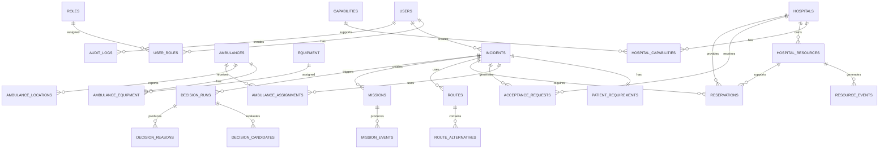

---

# 5. Schema Organization

Logical table groups:

```text
identity
├── users
├── roles
└── user_roles

emergency
├── incidents
└── patient_requirements

ambulance
├── ambulances
├── equipment
├── ambulance_equipment
├── ambulance_locations
└── ambulance_assignments

hospital
├── hospitals
├── capabilities
├── hospital_capabilities
├── hospital_resources
└── resource_events

coordination
├── acceptance_requests
├── reservations
├── missions
└── mission_events

routing
├── routes
└── route_alternatives

intelligence
├── decision_runs
├── decision_candidates
├── decision_reasons
├── model_registry
└── prediction_records

notifications
└── notifications

audit
└── audit_logs

simulation
├── simulation_scenarios
└── simulation_events
```

---

# 6. Naming Conventions

## Tables

Use:

```text
snake_case
plural nouns
```

Examples:

```text
incidents
ambulances
hospitals
reservations
```

## Columns

Use:

```text
snake_case
```

Examples:

```text
created_at
incident_id
hospital_id
available_capacity
```

## Primary Keys

Use UUID where practical.

Example:

```sql
id UUID PRIMARY KEY
```

Externally visible IDs should have separate human-friendly identifiers.

Example:

```text
id: UUID
incident_code: INC-000001
```

---

# 7. Common Audit Columns

Operational tables should generally contain:

```text
created_at
updated_at
created_by
updated_by
```

Not every table requires every field.

For immutable event tables, `updated_at` is unnecessary.

---

# 8. Timestamp Standard

All server-side timestamps should be stored as:

```text
TIMESTAMPTZ
```

and normalized to UTC.

Example:

```text
2026-09-12T12:30:00Z
```

Frontend converts to local timezone for display.

---

# 9. UUID Strategy

Use UUID for internal identity.

Example:

```sql
id UUID PRIMARY KEY DEFAULT gen_random_uuid()
```

Use human-friendly codes for operations.

Examples:

```text
INC-000001
AMB-002
H-003
RES-000391
MIS-000221
```

---

# 10. Enumerations

PostgreSQL enums may be used for stable states.

Alternatively, text + `CHECK` constraints can be used when frequent evolution is expected.

For hackathon development, `CHECK` constraints are often easier to migrate.

---

# 11. Users

## Table

```text
users
```

## Purpose

Stores authenticated platform users.

## Schema

| Column | Type | Constraints | Description |
|---|---|---|---|
| id | UUID | PK | User identity |
| name | VARCHAR(160) | NOT NULL | Display name |
| email | VARCHAR(255) | UNIQUE, NOT NULL | Login identity |
| password_hash | TEXT | NOT NULL | Password hash |
| phone | VARCHAR(30) | NULL | Optional contact |
| status | VARCHAR(30) | NOT NULL | User status |
| last_login_at | TIMESTAMPTZ | NULL | Last login |
| created_at | TIMESTAMPTZ | NOT NULL | Creation time |
| updated_at | TIMESTAMPTZ | NOT NULL | Update time |

## Status

```text
ACTIVE
INACTIVE
SUSPENDED
PENDING
```

---

# 12. Roles

## Table

```text
roles
```

| Column | Type | Constraints |
|---|---|---|
| id | UUID | PK |
| code | VARCHAR(50) | UNIQUE |
| name | VARCHAR(100) | NOT NULL |
| description | TEXT | NULL |
| created_at | TIMESTAMPTZ | NOT NULL |

Initial roles:

```text
DISPATCHER
AMBULANCE_CREW
HOSPITAL_STAFF
HOSPITAL_ADMIN
SYSTEM_ADMIN
DEMO_CONTROLLER
```

---

# 13. User Roles

## Table

```text
user_roles
```

| Column | Type | Constraints |
|---|---|---|
| user_id | UUID | FK users |
| role_id | UUID | FK roles |
| created_at | TIMESTAMPTZ | NOT NULL |

Primary key:

```sql
PRIMARY KEY (user_id, role_id)
```

---

# 14. Incidents

## Table

```text
incidents
```

This is one of the most important tables.

## Schema

| Column | Type | Constraints | Description |
|---|---|---|---|
| id | UUID | PK | Internal ID |
| incident_code | VARCHAR(40) | UNIQUE | Human-readable ID |
| incident_type | VARCHAR(50) | NOT NULL | Emergency type |
| severity | VARCHAR(20) | NOT NULL | Criticality |
| status | VARCHAR(40) | NOT NULL | Current state |
| location | geography(Point, 4326) | NOT NULL | Emergency location |
| address_text | TEXT | NULL | Human-readable address |
| patient_count | INTEGER | NOT NULL | Number of patients |
| notes | TEXT | NULL | Dispatcher notes |
| data_mode | VARCHAR(20) | NOT NULL | LIVE/SIMULATED/etc |
| created_by | UUID | FK users | Creator |
| created_at | TIMESTAMPTZ | NOT NULL | Created time |
| updated_at | TIMESTAMPTZ | NOT NULL | Update time |
| closed_at | TIMESTAMPTZ | NULL | Completion time |

---

# 15. Incident Type

Initial values:

```text
TRAUMA
CARDIAC
RESPIRATORY
NEUROLOGICAL
BURN
MATERNAL
PAEDIATRIC
GENERAL_CRITICAL
OTHER
```

The list is operational, not a validated medical taxonomy.

---

# 16. Incident Severity

```text
CRITICAL
HIGH
MEDIUM
LOW
```

The production definition of severity requires domain validation.

---

# 17. Incident State

```text
CREATED
ANALYZING
DISPATCHED
PICKUP
HOSPITAL_SELECTION
ACCEPTANCE_PENDING
ACCEPTED
RESOURCE_RESERVED
IN_TRANSIT
ARRIVED
HANDOVER
COMPLETED
CANCELLED
FAILED
ESCALATED
```

---

# 18. Incident Status Rules

Example lifecycle:

```text
CREATED
  ↓
ANALYZING
  ↓
DISPATCHED
  ↓
PICKUP
  ↓
HOSPITAL_SELECTION
  ↓
ACCEPTANCE_PENDING
  ↓
ACCEPTED
  ↓
RESOURCE_RESERVED
  ↓
IN_TRANSIT
  ↓
ARRIVED
  ↓
HANDOVER
  ↓
COMPLETED
```

Not every state transition should be client-controlled.

---

# 19. Incident Spatial Index

Create:

```sql
CREATE INDEX idx_incidents_location
ON incidents
USING GIST (location);
```

Use for spatial queries.

---

# 20. Patient Requirements

## Table

```text
patient_requirements
```

One primary structured requirement record per incident in the MVP.

## Schema

| Column | Type |
|---|---|
| id | UUID |
| incident_id | UUID |
| icu_required | BOOLEAN |
| trauma_required | BOOLEAN |
| ventilator_required | BOOLEAN |
| emergency_surgery_required | BOOLEAN |
| oxygen_required | BOOLEAN |
| specialist_required | VARCHAR(100) |
| severity | VARCHAR(30) |
| notes | TEXT |
| created_at | TIMESTAMPTZ |
| updated_at | TIMESTAMPTZ |

---

# 21. Requirement Status Model

Where more granularity is needed, use a separate requirement table.

Future structure:

```text
patient_requirement_items
```

| Field | Example |
|---|---|
| requirement_type | ICU |
| importance | REQUIRED |
| status | UNMET |
| notes | ... |

This is preferable if requirements will expand significantly.

---

# 22. Requirement Types

```text
ICU
TRAUMA
VENTILATOR
EMERGENCY_SURGERY
OXYGEN
CARDIOLOGY
NEUROLOGY
PAEDIATRIC
BURN_CARE
MATERNAL_CARE
OTHER
```

---

# 23. Ambulances

## Table

```text
ambulances
```

| Column | Type | Constraints |
|---|---|---|
| id | UUID | PK |
| ambulance_code | VARCHAR(40) | UNIQUE |
| vehicle_type | VARCHAR(50) | NOT NULL |
| status | VARCHAR(50) | NOT NULL |
| current_location | geography(Point, 4326) | NULL |
| gps_updated_at | TIMESTAMPTZ | NULL |
| crew_summary | JSONB | NULL |
| active_mission_id | UUID | NULL |
| registration_reference | VARCHAR(100) | NULL |
| data_mode | VARCHAR(20) | NOT NULL |
| created_at | TIMESTAMPTZ | NOT NULL |
| updated_at | TIMESTAMPTZ | NOT NULL |

---

# 24. Ambulance Status

```text
AVAILABLE
RESERVED
DISPATCHED
EN_ROUTE_TO_PATIENT
ON_SCENE
PATIENT_ON_BOARD
EN_ROUTE_TO_HOSPITAL
ARRIVED
HANDOVER
UNAVAILABLE
MAINTENANCE
```

---

# 25. Ambulance Spatial Index

```sql
CREATE INDEX idx_ambulances_location
ON ambulances
USING GIST (current_location);
```

---

# 26. Equipment

## Table

```text
equipment
```

| Column | Type |
|---|---|
| id | UUID |
| code | VARCHAR(50) |
| name | VARCHAR(120) |
| description | TEXT |
| created_at | TIMESTAMPTZ |

Examples:

```text
VENTILATOR
OXYGEN
DEFIBRILLATOR
CARDIAC_MONITOR
TRAUMA_KIT
```

---

# 27. Ambulance Equipment

## Table

```text
ambulance_equipment
```

| Column | Type |
|---|---|
| ambulance_id | UUID |
| equipment_id | UUID |
| quantity | INTEGER |
| status | VARCHAR(30) |
| updated_at | TIMESTAMPTZ |

Primary key:

```sql
PRIMARY KEY (ambulance_id, equipment_id)
```

---

# 28. Ambulance Locations

## Table

```text
ambulance_locations
```

Purpose:

Historical GPS track.

| Column | Type |
|---|---|
| id | BIGSERIAL |
| ambulance_id | UUID |
| location | geography(Point, 4326) |
| speed_kph | NUMERIC(8,2) |
| heading | NUMERIC(6,2) |
| accuracy_m | NUMERIC(10,2) |
| recorded_at | TIMESTAMPTZ |
| source | VARCHAR(30) |

This table may become large.

For production, partitioning/retention may be required.

---

# 29. Ambulance Assignment

## Table

```text
ambulance_assignments
```

| Column | Type |
|---|---|
| id | UUID |
| incident_id | UUID |
| ambulance_id | UUID |
| status | VARCHAR(40) |
| assigned_at | TIMESTAMPTZ |
| accepted_at | TIMESTAMPTZ |
| rejected_at | TIMESTAMPTZ |
| rejection_reason | TEXT |
| assigned_by | UUID |
| decision_run_id | UUID |
| created_at | TIMESTAMPTZ |

---

# 30. Assignment Status

```text
PROPOSED
ASSIGNED
ACCEPTED
REJECTED
CANCELLED
COMPLETED
FAILED
```

---

# 31. Capabilities

## Table

```text
capabilities
```

Examples:

```text
ALS
BLS
ICU_AMBULANCE
TRAUMA
ICU
EMERGENCY_SURGERY
VENTILATOR
CARDIOLOGY
NEUROLOGY
PAEDIATRIC_EMERGENCY
```

Schema:

| Column | Type |
|---|---|
| id | UUID |
| code | VARCHAR(80) |
| name | VARCHAR(120) |
| type | VARCHAR(40) |
| description | TEXT |

---

# 32. Hospital Table

## Table

```text
hospitals
```

| Column | Type |
|---|---|
| id | UUID |
| hospital_code | VARCHAR(40) |
| name | VARCHAR(255) |
| location | geography(Point, 4326) |
| address_text | TEXT |
| emergency_capable | BOOLEAN |
| status | VARCHAR(40) |
| contact_phone | VARCHAR(40) |
| data_mode | VARCHAR(20) |
| created_at | TIMESTAMPTZ |
| updated_at | TIMESTAMPTZ |

---

# 33. Hospital Status

```text
ACTIVE
LIMITED
TEMPORARILY_UNAVAILABLE
CLOSED
UNKNOWN
```

---

# 34. Hospital Spatial Index

```sql
CREATE INDEX idx_hospitals_location
ON hospitals
USING GIST (location);
```

---

# 35. Hospital Capabilities

## Table

```text
hospital_capabilities
```

| Column | Type |
|---|---|
| hospital_id | UUID |
| capability_id | UUID |
| status | VARCHAR(30) |
| updated_at | TIMESTAMPTZ |
| source | VARCHAR(50) |

Primary key:

```sql
PRIMARY KEY (hospital_id, capability_id)
```

---

# 36. Capability Status

```text
AVAILABLE
LIMITED
UNAVAILABLE
UNKNOWN
```

A capability being `AVAILABLE` does not automatically mean the hospital accepted a specific patient.

---

# 37. Hospital Resources

## Table

```text
hospital_resources
```

This is one of the most important tables.

| Column | Type | Description |
|---|---|---|
| id | UUID | Resource record |
| hospital_id | UUID | Hospital |
| resource_type | VARCHAR(60) | ICU, ventilator etc. |
| total_capacity | INTEGER | Total capacity |
| occupied_capacity | INTEGER | Currently occupied |
| reserved_capacity | INTEGER | Reserved |
| available_capacity | INTEGER | Available |
| status | VARCHAR(30) | Current status |
| last_updated_at | TIMESTAMPTZ | Freshness |
| source | VARCHAR(50) | Source |
| confidence | VARCHAR(20) | Confidence |
| data_mode | VARCHAR(20) | LIVE/SIMULATED/etc |
| version | BIGINT | Optimistic concurrency |
| created_at | TIMESTAMPTZ | Created |
| updated_at | TIMESTAMPTZ | Updated |

---

# 38. Resource Invariant

The database must guarantee:

```text
available_capacity
+
occupied_capacity
+
reserved_capacity
<=
total_capacity
```

If the system models only these three states, ideally:

```text
available
+
occupied
+
reserved
=
total
```

Unless there is an explicit state such as maintenance/out-of-service.

---

# 39. Resource Constraints

Example:

```sql
CHECK (total_capacity >= 0);

CHECK (occupied_capacity >= 0);

CHECK (reserved_capacity >= 0);

CHECK (available_capacity >= 0);

CHECK (
    occupied_capacity
    + reserved_capacity
    + available_capacity
    <= total_capacity
);
```

---

# 40. Resource Status

```text
AVAILABLE
LIMITED
FULL
UNAVAILABLE
UNKNOWN
```

The status should be derived from capacity where practical rather than manually duplicated.

---

# 41. Resource Freshness

A resource record should never be considered fully trusted without:

```text
last_updated_at
source
confidence
```

Example:

```text
ICU
Available: 1
Source: HospitalFeed
Updated: 15 sec ago
Confidence: High
```

---

# 42. Resource Events

## Table

```text
resource_events
```

Stores resource state changes.

| Column | Type |
|---|---|
| id | UUID |
| hospital_resource_id | UUID |
| event_type | VARCHAR(50) |
| old_available | INTEGER |
| new_available | INTEGER |
| old_reserved | INTEGER |
| new_reserved | INTEGER |
| source | VARCHAR(50) |
| actor_id | UUID |
| created_at | TIMESTAMPTZ |

Examples:

```text
RESOURCE_UPDATED
RESOURCE_RESERVED
RESOURCE_RELEASED
RESOURCE_LOST
RESOURCE_RESTORED
RESOURCE_EXPIRED
```

---

# 43. Acceptance Requests

## Table

```text
acceptance_requests
```

| Column | Type |
|---|---|
| id | UUID |
| incident_id | UUID |
| hospital_id | UUID |
| status | VARCHAR(30) |
| requested_at | TIMESTAMPTZ |
| expires_at | TIMESTAMPTZ |
| responded_at | TIMESTAMPTZ |
| response_reason | TEXT |
| responded_by | UUID |
| decision_run_id | UUID |
| created_at | TIMESTAMPTZ |

---

# 44. Acceptance Status

```text
PENDING
ACCEPTED
REJECTED
EXPIRED
CANCELLED
```

---

# 45. Acceptance Rules

A hospital becomes the confirmed destination only when:

```text
hospital candidate is feasible
AND
hospital acceptance = ACCEPTED
AND
required resources can be reserved
```

Depending on production policy, these may happen in slightly different order, but the system should not claim confirmed treatment readiness prematurely.

---

# 46. Reservations

## Table

```text
reservations
```

| Column | Type |
|---|---|
| id | UUID |
| reservation_code | VARCHAR(50) |
| incident_id | UUID |
| hospital_id | UUID |
| hospital_resource_id | UUID |
| resource_type | VARCHAR(60) |
| quantity | INTEGER |
| status | VARCHAR(30) |
| requested_at | TIMESTAMPTZ |
| held_at | TIMESTAMPTZ |
| confirmed_at | TIMESTAMPTZ |
| expires_at | TIMESTAMPTZ |
| released_at | TIMESTAMPTZ |
| release_reason | TEXT |
| created_by | UUID |
| created_at | TIMESTAMPTZ |
| updated_at | TIMESTAMPTZ |

---

# 47. Reservation Status

```text
REQUESTED
HELD
CONFIRMED
RELEASED
EXPIRED
CANCELLED
FAILED
IN_USE
```

---

# 48. Reservation Lifecycle

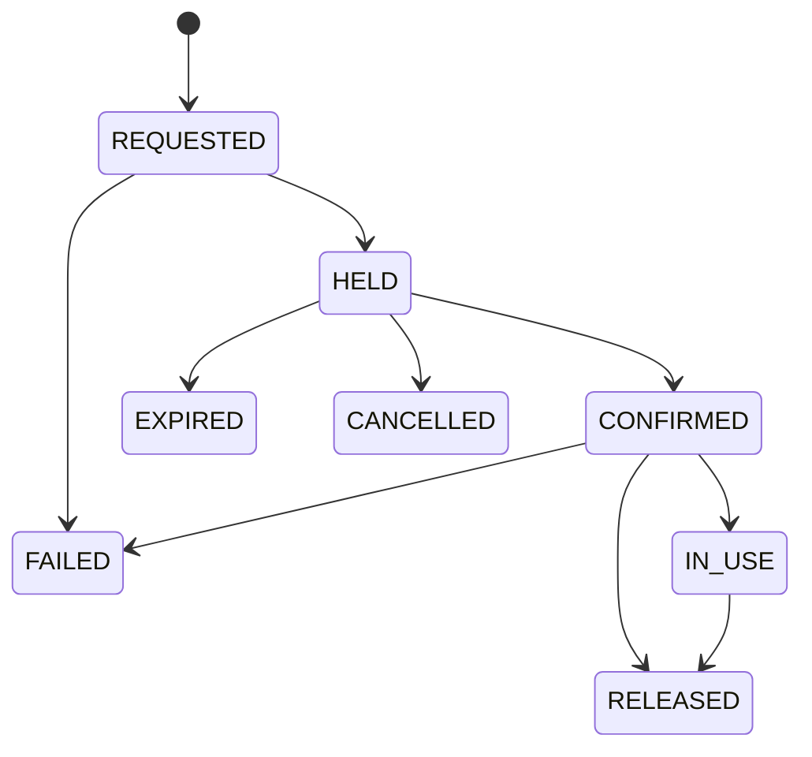

---

# 49. Reservation Quantity

Example:

```text
ICU
quantity = 1
```

A reservation for quantity 2 requires:

```text
available_capacity >= 2
```

---

# 50. Reservation Concurrency

Critical rule:

> Two simultaneous reservation requests must never consume the same capacity.

Use a transaction:

```sql
BEGIN;

SELECT *
FROM hospital_resources
WHERE id = :resource_id
FOR UPDATE;

-- Validate available capacity.

UPDATE hospital_resources
SET available_capacity = available_capacity - :quantity,
    reserved_capacity = reserved_capacity + :quantity,
    version = version + 1
WHERE id = :resource_id;

INSERT INTO reservations (...);

COMMIT;
```

If validation fails:

```sql
ROLLBACK;
```

---

# 51. Reservation Idempotency

Reservation requests should support an idempotency key.

Example:

```text
reservation_request_id
```

If the same request is submitted twice:

```text
first request → creates reservation
second request → returns original result
```

---

# 52. Reservation Expiry

A reservation may expire when:

- acceptance timed out;
- ambulance cancelled;
- mission cancelled;
- arrival window passed;
- hospital releases resource.

The expiration worker must restore resource availability transactionally.

---

# 53. Missions

## Table

```text
missions
```

This represents an end-to-end ambulance mission.

| Column | Type |
|---|---|
| id | UUID |
| mission_code | VARCHAR(50) |
| incident_id | UUID |
| ambulance_id | UUID |
| selected_hospital_id | UUID |
| selected_route_id | UUID |
| status | VARCHAR(50) |
| started_at | TIMESTAMPTZ |
| patient_pickup_at | TIMESTAMPTZ |
| hospital_departure_at | TIMESTAMPTZ |
| hospital_arrival_at | TIMESTAMPTZ |
| handover_at | TIMESTAMPTZ |
| completed_at | TIMESTAMPTZ |
| current_eta_seconds | INTEGER |
| current_location | geography(Point, 4326) |
| state_version | BIGINT |
| created_at | TIMESTAMPTZ |
| updated_at | TIMESTAMPTZ |

---

# 54. Mission State

```text
CREATED
ASSIGNED
EN_ROUTE_TO_PATIENT
ON_SCENE
PATIENT_ON_BOARD
EN_ROUTE_TO_HOSPITAL
ARRIVED
HANDOVER
COMPLETED
CANCELLED
FAILED
REASSESSMENT
```

---

# 55. Mission Versioning

Use:

```text
state_version
```

to prevent stale clients from overwriting newer state.

Example:

```text
Client expects version 14.
Server currently has version 15.
```

Reject mutation with:

```text
MISSION_STATE_CONFLICT
```

---

# 56. Mission Events

## Table

```text
mission_events
```

This is an append-only operational history.

| Column | Type |
|---|---|
| id | BIGSERIAL |
| mission_id | UUID |
| incident_id | UUID |
| event_type | VARCHAR(60) |
| payload | JSONB |
| actor_id | UUID |
| source | VARCHAR(40) |
| created_at | TIMESTAMPTZ |

---

# 57. Mission Event Types

```text
MISSION_CREATED
AMBULANCE_ASSIGNED
AMBULANCE_ACCEPTED
AMBULANCE_REJECTED
PATIENT_PICKUP
ROUTE_SELECTED
ROUTE_CHANGED
HOSPITAL_SELECTED
ACCEPTANCE_REQUESTED
HOSPITAL_ACCEPTED
HOSPITAL_REJECTED
RESOURCE_RESERVED
RESOURCE_RELEASED
RESOURCE_LOST
TRAFFIC_CHANGED
GPS_STALE
REASSESSMENT_STARTED
REASSESSMENT_COMPLETED
AMBULANCE_FAILURE
PATIENT_SEVERITY_CHANGED
HOSPITAL_ARRIVED
HANDOVER_COMPLETED
MISSION_COMPLETED
```

---

# 58. Event Immutability

Mission events should be append-only.

Do not update:

```text
mission_events
```

after insertion unless correcting data through a clearly audited correction process.

---

# 59. Routes

## Table

```text
routes
```

| Column | Type |
|---|---|
| id | UUID |
| incident_id | UUID |
| mission_id | UUID |
| provider | VARCHAR(50) |
| provider_route_id | VARCHAR(255) |
| origin | geography(Point, 4326) |
| destination | geography(Point, 4326) |
| distance_m | INTEGER |
| duration_seconds | INTEGER |
| traffic_duration_seconds | INTEGER |
| reliability_score | NUMERIC(6,4) |
| confidence | VARCHAR(20) |
| status | VARCHAR(30) |
| geometry | GEOMETRY(LineString, 4326) |
| generated_at | TIMESTAMPTZ |
| expires_at | TIMESTAMPTZ |

---

# 60. Route Status

```text
CALCULATED
SELECTED
ACTIVE
SUPERSEDED
FAILED
EXPIRED
```

---

# 61. Route Alternatives

## Table

```text
route_alternatives
```

| Column | Type |
|---|---|
| id | UUID |
| route_id | UUID |
| rank | INTEGER |
| distance_m | INTEGER |
| duration_seconds | INTEGER |
| traffic_duration_seconds | INTEGER |
| reliability_score | NUMERIC |
| geometry | GEOMETRY(LineString, 4326) |
| created_at | TIMESTAMPTZ |

---

# 62. Route Geometry

Store geometry only when necessary.

For the hackathon:

```text
GEOMETRY(LineString, 4326)
```

is acceptable.

If the external provider already returns geometry encoded efficiently, the raw provider response should not necessarily be stored permanently.

---

# 63. Route Provider Metadata

Store:

```text
provider
provider_route_id
generated_at
traffic_timestamp
```

so route results can be audited.

---

# 64. Decision Runs

## Table

```text
decision_runs
```

This table records each optimization/recommendation execution.

| Column | Type |
|---|---|
| id | UUID |
| incident_id | UUID |
| mission_id | UUID |
| decision_type | VARCHAR(50) |
| algorithm_version | VARCHAR(50) |
| model_version | VARCHAR(50) |
| configuration_version | VARCHAR(50) |
| trigger_event | VARCHAR(60) |
| input_snapshot | JSONB |
| output_snapshot | JSONB |
| selected_entity_id | UUID |
| confidence | VARCHAR(20) |
| execution_time_ms | INTEGER |
| created_at | TIMESTAMPTZ |

---

# 65. Decision Types

```text
AMBULANCE_ASSIGNMENT
HOSPITAL_SELECTION
ROUTE_SELECTION
REASSESSMENT
RESOURCE_ALLOCATION
```

---

# 66. Decision Candidates

## Table

```text
decision_candidates
```

Stores candidates considered during a decision.

| Column | Type |
|---|---|
| id | UUID |
| decision_run_id | UUID |
| entity_type | VARCHAR(40) |
| entity_id | UUID |
| eligible | BOOLEAN |
| exclusion_reason | TEXT |
| normalized_score | NUMERIC(8,5) |
| rank | INTEGER |
| feature_values | JSONB |
| created_at | TIMESTAMPTZ |

---

# 67. Decision Reasons

## Table

```text
decision_reasons
```

| Column | Type |
|---|---|
| id | UUID |
| decision_run_id | UUID |
| candidate_id | UUID |
| reason_code | VARCHAR(80) |
| reason_type | VARCHAR(30) |
| explanation | TEXT |
| weight | NUMERIC(8,5) |
| contribution | NUMERIC(8,5) |
| created_at | TIMESTAMPTZ |

---

# 68. Reason Types

```text
HARD_CONSTRAINT
SOFT_OBJECTIVE
PREDICTION
WARNING
DATA_QUALITY
```

---

# 69. Decision Reason Examples

```text
REQUIRED_ICU
REQUIRED_TRAUMA
REQUIRED_VENTILATOR
ACCEPTANCE_CONFIRMED
LOWEST_FEASIBLE_ETA
HIGH_RESOURCE_READINESS
STALE_RESOURCE_DATA
AMBULANCE_UNAVAILABLE
CAPABILITY_MISMATCH
```

---

# 70. Explainability Requirements in Database

A recommendation must be reconstructable.

At minimum preserve:

```text
algorithm_version
configuration_version
candidate_set
filtered candidates
scores
selection
reasons
timestamp
confidence
```

---

# 71. Prediction Records

## Table

```text
prediction_records
```

| Column | Type |
|---|---|
| id | UUID |
| incident_id | UUID |
| mission_id | UUID |
| prediction_type | VARCHAR(50) |
| target_entity_type | VARCHAR(40) |
| target_entity_id | UUID |
| model_version | VARCHAR(50) |
| input_features | JSONB |
| prediction | JSONB |
| confidence | NUMERIC(8,5) |
| created_at | TIMESTAMPTZ |

---

# 72. Prediction Types

```text
ETA
ICU_AVAILABILITY
RESOURCE_READINESS
HOSPITAL_CONGESTION
EMERGENCY_DEMAND
```

Only implement types that are actually used.

---

# 73. Model Registry

## Table

```text
model_registry
```

| Column | Type |
|---|---|
| id | UUID |
| model_name | VARCHAR(120) |
| version | VARCHAR(50) |
| model_type | VARCHAR(50) |
| dataset_version | VARCHAR(100) |
| feature_schema | JSONB |
| metrics | JSONB |
| limitations | TEXT |
| status | VARCHAR(30) |
| artifact_uri | TEXT |
| created_at | TIMESTAMPTZ |

---

# 74. Model Status

```text
TRAINING
VALIDATION
ACTIVE
DISABLED
RETIRED
```

---

# 75. Notifications

## Table

```text
notifications
```

| Column | Type |
|---|---|
| id | UUID |
| user_id | UUID |
| incident_id | UUID |
| mission_id | UUID |
| severity | VARCHAR(20) |
| notification_type | VARCHAR(60) |
| title | VARCHAR(255) |
| message | TEXT |
| payload | JSONB |
| read_at | TIMESTAMPTZ |
| acknowledged_at | TIMESTAMPTZ |
| created_at | TIMESTAMPTZ |

---

# 76. Notification Types

```text
AMBULANCE_ASSIGNED
HOSPITAL_ACCEPTED
HOSPITAL_REJECTED
RESOURCE_RESERVED
RESOURCE_LOST
ROUTE_CHANGED
ETA_CHANGED
GPS_STALE
MANUAL_INTERVENTION_REQUIRED
MISSION_COMPLETED
```

---

# 77. Audit Logs

## Table

```text
audit_logs
```

This table records security-sensitive and operationally significant actions.

| Column | Type |
|---|---|
| id | BIGSERIAL |
| actor_id | UUID |
| actor_role | VARCHAR(50) |
| action | VARCHAR(100) |
| entity_type | VARCHAR(50) |
| entity_id | UUID |
| incident_id | UUID |
| before_state | JSONB |
| after_state | JSONB |
| reason | TEXT |
| ip_address | INET |
| user_agent | TEXT |
| created_at | TIMESTAMPTZ |

---

# 78. Audit Actions

Examples:

```text
LOGIN
LOGOUT
INCIDENT_CREATED
AMBULANCE_ASSIGNED
AMBULANCE_REASSIGNED
HOSPITAL_SELECTED
HOSPITAL_OVERRIDE
HOSPITAL_ACCEPTED
HOSPITAL_REJECTED
RESERVATION_CREATED
RESERVATION_RELEASED
RESOURCE_UPDATED
MISSION_CANCELLED
MANUAL_OVERRIDE
CONFIGURATION_CHANGED
```

---

# 79. Audit Requirements

The following must always be audited:

- manual override;
- resource reservation;
- resource release;
- hospital rejection;
- hospital acceptance;
- mission reassignment;
- critical configuration changes.

---

# 80. Simulation Scenarios

## Table

```text
simulation_scenarios
```

| Column | Type |
|---|---|
| id | UUID |
| scenario_code | VARCHAR(50) |
| name | VARCHAR(255) |
| description | TEXT |
| initial_state | JSONB |
| configuration | JSONB |
| seed | BIGINT |
| status | VARCHAR(30) |
| created_at | TIMESTAMPTZ |

---

# 81. Simulation Events

## Table

```text
simulation_events
```

| Column | Type |
|---|---|
| id | UUID |
| scenario_id | UUID |
| sequence_number | INTEGER |
| delay_ms | INTEGER |
| event_type | VARCHAR(60) |
| payload | JSONB |
| executed_at | TIMESTAMPTZ |
| created_at | TIMESTAMPTZ |

---

# 82. Scenario Types

```text
NORMAL_EMERGENCY
TRAFFIC_CONGESTION
HOSPITAL_REJECTION
ICU_FAILURE
AMBULANCE_FAILURE
PATIENT_SEVERITY_CHANGE
GPS_FAILURE
ROUTING_FAILURE
NO_FEASIBLE_HOSPITAL
```

---

# 83. Seed Data Requirements

The demo database should contain enough data to demonstrate meaningful decisions.

Recommended minimum:

```text
10 ambulances
10 hospitals
multiple capability combinations
multiple resource states
multiple emergency scenarios
```

These values are development targets, not claims about real-world capacity.

---

# 84. Seed Ambulance Examples

```text
AMB-001
BLS
Oxygen
Available

AMB-002
ALS
Ventilator
Defibrillator
Trauma
Available

AMB-003
ICU Ambulance
Ventilator
Oxygen
Cardiac
Available

AMB-004
ALS
Ventilator
Active Mission
```

---

# 85. Seed Hospital Examples

```text
H-001
Trauma
No ICU

H-002
ICU
No Trauma

H-003
Trauma
ICU
Ventilator
Emergency Surgery

H-004
Trauma
ICU
Acceptance Pending

H-005
All capabilities
Resource constrained
```

Use clearly fictitious or authorized data in the prototype.

---

# 86. Seed Data Strategy

The dataset should deliberately contain:

- nearby but unsuitable ambulances;
- farther but suitable ambulances;
- nearby but unsuitable hospitals;
- accepting hospitals;
- rejecting hospitals;
- scarce ICU resources;
- changing resource states;
- traffic scenarios.

A perfectly clean dataset will not adequately demonstrate the intelligence of the system.

---

# 87. Spatial Data Model

Use SRID:

```text
4326
```

for external GPS coordinates.

Use PostGIS geography for distance calculations.

Example:

```sql
location geography(Point, 4326)
```

---

# 88. Coordinate Convention

Store:

```text
longitude, latitude
```

when creating a PostGIS point from numeric coordinates:

```sql
ST_SetSRID(
    ST_Point(:longitude, :latitude),
    4326
)
```

Be careful not to reverse latitude and longitude.

---

# 89. Ambulance Nearest-Neighbor Query

Example:

```sql
SELECT
    id,
    ambulance_code,
    ST_Distance(
        current_location,
        ST_SetSRID(
            ST_Point(:lng, :lat),
            4326
        )::geography
    ) AS distance_m
FROM ambulances
WHERE status = 'AVAILABLE'
ORDER BY current_location
    <-> ST_SetSRID(
        ST_Point(:lng, :lat),
        4326
    )::geography
LIMIT 20;
```

Actual routing ETA should still be used before final selection.

---

# 90. Hospital Candidate Query

Initial geographic filtering:

```sql
SELECT
    id,
    hospital_code,
    name
FROM hospitals
WHERE emergency_capable = TRUE
  AND ST_DWithin(
      location,
      ST_SetSRID(
          ST_Point(:lng, :lat),
          4326
      )::geography,
      :radius_m
  );
```

Then apply capability and resource constraints.

---

# 91. Geographic Search Expansion

If no suitable hospital exists within the initial radius:

```text
radius 1
    ↓
radius 2
    ↓
regional search
    ↓
manual escalation
```

Exact radius values should be configurable.

Do not hardcode medically unsafe distance limits without domain validation.

---

# 92. Resource Query

Example:

```sql
SELECT *
FROM hospital_resources
WHERE hospital_id = :hospital_id
  AND resource_type = 'ICU';
```

The application should evaluate:

```text
available_capacity
+
status
+
last_updated_at
+
confidence
```

together.

---

# 93. Active Reservation Query

```sql
SELECT *
FROM reservations
WHERE hospital_resource_id = :resource_id
  AND status IN (
      'HELD',
      'CONFIRMED',
      'IN_USE'
  );
```

---

# 94. Reservation Capacity Check

Conceptually:

```sql
SELECT
    total_capacity,
    occupied_capacity,
    reserved_capacity,
    available_capacity
FROM hospital_resources
WHERE id = :resource_id
FOR UPDATE;
```

Then:

```text
available_capacity >= requested_quantity
```

must be true before reservation.

---

# 95. Resource Update Transaction

Resource changes should occur transactionally.

```sql
BEGIN;

SELECT *
FROM hospital_resources
WHERE id = :resource_id
FOR UPDATE;

-- Validate requested transition.

UPDATE hospital_resources
SET
    available_capacity = :new_available,
    occupied_capacity = :new_occupied,
    reserved_capacity = :new_reserved,
    version = version + 1,
    updated_at = NOW()
WHERE id = :resource_id;

INSERT INTO resource_events (...);

COMMIT;
```

---

# 96. Optimistic Locking

For frequently changing entities, use:

```text
version BIGINT
```

Example:

```text
version 8
```

Update:

```sql
UPDATE hospital_resources
SET
    available_capacity = :new_value,
    version = version + 1
WHERE
    id = :id
    AND version = :expected_version;
```

If zero rows are updated:

```text
CONCURRENT_UPDATE
```

---

# 97. Foreign Key Strategy

Operational entities should use foreign keys.

Examples:

```sql
incidents.created_by
    REFERENCES users(id)

ambulance_assignments.incident_id
    REFERENCES incidents(id)

ambulance_assignments.ambulance_id
    REFERENCES ambulances(id)

reservations.hospital_id
    REFERENCES hospitals(id)

reservations.hospital_resource_id
    REFERENCES hospital_resources(id)
```

---

# 98. Delete Strategy

Avoid hard deletion of operational records.

Use status fields such as:

```text
INACTIVE
ARCHIVED
CLOSED
```

Critical historical records must remain available for auditing.

---

# 99. Soft Deletion

For configurable master data:

```text
deleted_at
```

may be used.

Examples:

- hospitals;
- ambulances;
- users;
- equipment definitions.

Do not soft-delete current emergency records in a way that makes active missions disappear.

---

# 100. Data Retention

## Hackathon

Keep:

- all scenarios;
- all events;
- all audit logs;
- all decision traces.

## Production

Retention policies must be defined according to:

- legal requirements;
- organizational policy;
- data sensitivity;
- operational needs.

Do not claim a production retention period without an approved policy.

---

# 101. High-Volume Tables

Potentially high-volume tables:

```text
ambulance_locations
mission_events
audit_logs
notifications
decision_candidates
prediction_records
```

---

# 102. Production Partitioning Candidates

`ambulance_locations` may eventually need partitioning by time.

Example conceptual partition:

```text
ambulance_locations_2026_09
ambulance_locations_2026_10
```

This is not necessary for the hackathon MVP.

---

# 103. Index Strategy

## Users

```sql
CREATE UNIQUE INDEX idx_users_email
ON users(email);
```

## Incidents

```sql
CREATE INDEX idx_incidents_status
ON incidents(status);

CREATE INDEX idx_incidents_created_at
ON incidents(created_at DESC);

CREATE INDEX idx_incidents_location
ON incidents
USING GIST(location);
```

## Ambulances

```sql
CREATE INDEX idx_ambulances_status
ON ambulances(status);

CREATE INDEX idx_ambulances_location
ON ambulances
USING GIST(current_location);
```

## Hospitals

```sql
CREATE INDEX idx_hospitals_location
ON hospitals
USING GIST(location);

CREATE INDEX idx_hospitals_status
ON hospitals(status);
```

## Resources

```sql
CREATE INDEX idx_hospital_resources_hospital
ON hospital_resources(hospital_id);

CREATE INDEX idx_hospital_resources_type
ON hospital_resources(resource_type);
```

## Reservations

```sql
CREATE INDEX idx_reservations_incident
ON reservations(incident_id);

CREATE INDEX idx_reservations_resource
ON reservations(hospital_resource_id);

CREATE INDEX idx_reservations_status
ON reservations(status);
```

---

# 104. Partial Unique Index for Active Reservations

If one resource capacity unit cannot have conflicting active reservations, consider a partial unique strategy where appropriate.

For resource types with quantity semantics, application/transaction logic may still be necessary.

Example conceptual constraint:

```sql
CREATE INDEX idx_active_reservations_resource
ON reservations(hospital_resource_id)
WHERE status IN ('HELD', 'CONFIRMED', 'IN_USE');
```

This index alone does not solve multi-unit resource allocation; transactional capacity checks remain mandatory.

---

# 105. JSONB Usage

Use JSONB for:

- provider metadata;
- decision snapshots;
- simulation payload;
- ML feature snapshots;
- flexible notes.

Do not put core relational fields into JSONB unnecessarily.

Bad:

```text
hospital.resources = JSONB
```

for all resource data.

Better:

```text
hospital_resources
```

as structured relational data.

---

# 106. Decision Snapshot Example

```json
{
  "incident": {
    "severity": "CRITICAL",
    "requirements": {
      "icu": true,
      "trauma": true,
      "ventilator": true,
      "surgery": true
    }
  },
  "ambulance_candidates": [
    {
      "id": "AMB-001",
      "eligible": false,
      "reason": "MISSING_VENTILATOR"
    },
    {
      "id": "AMB-002",
      "eligible": true,
      "eta_seconds": 420,
      "score": 0.93
    }
  ]
}
```

This should be stored in `decision_runs.input_snapshot` or related trace structures.

---

# 107. Resource Source Model

Use source fields consistently.

Examples:

```text
HOSPITAL_API
AMBULANCE_GPS
ROUTING_PROVIDER
SIMULATION
MANUAL_ENTRY
REPLAY
```

---

# 108. Data Confidence Model

Initial values:

```text
HIGH
MEDIUM
LOW
UNKNOWN
```

The definition of confidence must be implementation-specific and documented.

Do not imply statistical calibration unless actually calibrated.

---

# 109. Data Mode Model

```text
LIVE
REPLAY
SYNTHETIC
SIMULATED
UNKNOWN
```

---

# 110. Example Hospital Resource Record

```json
{
  "hospital_id": "H-003",
  "resource_type": "ICU",
  "total_capacity": 10,
  "occupied_capacity": 8,
  "reserved_capacity": 1,
  "available_capacity": 1,
  "status": "AVAILABLE",
  "last_updated_at": "2026-09-12T12:30:20Z",
  "source": "SIMULATION",
  "confidence": "MEDIUM",
  "data_mode": "SIMULATED",
  "version": 17
}
```

---

# 111. Example Reservation Record

```json
{
  "reservation_code": "RES-00391",
  "incident_id": "INC-001",
  "hospital_id": "H-003",
  "resource_type": "ICU",
  "quantity": 1,
  "status": "CONFIRMED",
  "confirmed_at": "2026-09-12T12:31:10Z",
  "expires_at": "2026-09-12T12:45:00Z"
}
```

---

# 112. Example Decision Record

```json
{
  "decision_type": "HOSPITAL_SELECTION",
  "algorithm_version": "hospital-score-v1",
  "configuration_version": "config-v3",
  "selected_entity_id": "H-003",
  "confidence": "HIGH",
  "execution_time_ms": 142
}
```

---

# 113. Example Mission Timeline Record

```json
{
  "mission_id": "MIS-001",
  "event_type": "RESOURCE_LOST",
  "payload": {
    "hospital_id": "H-003",
    "resource_type": "ICU",
    "previous_available": 1,
    "new_available": 0
  },
  "source": "SIMULATION"
}
```

---

# 114. Notification Delivery State

Optional additional fields:

```text
delivery_status
delivered_at
failed_at
failure_reason
```

Statuses:

```text
PENDING
DELIVERED
FAILED
READ
ACKNOWLEDGED
```

---

# 115. Demo Reset Strategy

Demo reset should not manually delete tables indiscriminately.

Preferred flow:

```text
reset scenario state
    ↓
restore seed dataset
    ↓
clear active incidents
    ↓
clear active missions
    ↓
restore resource capacities
    ↓
restore ambulance states
    ↓
restore hospital states
    ↓
retain optional audit history
```

For isolated demo environments, full database reset may be acceptable.

---

# 116. Simulation Seed Strategy

Use deterministic seed values.

Example:

```text
seed = 2026
```

This ensures:

```text
same scenario
+
same seed
=
repeatable result
```

---

# 117. Scenario Data Isolation

Scenario execution should ideally use:

```text
scenario_id
```

so events from different scenarios cannot interfere.

For the hackathon, a single active scenario at a time is acceptable.

---

# 118. Database Transaction Boundaries

Critical operations should be transactional.

## Transaction A — Ambulance Assignment

```text
Validate ambulance
→ lock assignment state
→ assign
→ update ambulance
→ create assignment
→ create event
→ commit
```

## Transaction B — Hospital Acceptance

```text
Validate acceptance
→ save acceptance
→ commit
```

## Transaction C — Resource Reservation

```text
Lock resource
→ validate capacity
→ update resource
→ create reservation
→ create resource event
→ commit
```

---

# 119. Reservation Failure Transaction

If any part fails:

```text
resource unchanged
reservation not confirmed
event not emitted as success
```

Do not create partially completed reservations.

---

# 120. Event Publication Strategy

If the application uses database transactions plus real-time events, avoid publishing a successful event before the transaction commits.

Preferred pattern:

```text
DB transaction
    ↓
commit
    ↓
publish WebSocket/event
```

For production, an outbox pattern may be introduced.

---

# 121. Outbox Pattern — Future

Potential tables:

```text
event_outbox
```

Flow:

```text
Transaction
   ↓
State change
   +
Outbox event
   ↓
Commit
   ↓
Event worker
   ↓
WebSocket / queue
```

Not required for MVP.

---

# 122. Database Constraints

Important constraints include:

```text
email unique
incident_code unique
ambulance_code unique
hospital_code unique
reservation_code unique
capacity >= 0
quantity > 0
timestamps valid
foreign keys valid
```

---

# 123. Timestamp Validation

For example:

```text
completed_at >= created_at
```

where practical.

Mission timelines should not allow impossible temporal ordering.

---

# 124. Mission Completion Constraints

A mission should not be marked:

```text
COMPLETED
```

unless:

```text
ARRIVED
AND
HANDOVER_CONFIRMED
```

unless an explicitly configured exceptional workflow exists.

---

# 125. Hospital Acceptance Constraints

A hospital should not transition to:

```text
ACCEPTED
```

for a closed/cancelled incident.

---

# 126. Reservation Constraints

A reservation should not be:

```text
CONFIRMED
```

if the related resource is:

```text
UNAVAILABLE
```

unless an authorized exceptional workflow exists.

---

# 127. Ambulance Assignment Constraints

An ambulance cannot simultaneously have multiple active assignments unless the operational policy explicitly allows it.

Preferred MVP rule:

```text
one active emergency assignment per ambulance
```

---

# 128. Active Assignment Constraint

Conceptually:

```sql
CREATE UNIQUE INDEX idx_one_active_assignment_per_ambulance
ON ambulance_assignments(ambulance_id)
WHERE status IN ('ASSIGNED', 'ACCEPTED');
```

This must be adapted if mission-state transitions require additional active statuses.

---

# 129. Active Mission Constraint

Similarly:

```sql
CREATE UNIQUE INDEX idx_one_active_mission_per_ambulance
ON missions(ambulance_id)
WHERE status IN (
    'ASSIGNED',
    'EN_ROUTE_TO_PATIENT',
    'ON_SCENE',
    'PATIENT_ON_BOARD',
    'EN_ROUTE_TO_HOSPITAL',
    'ARRIVED',
    'HANDOVER',
    'REASSESSMENT'
);
```

---

# 130. Historical Integrity

Do not mutate:

- old decision traces;
- old route records;
- old acceptance events;
- old mission events;
- old audit logs.

New decisions create new records.

---

# 131. Current State vs Historical State

Example:

`hospital_resources`

stores:

```text
current state
```

while:

`resource_events`

stores:

```text
historical changes
```

Likewise:

`missions`

stores:

```text
current mission state
```

while:

`mission_events`

stores:

```text
history
```

---

# 132. Database Views

Useful views:

## active_emergencies

```sql
CREATE VIEW active_emergencies AS
SELECT *
FROM incidents
WHERE status NOT IN (
    'COMPLETED',
    'CANCELLED',
    'FAILED'
);
```

## available_ambulances

```sql
CREATE VIEW available_ambulances AS
SELECT *
FROM ambulances
WHERE status = 'AVAILABLE';
```

## active_reservations

```sql
CREATE VIEW active_reservations AS
SELECT *
FROM reservations
WHERE status IN (
    'HELD',
    'CONFIRMED',
    'IN_USE'
);
```

---

# 133. Hospital Readiness View

A derived view can combine:

```text
hospital
+
acceptance
+
resource state
+
mission ETA
```

to create an operational readiness view.

This should be derived rather than manually stored unless there is a compelling reason.

---

# 134. Data Denormalization

Avoid premature denormalization.

For example, do not duplicate:

```text
hospital name
hospital capabilities
hospital resources
```

inside every incident.

Instead reference:

```text
hospital_id
```

and preserve historical decision snapshots separately.

---

# 135. Snapshot Strategy

For historical decisions, store snapshots because current entities can change.

Example:

Hospital C currently:

```text
ICU = 0
```

But at the time of selection:

```text
ICU = 1
```

The decision record must preserve the state that actually informed the decision.

---

# 136. Decision Snapshot Requirement

Every decision run should preserve enough state to answer:

> "What did the system know when it made this decision?"

This is essential for debugging and auditability.

---

# 137. Privacy Design

Sensitive fields should be minimized.

Potential sensitive data:

```text
patient information
caller contact
location
emergency notes
user identity
```

The hackathon database should use synthetic patients.

---

# 138. Sensitive Data Handling

Avoid storing unnecessary:

- patient names;
- phone numbers;
- exact medical history;
- identifying notes.

Where required for production, use appropriate access controls and data governance.

---

# 139. Role-Based Database Access

The application layer should enforce role access.

Examples:

### Dispatcher

Can:

- read all active emergencies;
- assign ambulance;
- view hospital status.

### Ambulance

Can:

- read own mission;
- update own location;
- accept assignment.

### Hospital

Can:

- read its incoming cases;
- update its resources;
- accept/reject.

### Admin

Can:

- manage configuration.

---

# 140. Database Security

Production database should:

- require encrypted connections;
- use least-privilege accounts;
- separate application and migration roles;
- disable unnecessary public access;
- use secure credentials.

---

# 141. Database Users

Recommended:

```text
app_runtime
app_migrations
readonly_analytics
```

The runtime account should not have schema modification privileges in production.

---

# 142. Backup Strategy

## Hackathon

Simple:

- database dump;
- seed script;
- migration repository.

## Production

Need:

- scheduled backups;
- point-in-time recovery;
- backup encryption;
- restore testing;
- disaster recovery process.

Do not claim backups work until restoration has actually been tested.

---

# 143. Migration Strategy

Use Alembic or equivalent.

Migration sequence:

```text
001_initial_schema
002_identity
003_incidents
004_ambulances
005_hospitals
006_resources
007_acceptance
008_reservations
009_missions
010_routing
011_decisions
012_audit
013_simulation
014_ml
```

Actual numbering may differ during implementation.

---

# 144. Migration Rules

Never modify an old migration after it has been applied to shared environments.

Create a new migration.

Bad:

```text
modify 009_missions.sql
```

Better:

```text
010_add_mission_state_version.sql
```

---

# 145. Local Development Database

Provide:

```text
docker-compose.yml
```

with:

```text
postgres
postgis
```

Optional:

```text
redis
```

---

# 146. Development Seed Command

Recommended:

```bash
python scripts/seed.py
```

Result:

```text
Created:
10 ambulances
10 hospitals
resource data
demo scenarios
users
```

---

# 147. Reset Command

Recommended:

```bash
python scripts/reset_demo.py
```

Expected:

```text
Database reset
Demo data restored
Resources restored
Ambulances reset
Scenarios ready
```

---

# 148. Test Database

Use a dedicated test database.

Example:

```text
smart_ambulance_test
```

Tests must not mutate development/production data.

---

# 149. Database Tests

## Unit-level

Test:

- requirement mapping;
- status transitions;
- score calculations.

## Integration-level

Test:

- foreign keys;
- transactions;
- reservation concurrency;
- mission lifecycle.

## Scenario-level

Test:

- full emergency flow;
- resource loss;
- rejection;
- rerouting.

---

# 150. Reservation Concurrency Test

Run two simultaneous requests:

```text
Request A → reserve ICU
Request B → reserve ICU
```

Expected:

```text
A → SUCCESS
B → FAILURE
```

if only one capacity unit exists.

This test is mandatory.

---

# 151. Database State Transition Test

Example:

```text
AVAILABLE
→ HELD
→ CONFIRMED
```

Valid.

But:

```text
AVAILABLE
→ IN_USE
```

should require the appropriate transition.

---

# 152. Foreign Key Test

Attempt:

```text
reservation.hospital_id = unknown UUID
```

Expected:

```text
FOREIGN KEY VIOLATION
```

---

# 153. Capacity Test

Initial:

```text
total = 10
occupied = 8
reserved = 1
available = 1
```

Reserve one:

```text
occupied = 8
reserved = 2
available = 0
```

Attempt second reservation:

```text
FAIL
```

---

# 154. Decision Snapshot Test

Change hospital state after decision.

Verify:

```text
current database state
```

may change, but:

```text
decision_run.input_snapshot
```

remains unchanged.

---

# 155. Audit Test

Perform manual hospital override.

Verify:

```text
audit_logs
```

contains:

- actor;
- role;
- incident;
- old decision;
- new decision;
- reason;
- timestamp.

---

# 156. Simulation Test

Scenario:

```text
ICU failure
```

Expected:

```text
resource updated
→ event created
→ reservation invalidated
→ decision recalculated
→ new hospital selected
```

---

# 157. Data Lifecycle

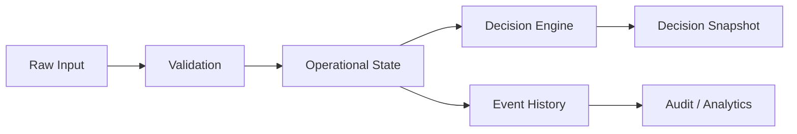

---

# 158. Operational State Lifecycle

Example for hospital resource:

```text
external/manual/simulation update
            ↓
validation
            ↓
hospital_resources
            ↓
resource_events
            ↓
decision engine
            ↓
notifications
```

---

# 159. Data Flow — Emergency

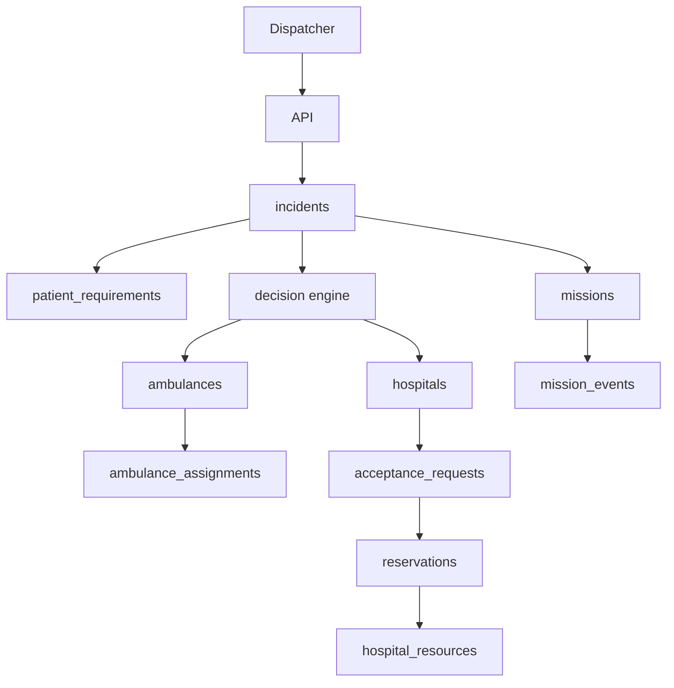

---

# 160. Data Flow — Live Tracking

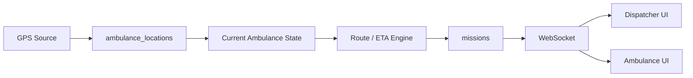

---

# 161. Data Flow — Hospital Resource Failure

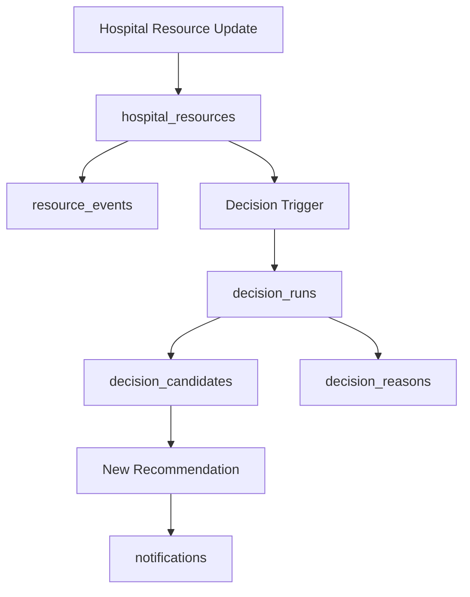

---

# 162. Current State Derivation

Where possible, state should have one authoritative source.

Example:

Reservation status:

```text
reservations.status
```

Resource availability:

```text
hospital_resources
```

Mission status:

```text
missions.status
```

Do not maintain multiple contradictory copies unless necessary for performance.

---

# 163. Materialized Views

Only consider materialized views when measured read performance requires them.

Potential future view:

```text
hospital_operational_summary
```

For MVP, normal views and indexed queries are sufficient.

---

# 164. Query Performance Requirements

High-frequency queries:

```text
available ambulances nearby
candidate hospitals nearby
hospital resource state
active mission state
active reservations
active alerts
```

These require appropriate indexes.

---

# 165. Spatial Query Performance

Use:

```text
GIST
```

indexes on geography columns.

Potential spatially indexed fields:

```text
incidents.location
ambulances.current_location
ambulance_locations.location
hospitals.location
routes.origin
routes.destination
```

Do not add spatial indexes to every geometry without need.

---

# 166. Database Monitoring

Monitor:

```text
connection count
query latency
slow queries
locks
deadlocks
transaction duration
disk usage
table growth
index usage
```

---

# 167. Reservation Monitoring

Monitor:

```text
reservation conflicts
reservation failures
reservation expiry rate
reservation duration
resource utilization
```

---

# 168. Data Freshness Monitoring

Monitor:

```text
hospital resource update age
ambulance GPS age
routing response age
```

Example operational metric:

```text
number of hospitals with stale resource data
```

---

# 169. Event Monitoring

Monitor:

```text
events per minute
failed event handling
duplicate event detection
out-of-order events
```

---

# 170. Data Integrity Checks

Periodic integrity queries can detect:

### Negative capacity

```sql
SELECT *
FROM hospital_resources
WHERE available_capacity < 0
   OR occupied_capacity < 0
   OR reserved_capacity < 0;
```

Expected:

```text
0 rows
```

### Invalid active reservations

Find reservations pointing to resources that cannot support them.

---

# 171. Orphan Detection

Check:

- assignments without incidents;
- reservations without resources;
- missions without ambulances;
- acceptance requests without incidents.

Foreign keys prevent most cases.

---

# 172. Data Reconciliation

Production integrations may report data inconsistencies.

The system should support:

```text
source value
+
last trusted value
+
reconciliation status
```

This is future scope unless external integrations are introduced.

---

# 173. External Provider Data

Do not store entire external provider responses unless required.

Prefer:

```text
normalized useful fields
+
provider metadata
+
raw response reference if needed
```

---

# 174. Routing Provider Data

Store:

```text
provider
route ID
distance
duration
traffic duration
geometry
timestamp
```

not necessarily the full provider response.

---

# 175. Hospital Integration Data

Production adapter may map external fields into:

```text
hospitals
hospital_capabilities
hospital_resources
acceptance_requests
```

External identifiers should be preserved.

Recommended fields:

```text
external_system
external_id
```

---

# 176. External ID Mapping

Potential future fields:

```text
hospitals.external_system
hospitals.external_id
```

This allows:

```text
Hospital H-003
↔
External HMIS ID 918273
```

without replacing the internal identifier.

---

# 177. Interoperability Extension

Future tables may include:

```text
integration_connections
integration_events
external_entities
```

Not required for MVP.

---

# 178. Data Contract for Hospital Feed

A normalized hospital resource payload should look like:

```json
{
  "hospital_external_id": "EXT-001",
  "resource_type": "ICU",
  "total_capacity": 10,
  "occupied_capacity": 8,
  "reserved_capacity": 1,
  "available_capacity": 1,
  "timestamp": "2026-09-12T12:30:00Z",
  "source": "HOSPITAL_SYSTEM",
  "confidence": "HIGH"
}
```

---

# 179. Data Contract for Ambulance GPS

```json
{
  "ambulance_external_id": "AMB-002",
  "latitude": 10.012,
  "longitude": 76.291,
  "speed_kph": 42.4,
  "heading": 91.5,
  "accuracy_m": 5.4,
  "timestamp": "2026-09-12T12:30:00Z"
}
```

---

# 180. Database API Boundary

The API layer should not expose database tables directly.

Use domain schemas.

Bad:

```text
GET /hospital_resources
```

as a direct database dump.

Better:

```text
GET /hospitals/H-003/resources
```

returning an operational resource model.

---

# 181. API Response Model Example

Hospital:

```json
{
  "id": "H-003",
  "name": "Hospital C",
  "status": "ACTIVE",
  "capabilities": {
    "trauma": true,
    "icu": true,
    "ventilator": true,
    "emergency_surgery": true
  },
  "resources": [
    {
      "type": "ICU",
      "available": 1,
      "status": "AVAILABLE",
      "updated_at": "..."
    }
  ]
}
```

---

# 182. Database Environment Separation

Use separate databases:

```text
smart_ambulance_dev
smart_ambulance_test
smart_ambulance_demo
smart_ambulance_prod
```

Never run demo reset commands against production.

---

# 183. Production Migration Safety

Before migration:

```text
backup
+
migration test
+
rollback plan
```

For destructive migrations:

```text
expand
→ migrate
→ switch
→ contract
```

---

# 184. Data Seeding Levels

## Level 1 — Static Master Data

- roles;
- capabilities;
- equipment types.

## Level 2 — Demo Operational Data

- hospitals;
- ambulances;
- resources.

## Level 3 — Scenario Data

- incidents;
- traffic events;
- failures.

---

# 185. Master Data Example

Capabilities:

```text
ALS
BLS
TRAUMA
ICU
VENTILATOR
EMERGENCY_SURGERY
```

Equipment:

```text
OXYGEN
VENTILATOR
DEFIBRILLATOR
TRAUMA_KIT
```

Resource types:

```text
ICU
EMERGENCY_BED
VENTILATOR
TRAUMA_TEAM
SURGICAL_TEAM
```

---

# 186. Database Documentation Requirements

The repository must include:

```text
database.md
ERD
migration files
seed scripts
schema diagrams
data dictionary
```

---

# 187. Data Dictionary

A formal data dictionary should eventually document:

```text
table
column
type
nullable
meaning
source
allowed values
example
```

This document serves as the initial data dictionary.

---

# 188. Database Versioning

Application releases should identify schema version.

Example:

```text
Application:
v0.1.0

Database:
schema-v14
```

Migration status endpoint may expose:

```text
database_schema_version
```

to administrators.

---

# 189. Transaction Isolation

Default PostgreSQL isolation may be sufficient for most operations.

For resource reservation:

- use row locking;
- keep transaction short;
- validate capacity inside transaction.

Do not hold locks while calling external APIs.

---

# 190. External API + DB Transaction Rule

Never do:

```text
BEGIN DATABASE TRANSACTION
→ call Google API
→ wait 2 seconds
→ call hospital API
→ commit
```

Instead:

```text
External data retrieval
        ↓
validated result
        ↓
short DB transaction
        ↓
commit
```

---

# 191. Reservation + Hospital Acceptance

Recommended sequence:

```text
1. Hospital accepts.
2. Backend revalidates current resources.
3. Transactionally reserve resource.
4. If reservation succeeds:
   case becomes confirmed.
5. If reservation fails:
   hospital may require re-evaluation.
```

This prevents accepting a resource based on stale capacity.

---

# 192. Acceptance/Reservation Atomicity

Depending on product policy, acceptance and reservation may be modeled as:

```text
ACCEPTED
→ RESOURCE_CONFIRMATION_PENDING
→ RESOURCE_CONFIRMED
```

rather than instantly assuming:

```text
ACCEPTED = READY
```

This is the safer MVP model.

---

# 193. Recommended Status Combination

Hospital destination state can be represented as:

```text
Acceptance:
CONFIRMED

Resource:
RESERVED

Readiness:
PREPARING
```

Only when preparation is complete:

```text
Readiness:
READY
```

This keeps three concepts distinct.

---

# 194. Hospital Readiness Table — Optional

If hospital preparation requires structured tracking, add:

```text
hospital_readiness
```

| Column | Type |
|---|---|
| id | UUID |
| incident_id | UUID |
| hospital_id | UUID |
| icu_ready | BOOLEAN |
| ventilator_ready | BOOLEAN |
| trauma_team_ready | BOOLEAN |
| surgery_ready | BOOLEAN |
| overall_status | VARCHAR(30) |
| updated_at | TIMESTAMPTZ |

This is optional but useful for the demo.

---

# 195. Readiness State

```text
NOT_STARTED
PREPARING
READY
BLOCKED
UNKNOWN
```

---

# 196. Handover Table — Optional

If detailed handover tracking is required:

```text
handover_records
```

Fields:

```text
id
mission_id
hospital_id
ambulance_id
handover_started_at
handover_completed_at
status
notes
completed_by
```

For the MVP, `mission_events` may be sufficient.

---

# 197. Incident Cancellation

When cancelled:

```text
incident.status = CANCELLED
```

Then:

- active assignment cancelled;
- pending acceptance cancelled;
- reservation released;
- mission cancelled;
- notifications generated;
- audit record created.

---

# 198. Mission Reassignment

If ambulance changes:

```text
old assignment
→ CANCELLED / SUPERSEDED

new assignment
→ ACTIVE
```

Do not simply overwrite the original assignment.

This preserves the history.

---

# 199. Hospital Reassignment

If hospital changes:

```text
old selection
→ SUPERSEDED

new selection
→ ACTIVE
```

Existing reservation must be:

```text
released
```

before replacement reservation is confirmed, unless an atomic swap strategy is used.

---

# 200. Atomic Hospital Resource Swap — Advanced

Future production workflow:

```text
reserve new resource
→ confirm new hospital
→ release old resource
```

This minimizes gaps.

However, it requires careful business rules and should not be attempted casually in the hackathon.

---

# 201. Decision History

The decision engine may run many times during a mission.

Example:

```text
Decision 1
Ambulance selection

Decision 2
Hospital selection

Decision 3
Traffic reroute

Decision 4
Hospital resource failure

Decision 5
New hospital selection
```

Every run should have a unique `decision_run_id`.

---

# 202. Recommendation Versioning

A recommendation should have:

```text
decision_run_id
algorithm_version
configuration_version
created_at
```

This makes later debugging possible.

---

# 203. Configuration Tables — Optional

If decision weights must be editable through Admin UI, use:

```text
decision_configurations
```

Example:

| Field | Value |
|---|---|
| version | config-v3 |
| ambulance_eta_weight | 0.45 |
| ambulance_capability_weight | 0.25 |
| hospital_eta_weight | 0.30 |
| hospital_acceptance_weight | 0.20 |

For the MVP, configuration can be file/env-based instead.

---

# 204. Feature Flags — Optional

Future table:

```text
feature_flags
```

Examples:

```text
VOICE_ENABLED
ETA_ML_ENABLED
CAPACITY_PREDICTION_ENABLED
ADVANCED_OPTIMIZATION_ENABLED
```

This allows risky features to be disabled.

---

# 205. Database Configuration Hierarchy

Recommended:

```text
environment defaults
        ↓
application configuration
        ↓
database configuration
        ↓
runtime feature flag
```

Do not allow arbitrary database users to change critical optimization policies.

---

# 206. Data Export

Admin may need:

```text
CSV
JSON
```

for:

- emergency history;
- decision traces;
- audit;
- demo results.

Exports must respect role permissions.

---

# 207. Export Audit

Every sensitive export should create:

```text
DATA_EXPORT
```

audit entry.

---

# 208. Demo Data Privacy

All demo data should be:

```text
fictional
synthetic
non-identifying
```

Do not import actual patient records into the hackathon database unless specifically authorized and appropriately protected.

---

# 209. Database Health Endpoint

Backend should expose:

```text
GET /health/db
```

checking:

- connectivity;
- migration version;
- simple query.

Do not expose database credentials or internal connection details.

---

# 210. Database Backup Test

A valid backup strategy is not:

> "We created a dump."

It is:

```text
backup created
→ backup restored
→ application connected
→ sample mission retrieved
```

Restore testing is mandatory before any production claim.

---

# 211. Disaster Recovery — Future

Production should define:

```text
RPO
RTO
backup frequency
restore process
failover architecture
```

These values require operational decisions and are intentionally not invented here.

---

# 212. Database Risk Register

| Risk | Severity | Mitigation |
|---|---|---|
| Double reservation | Critical | DB transaction + row lock |
| Stale hospital data | Critical | timestamp + confidence |
| Duplicate assignment | Critical | unique active-assignment constraint |
| Lost decision history | Major | immutable decision runs |
| Lost mission history | Major | event table |
| GPS table growth | Major | retention/partitioning |
| External ID mismatch | Major | provider mapping |
| Incorrect coordinate order | Major | validation/tests |
| Migration failure | Major | versioned migrations |
| Demo reset on wrong DB | Critical | environment guards |
| Sensitive data leakage | Critical | synthetic demo data + RBAC |

---

# 213. Database Acceptance Tests

## Test DB-001

Create incident.

Expected:

```text
incident exists
patient requirements exists
```

---

## Test DB-002

Assign ambulance.

Expected:

```text
assignment exists
ambulance state updated
mission event exists
audit exists where applicable
```

---

## Test DB-003

Reserve one ICU.

Expected:

```text
available decreases
reserved increases
reservation exists
resource event exists
```

---

## Test DB-004

Attempt second ICU reservation when capacity is zero.

Expected:

```text
transaction fails
resource unchanged
reservation not created
```

---

## Test DB-005

Hospital rejects.

Expected:

```text
acceptance request = REJECTED
mission event = HOSPITAL_REJECTED
hospital excluded from active recommendation
```

---

## Test DB-006

ICU resource becomes unavailable.

Expected:

```text
resource state updated
resource event created
existing reservation invalidated/reassessed
decision run created
notification generated
```

---

# 214. Full Golden-Path Database Test

Starting state:

```text
INC-001
No ambulance assigned
No hospital
No reservation
```

Sequence:

```text
create incident
→ create requirements
→ assign ambulance
→ create mission
→ calculate route
→ request hospital
→ hospital accepts
→ reserve ICU
→ mission begins
→ mission arrival
→ handover
→ complete
```

Expected final state:

```text
incident = COMPLETED
ambulance = AVAILABLE
hospital = ACTIVE
reservation = RELEASED/IN_USE according to workflow
mission = COMPLETED
events = complete timeline
audit = present
```

---

# 215. Critical-Path Database Test

Scenario:

```text
hospital accepted
+
ICU reserved
+
ICU lost
```

Expected:

```text
resource available = 0
reservation invalid/released
decision rerun
alternative hospital selected
new resource reserved
```

No orphaned reservation may remain.

---

# 216. Database Folder Structure

Recommended:

```text
backend/
└── app/
    └── db/
        ├── session.py
        ├── base.py
        ├── models/
        │   ├── user.py
        │   ├── role.py
        │   ├── incident.py
        │   ├── patient_requirement.py
        │   ├── ambulance.py
        │   ├── hospital.py
        │   ├── resource.py
        │   ├── acceptance.py
        │   ├── reservation.py
        │   ├── mission.py
        │   ├── route.py
        │   ├── decision.py
        │   ├── notification.py
        │   ├── audit.py
        │   └── simulation.py
        │
        └── migrations/
            ├── versions/
            └── env.py

data/
├── seed/
│   ├── users.json
│   ├── ambulances.json
│   ├── hospitals.json
│   ├── resources.json
│   └── scenarios/
```

---

# 217. ORM Strategy

Recommended:

**SQLAlchemy**

Use:

- declarative models;
- relationships;
- explicit transaction boundaries;
- migrations through Alembic.

Avoid automatically exposing ORM objects directly as API responses.

Use API schemas/DTOs.

---

# 218. Repository Layer

Recommended:

```text
repositories/
├── incident_repository.py
├── ambulance_repository.py
├── hospital_repository.py
├── resource_repository.py
├── reservation_repository.py
├── mission_repository.py
└── decision_repository.py
```

The repository layer should handle:

- database queries;
- transactions where appropriate;
- persistence.

Business decisions belong in services/domain logic.

---

# 219. Service Layer

Recommended:

```text
services/
├── incident_service.py
├── dispatch_service.py
├── routing_service.py
├── hospital_service.py
├── acceptance_service.py
├── reservation_service.py
├── mission_service.py
└── reassessment_service.py
```

---

# 220. Database and Decision Engine Boundary

The decision engine should read normalized state.

It should not know database implementation details.

Example:

```python
candidate_hospitals = hospital_repository.find_candidates(...)
```

rather than:

```python
session.execute("SELECT ...")
```

inside the optimization algorithm.

---

# 221. Database and ML Boundary

ML services should receive:

```text
feature objects
```

rather than direct ORM entities.

Example:

```python
eta_features = {
    "distance_m": 7200,
    "traffic_level": 0.72,
    "hour": 17
}
```

---

# 222. Database and Routing Boundary

Routing provider returns normalized:

```text
RouteResult
```

containing:

```text
distance
duration
traffic_duration
geometry
provider
timestamp
confidence
```

This normalized result may be persisted to `routes`.

---

# 223. Data Flow for Ambulance Matching

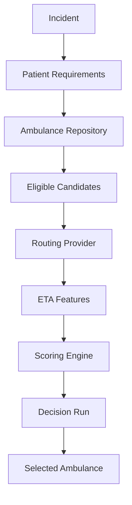

---

# 224. Data Flow for Hospital Matching

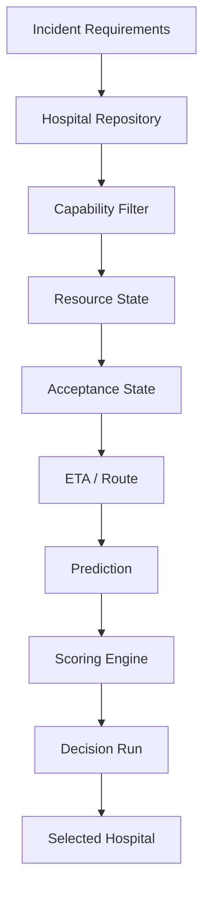

---

# 225. Data Flow for Reservation

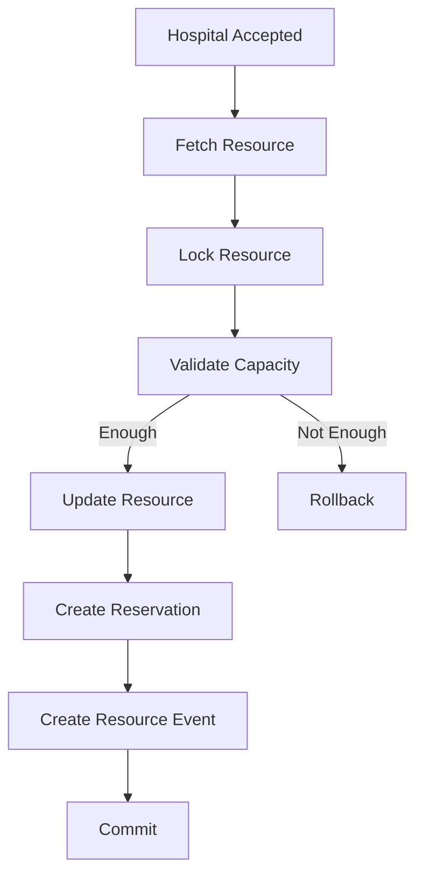

---

# 226. Data Flow for Reassessment

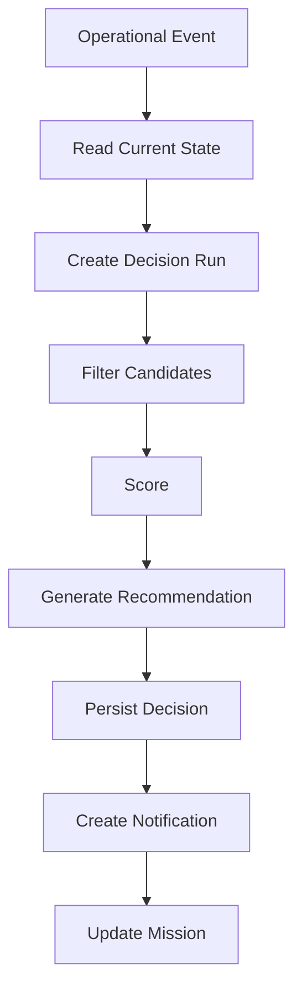

---

# 227. Data Consistency Rules

The database must maintain consistency between:

```text
ambulance_assignments
missions
ambulances.status
```

and:

```text
acceptance_requests
reservations
hospital_resources
```

The service layer should update related states transactionally where practical.

---

# 228. Example Ambulance Consistency

If mission is:

```text
EN_ROUTE_TO_HOSPITAL
```

then the ambulance should not be:

```text
AVAILABLE
```

unless an explicit operational exception exists.

---

# 229. Example Hospital Consistency

If a confirmed reservation exists:

```text
hospital_resources.reserved_capacity
```

must reflect the reservation.

---

# 230. Reconciliation Job — Future

A periodic job can detect inconsistent states.

Example:

```text
Reservation says CONFIRMED
but resource.reserved_capacity does not include it
```

The system should flag:

```text
DATA_INCONSISTENCY
```

for operator investigation.

---

# 231. Idempotent Event Processing

Events such as:

```text
RESOURCE_LOST
HOSPITAL_REJECTED
AMBULANCE_FAILURE
```

may be delivered more than once.

Use:

```text
event_id
```

to ensure handlers can detect duplicates.

---

# 232. Event Deduplication

Maintain:

```text
processed_events
```

or use event IDs in event-processing infrastructure.

For MVP, handler-level idempotency may be enough.

---

# 233. Ordering

Events can arrive out of order.

Example:

```text
ETA_UPDATED
```

arrives after:

```text
MISSION_COMPLETED
```

Handlers must reject or ignore events that no longer apply.

---

# 234. Event Validity

Each event should include:

```text
event_id
entity_id
entity_version
created_at
source
```

This helps prevent stale-event corruption.

---

# 235. Database Clock

Use server-side timestamps:

```sql
NOW()
```

for authoritative state changes.

Do not trust client timestamps for security-sensitive auditing.

---

# 236. Demo Clock

Simulation may use a virtual clock.

Store:

```text
simulation_time
real_time
```

separately if required.

For the MVP, a scenario engine may simply use delays.

---

# 237. Demo Speed

Allow:

```text
1x
2x
5x
10x
```

scenario speed.

This is useful for presentation.

---

# 238. Demo Reset Safety

Demo reset must verify:

```text
APP_ENV != production
```

before destructive operations.

Recommended:

```python
if settings.environment == "production":
    raise RuntimeError("Demo reset disabled in production")
```

---

# 239. Data Seeding Order

Seed in this order:

```text
1. Roles
2. Users
3. Capabilities
4. Equipment
5. Hospitals
6. Hospital capabilities
7. Hospital resources
8. Ambulances
9. Ambulance equipment
10. Demo scenarios
```

Incidents/missions are created during scenarios.

---

# 240. Database Migration Order

Recommended conceptual order:

```text
001 extensions
002 identity
003 master data
004 incidents
005 ambulances
006 hospitals
007 resources
008 acceptance
009 reservations
010 missions
011 routing
012 decisions
013 notifications
014 audit
015 simulation
016 ML metadata
```

---

# 241. PostgreSQL Extensions

Potential required extension:

```sql
CREATE EXTENSION IF NOT EXISTS postgis;
```

UUID generation may use:

```sql
CREATE EXTENSION IF NOT EXISTS pgcrypto;
```

Exact extension choice depends on the deployment environment.

---

# 242. Initial Database Setup

Example:

```bash
createdb smart_ambulance
psql smart_ambulance -c "CREATE EXTENSION postgis;"
```

Then:

```bash
alembic upgrade head
```

Then:

```bash
python scripts/seed.py
```

---

# 243. Local Docker Setup

Conceptually:

```yaml
services:
  postgres:
    image: postgis/postgis
    environment:
      POSTGRES_DB: smart_ambulance
      POSTGRES_USER: app
      POSTGRES_PASSWORD: change-me
    ports:
      - "5432:5432"
```

Production credentials must never use values from example configuration.

---

# 244. Environment Variables

Example:

```env
DATABASE_URL=postgresql+asyncpg://...
DATABASE_SCHEMA_VERSION=...

DEMO_MODE=true
```

Optional:

```env
DATABASE_POOL_SIZE=10
DATABASE_MAX_OVERFLOW=20
```

Exact values should be load-tested.

---

# 245. Connection Pooling

Use connection pooling.

Development:

```text
small pool
```

Production:

```text
load-tested pool
```

Avoid creating a new database connection for every request.

---

# 246. Long-Running Queries

Avoid running:

- model training;
- large analytics;
- external API requests

inside a database transaction.

---

# 247. Analytics Query Isolation

Heavy analytics queries should not impact emergency operational queries.

Future production options:

- replica;
- separate analytics database;
- warehouse.

Not required for MVP.

---

# 248. Search Strategy

For frequently searched fields:

```text
incident_code
ambulance_code
hospital_code
email
```

use B-tree indexes.

For location:

```text
GIST
```

---

# 249. Full Text Search

Not required for MVP.

If needed later, use PostgreSQL full-text search for:

- hospital name;
- addresses;
- operational notes.

Do not add Elasticsearch unless actual scale requires it.

---

# 250. Database Performance Baseline

Before presentation, measure:

```text
incident creation
ambulance candidate query
hospital candidate query
reservation transaction
decision persistence
mission event insertion
```

Report actual measurements.

Do not claim performance figures in the presentation unless measured.

---

# 251. Data Retention for GPS

For MVP:

- retain scenario GPS history.

For production:

- define a retention policy;
- consider downsampling;
- partition by time;
- archive old data.

---

# 252. Data Retention for Audit

Critical audit records should be retained according to operational/legal requirements.

Exact production retention period remains a decision requiring policy.

---

# 253. Database Disaster Scenario

If database becomes unavailable:

```text
Application
→ read-only/cached operational state where safe
→ alert dispatcher
→ manual fallback
```

Do not attempt to fabricate updated resource availability.

---

# 254. Read-Only Degradation

Potential safe degraded mode:

```text
view last known mission
view last confirmed destination
view last confirmed resource
```

but disable:

```text
new reservations
critical state mutations
```

if consistency cannot be guaranteed.

---

# 255. Database Failure Alert

Example:

```text
🔴 DATABASE CONNECTION FAILURE

Live state updates may be unavailable.

Last confirmed mission state:
12:31:20

Recommended:
Continue manual coordination.
```

---

# 256. Security Audit Fields

For sensitive operations, record:

```text
actor
role
action
target
timestamp
before
after
reason
```

---

# 257. Data Access Boundaries

Hospital users should not automatically see:

- other hospitals' internal resource details;
- unrelated patient incidents;
- full ambulance fleet operational details.

Dispatchers may have broader visibility depending on deployment policy.

---

# 258. Hospital Data Isolation

At minimum:

```text
hospital user
→ own hospital data
```

except explicitly shared emergency information.

---

# 259. Ambulance Data Isolation

An ambulance user should primarily access:

```text
own ambulance
own mission
assigned patient requirements
destination information
```

not the entire fleet's sensitive state.

---

# 260. Dispatcher Data Access

Dispatcher may access:

```text
active emergencies
ambulances
hospitals
resources
missions
decision traces
```

subject to deployment policy.

---

# 261. Database Test Dataset

Automated tests should include:

### Ambulances

- fully suitable;
- partially suitable;
- unavailable;
- stale GPS.

### Hospitals

- fully suitable;
- missing ICU;
- missing trauma;
- stale resource;
- rejecting;
- accepting.

### Resources

- available;
- zero;
- reserved;
- concurrent reservation.

---

# 262. Required Negative Tests

Test:

```text
negative capacity
unknown hospital
invalid ambulance
duplicate assignment
duplicate reservation
invalid state transition
stale event
unauthorized update
```

---

# 263. State Transition Validation

Prefer explicit transition functions.

Example:

```python
ALLOWED_TRANSITIONS = {
    "AVAILABLE": {"HELD"},
    "HELD": {"CONFIRMED", "EXPIRED"},
    "CONFIRMED": {"IN_USE", "RELEASED"}
}
```

Do not permit arbitrary status updates from the API.

---

# 264. Hospital Resource State Transition

Example:

```text
AVAILABLE
→ HELD
→ CONFIRMED
→ IN_USE
→ RELEASED
```

Failure:

```text
CONFIRMED
→ UNAVAILABLE
```

This should create a critical event.

---

# 265. Ambulance State Transition

Example:

```text
AVAILABLE
→ RESERVED
→ DISPATCHED
→ EN_ROUTE_TO_PATIENT
→ ON_SCENE
→ PATIENT_ON_BOARD
→ EN_ROUTE_TO_HOSPITAL
→ ARRIVED
→ HANDOVER
→ AVAILABLE
```

---

# 266. Acceptance State Transition

```text
PENDING
→ ACCEPTED
```

or:

```text
PENDING
→ REJECTED
```

or:

```text
PENDING
→ EXPIRED
```

---

# 267. Incident-to-Mission Relationship

One incident may have:

```text
multiple assignment attempts
multiple decision runs
multiple route versions
multiple acceptance requests
multiple reservations
one active mission
```

This should be reflected in the schema.

---

# 268. Mission Version History

When mission destination changes:

Do not overwrite all historical values.

Instead:

```text
missions.selected_hospital_id
```

stores current state.

Historical destination changes are recorded in:

```text
mission_events
decision_runs
routes
```

---

# 269. Current Recommendation

The latest decision can be determined by:

```text
latest decision_run
```

rather than storing multiple competing "current" recommendations.

A cached field may be added later for performance.

---

# 270. Decision Cache — Optional

Future:

```text
incident_current_decision
```

or Redis cache.

MVP can query latest `decision_run`.

---

# 271. Database Relationship Summary

```text
USERS
  ↓
INCIDENTS
  ↓
PATIENT_REQUIREMENTS
  ↓
AMBULANCE_ASSIGNMENTS
  ↓
MISSIONS
  ↓
ROUTES
  ↓
HOSPITAL SELECTION
  ↓
ACCEPTANCE_REQUESTS
  ↓
RESERVATIONS
  ↓
HOSPITAL_RESOURCES
  ↓
MISSION_EVENTS
```

Parallel intelligence:

```text
DECISION_RUNS
    ↓
DECISION_CANDIDATES
    ↓
DECISION_REASONS

MODEL_REGISTRY
    ↓
PREDICTION_RECORDS
```

Audit:

```text
AUDIT_LOGS
```

cuts across all domains.

---

# 272. Minimal MVP Tables

If development time becomes very limited, the absolute minimum schema is:

```text
users
roles
user_roles

incidents
patient_requirements

ambulances
ambulance_equipment

hospitals
hospital_resources

ambulance_assignments
acceptance_requests
reservations
missions
mission_events

routes

decision_runs
decision_candidates

audit_logs
```

Everything else can be added incrementally.

---

# 273. Recommended Full MVP Tables

For the intended prototype:

```text
users
roles
user_roles

incidents
patient_requirements

ambulances
equipment
ambulance_equipment
ambulance_locations
ambulance_assignments

hospitals
capabilities
hospital_capabilities
hospital_resources
resource_events

acceptance_requests
reservations

missions
mission_events

routes
route_alternatives

decision_runs
decision_candidates
decision_reasons

prediction_records
model_registry

notifications
audit_logs

simulation_scenarios
simulation_events
```

---

# 274. Database Implementation Priority

## P0 — Build First

```text
users
roles
incidents
patient_requirements
ambulances
hospitals
hospital_resources
ambulance_assignments
acceptance_requests
reservations
missions
mission_events
routes
decision_runs
audit_logs
```

## P1

```text
ambulance_locations
decision_candidates
decision_reasons
notifications
resource_events
simulation_scenarios
simulation_events
```

## P2

```text
prediction_records
model_registry
advanced analytics
integration metadata
```

---

# 275. Database Definition of Done

Database implementation is complete when:

- [ ] PostgreSQL/PostGIS is running.
- [ ] All P0 tables exist.
- [ ] Migrations are reproducible.
- [ ] Foreign keys are enforced.
- [ ] Core indexes exist.
- [ ] Spatial indexes exist.
- [ ] Resource constraints work.
- [ ] Reservations are transactional.
- [ ] Duplicate active ambulance assignments are prevented.
- [ ] Mission events are append-only.
- [ ] Decision traces are stored.
- [ ] Audit logs are stored.
- [ ] Demo seed data can be generated.
- [ ] Demo reset is protected from production.
- [ ] Full emergency scenario passes.
- [ ] Reservation concurrency test passes.
- [ ] ICU failure scenario passes.
- [ ] Hospital rejection scenario passes.
- [ ] Ambulance failure scenario passes.
- [ ] Backup/restore has been tested for the deployed environment.

---

# 276. Final Canonical Schema

```text
IDENTITY
├── users
├── roles
└── user_roles

EMERGENCY
├── incidents
└── patient_requirements

AMBULANCE
├── ambulances
├── equipment
├── ambulance_equipment
├── ambulance_locations
└── ambulance_assignments

HOSPITAL
├── hospitals
├── capabilities
├── hospital_capabilities
├── hospital_resources
└── resource_events

COORDINATION
├── acceptance_requests
├── reservations
├── missions
└── mission_events

ROUTING
├── routes
└── route_alternatives

INTELLIGENCE
├── decision_runs
├── decision_candidates
├── decision_reasons
├── prediction_records
└── model_registry

COMMUNICATION
└── notifications

GOVERNANCE
└── audit_logs

SIMULATION
├── simulation_scenarios
└── simulation_events
```

---

# 277. Final Database Architecture

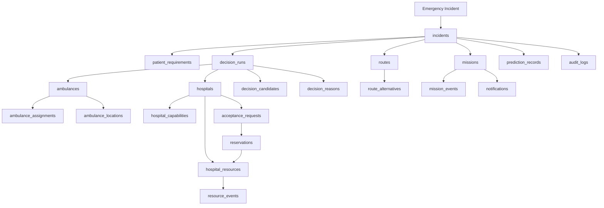

---

# 278. Final Database Principle

The database must represent the emergency journey accurately.

It must answer at any moment:

```text
WHAT EMERGENCY IS ACTIVE?
        ↓
WHAT DOES THE PATIENT REQUIRE?
        ↓
WHICH AMBULANCE IS ASSIGNED?
        ↓
WHERE IS IT?
        ↓
WHICH ROUTE IS ACTIVE?
        ↓
WHICH HOSPITAL IS SELECTED?
        ↓
HAS THE HOSPITAL ACCEPTED?
        ↓
WHAT RESOURCE IS RESERVED?
        ↓
IS THE RESOURCE STILL AVAILABLE?
        ↓
IS THE HOSPITAL READY?
        ↓
WHAT HAS CHANGED?
        ↓
WHY DID THE SYSTEM CHANGE ITS DECISION?
```

---

# 279. Final Database Rule

> **The database must never only store "what is true now." It must also preserve enough information to explain how the system got there.**

Therefore the architecture deliberately combines:

```text
CURRENT STATE
+
EVENT HISTORY
+
DECISION TRACE
+
DATA PROVENANCE
+
AUDIT HISTORY
```

This is essential because the project's core decisions are dynamic and potentially high-impact.

---

# 280. Final Data Integrity Rule

The most important database invariant is:

> **The system must never represent an operational state that contradicts its own resource, assignment, acceptance, or reservation records.**

Examples:

```text
Available ambulance
≠
simultaneously active on another emergency
```

```text
One ICU slot
≠
two confirmed reservations
```

```text
Hospital rejected
≠
still confirmed as destination
```

```text
ICU unavailable
≠
active confirmed ICU reservation without reassessment
```

```text
Unknown resource
≠
confirmed available resource
```

---

# 281. Final Database Success Condition

The database implementation succeeds when a complete emergency can be reconstructed from the stored data:

```text
INCIDENT
  ↓
PATIENT REQUIREMENTS
  ↓
AMBULANCE CANDIDATES
  ↓
AMBULANCE ASSIGNMENT
  ↓
ROUTE
  ↓
HOSPITAL CANDIDATES
  ↓
DECISION
  ↓
ACCEPTANCE
  ↓
RESOURCE RESERVATION
  ↓
MISSION
  ↓
LIVE EVENTS
  ↓
REASSESSMENT
  ↓
NEW DECISION
  ↓
ARRIVAL
  ↓
HANDOVER
  ↓
COMPLETION
```

At every important point, the system should be able to answer:

> **What happened?**

> **When did it happen?**

> **Who/what caused it?**

> **What information was available at the time?**

> **Why did the system make that decision?**

> **What changed afterward?**

That traceability is the database-level foundation of a technically credible, explainable, and judge-resistant emergency coordination platform.