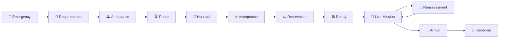

# Smart Ambulance Routing & Emergency Bed Allocation System

# `design.md`

> Master UI/UX and visual design specification for the Smart Ambulance Routing & Emergency Bed Allocation System.

---

# 1. Design Document Purpose

This document defines the visual and interaction design system for the application.

It is intended to be used directly by:

- UI/UX designers;
- frontend developers;
- component developers;
- design-system implementers;
- presentation/demo teams;
- accessibility reviewers.

This document defines:

- product visual identity;
- design principles;
- information hierarchy;
- color system;
- typography;
- spacing;
- layout;
- navigation;
- dashboard design;
- map design;
- emergency interfaces;
- ambulance interface;
- hospital interface;
- alerts;
- status indicators;
- forms;
- tables;
- cards;
- timelines;
- responsive layouts;
- mobile behavior;
- loading states;
- empty states;
- error states;
- accessibility;
- interaction patterns;
- animation;
- demo mode styling.

The design must communicate **emergency intelligence and operational clarity**, not a generic healthcare dashboard.

---

# 2. Core Design Philosophy

The design should follow five principles:

```text
CLARITY
    +
SPEED
    +
TRUST
    +
CONTROL
    +
CONTEXT
```

## 2.1 Clarity

A dispatcher must immediately understand:

- what is happening;
- which emergency is active;
- which ambulance is responding;
- which hospital is selected;
- whether the hospital accepted;
- whether the resource is reserved;
- whether anything requires intervention.

## 2.2 Speed

Critical information must be visible without navigating through multiple screens.

## 2.3 Trust

The interface must clearly distinguish:

- confirmed information;
- predicted information;
- simulated information;
- stale information;
- unknown information.

## 2.4 Control

The dispatcher remains in control.

AI recommendations are recommendations, not unexplained autonomous actions.

## 2.5 Context

Every status should be displayed with enough context to make it actionable.

Bad:

```text
ICU: 1
```

Better:

```text
ICU
1 available
Updated 18 sec ago
Confirmed
```

---

# 3. Primary Visual Concept

The product should visually communicate:

> **Emergency Command Center + Intelligent Coordination + Live Geospatial Operations**

The visual language should feel closer to:

- emergency command software;
- aviation/mission control;
- modern logistics platforms;
- high-reliability operations dashboards;

than to:

- hospital appointment software;
- generic admin dashboards;
- consumer healthcare apps.

---

# 4. Visual Personality

## Desired

- professional;
- calm;
- precise;
- operational;
- trustworthy;
- modern;
- technically sophisticated;
- highly readable.

## Avoid

- overly futuristic;
- neon cyberpunk;
- excessive gradients;
- gaming-style UI;
- unnecessary glassmorphism;
- decorative 3D objects;
- excessive animations;
- medical clip-art;
- generic SaaS dashboard appearance.

---

# 5. Brand Direction

## Suggested Product Identity

### Product name

**Smart Emergency Coordination**

Full name:

**Smart Ambulance Routing & Emergency Bed Allocation System**

Short UI name:

**Emergency Command**

This keeps the visible UI compact while preserving the full project name in documentation/presentation.

---

# 6. Visual Design Direction

Recommended visual language:

```text
Dark operational shell
+
Light/neutral information surfaces
+
Strong emergency accents
+
High-contrast maps
+
Clear status semantics
```

The application can use a predominantly dark command-center environment on dispatcher screens while ambulance and hospital operational screens may use lighter surfaces for readability.

---

# 7. Color System

The exact color palette can be adjusted during implementation, but semantic meanings must remain consistent.

## 7.1 Primary

```text
Primary Blue
#2563EB
```

Purpose:

- navigation;
- interactive controls;
- selected states;
- active route;
- primary CTA.

## 7.2 Deep Navy

```text
#0F172A
```

Purpose:

- application shell;
- command-center header;
- high-level chrome;
- map overlay panels.

## 7.3 Surface

```text
#FFFFFF
```

Purpose:

- cards;
- forms;
- data panels.

## 7.4 Neutral Background

```text
#F8FAFC
```

Purpose:

- page background;
- non-critical information areas.

## 7.5 Critical Red

```text
#DC2626
```

Purpose:

- critical emergency;
- resource failure;
- urgent alerts;
- severe operational failures.

## 7.6 Warning Amber

```text
#D97706
```

Purpose:

- pending;
- stale data;
- caution;
- moderate risk.

## 7.7 Success Green

```text
#16A34A
```

Purpose:

- confirmed;
- available;
- accepted;
- reserved;
- ready.

## 7.8 Info Cyan/Blue

```text
#0891B2
```

Purpose:

- system information;
- ETA;
- informational events.

---

# 8. Semantic Color Rules

Color must never be the only indicator.

| Meaning | Color | Text/Icon |
|---|---|---|
| Ready | Green | READY |
| Confirmed | Green | CONFIRMED |
| Active | Blue | ACTIVE |
| Pending | Amber | PENDING |
| Warning | Amber | WARNING |
| Critical | Red | CRITICAL |
| Failed | Red | FAILED |
| Unknown | Gray | UNKNOWN |
| Stale | Amber/Gray | STALE |
| Unavailable | Red/Gray | UNAVAILABLE |

Example:

```text
🟢 CONFIRMED
🟡 PENDING
🔴 CRITICAL
⚪ UNKNOWN
```

---

# 9. Map Color Semantics

Map elements require separate semantic treatment.

## Ambulance

```text
Blue / high-visibility marker
```

## Selected ambulance

```text
Bright blue + halo
```

## Emergency location

```text
Red marker
```

## Selected hospital

```text
Green marker + halo
```

## Alternative hospital

```text
Gray/blue marker
```

## Critical hospital/resource failure

```text
Red marker
```

## Route

Selected:

```text
Primary blue
```

Alternative:

```text
Muted gray/blue
```

Traffic:

```text
Normal → neutral
Moderate → amber
Heavy → red
```

Do not make the map visually noisy.

---

# 10. Typography

Recommended:

## Heading Typeface

**Manrope**

Use for:

- page titles;
- section headings;
- large metrics;
- emergency labels;
- CTA text.

## Body Typeface

**Inter**

Use for:

- forms;
- labels;
- table data;
- descriptions;
- operational information.

This gives the interface a technical but approachable character.

---

# 11. Typography Scale

| Element | Size | Weight |
|---|---:|---:|
| Display | 32–40px | 700 |
| H1 | 28–32px | 700 |
| H2 | 22–24px | 700 |
| H3 | 18–20px | 650 |
| Body Large | 16px | 500 |
| Body | 14–15px | 400–500 |
| Small | 12–13px | 400–500 |
| Caption | 11–12px | 500 |

Emergency values such as:

```text
08:32
CRITICAL
1 ICU
```

can use larger typography.

---

# 12. Typography Rules

Do not use:

- excessive all-caps text;
- tiny dashboard labels;
- multiple competing heading sizes;
- decorative fonts.

Use uppercase primarily for:

- status labels;
- small system labels;
- operational categories.

Example:

```text
STATUS

CRITICAL
```

rather than an entire paragraph in uppercase.

---

# 13. Spacing System

Use a 4px base scale.

```text
4
8
12
16
20
24
32
40
48
64
```

Primary spacing:

```text
Card padding:
20–24px

Section spacing:
24–32px

Page margin:
24–32px

Compact controls:
8–12px
```

Avoid arbitrary spacing values.

---

# 14. Border Radius

Recommended:

```text
Small controls: 8px
Cards: 12px
Major panels: 14px
Modal: 16px
Pills: 999px
```

Do not use extremely rounded "mobile app" cards throughout the command center.

---

# 15. Shadows

Use subtle shadows only.

Recommended:

```text
0 2px 8px rgba(...)
```

Avoid:

- heavy shadows;
- glowing cards;
- excessive elevation.

Hierarchy should primarily come from:

- spacing;
- typography;
- contrast;
- borders;
- placement.

---

# 16. Borders

Default:

```text
1px solid neutral
```

Critical state:

```text
1px solid critical
```

Selected state:

```text
2px solid primary
```

Do not use thick borders everywhere.

---

# 17. Application Shell

Desktop:

```text
┌─────────────────────────────────────────────────────────────┐
│ Top Bar                                                      │
├─────────────┬───────────────────────────────────────────────┤
│ Sidebar     │ Main Content                                  │
│             │                                               │
│             │                                               │
│             │                                               │
└─────────────┴───────────────────────────────────────────────┘
```

---

# 18. Dispatcher Layout

Recommended width structure:

```text
Sidebar:
240–260px

Main:
Flexible

Right context panel:
360–420px
```

Example:

```text
┌─────────────┬──────────────────────────────┬─────────────────┐
│             │                              │                 │
│ Navigation  │          LIVE MAP            │ Incident Panel  │
│             │                              │                 │
│             │                              │                 │
│             │                              │                 │
├─────────────┴──────────────────────────────┴─────────────────┤
│                      Mission Timeline                         │
└──────────────────────────────────────────────────────────────┘
```

---

# 19. Sidebar

## Primary Sections

```text
COMMAND CENTER

Overview

OPERATIONS
Emergencies
Live Missions
Ambulances
Hospitals

MONITORING
Alerts
History

SYSTEM
Settings
```

The sidebar should highlight the active section.

---

# 20. Sidebar Behaviour

Collapsed desktop state:

```text
Icon only
```

Expanded:

```text
Icon + label
```

Mobile:

```text
Drawer
```

Do not permanently consume mobile width.

---

# 21. Top Bar

Display:

```text
Product name
System health
Demo/Live status
Active emergency count
User profile
```

Example:

```text
┌─────────────────────────────────────────────────────────────┐
│ EMERGENCY COMMAND     ● SYSTEM HEALTHY     DEMO MODE       │
│                                      Dispatcher ▾            │
└─────────────────────────────────────────────────────────────┘
```

---

# 22. System Health Indicator

Always visible.

```text
🟢 SYSTEM HEALTHY
```

Click:

```text
SYSTEM STATUS

Database        ✓
Routing         ✓
Decision Engine ✓
WebSocket       ✓
ML              ⚠
Voice           ✓
```

---

# 23. Demo Mode Indicator

Because the project uses simulated emergency/hospital data for the hackathon, the UI must visibly label it.

Recommended:

```text
DEMO MODE
```

and where necessary:

```text
SIMULATED HOSPITAL DATA
```

This must not be hidden behind a settings page.

---

# 24. Dispatcher Dashboard Hierarchy

Priority:

```text
1. Critical alerts
2. Active emergency
3. Current decision
4. Map
5. Hospital/ambulance state
6. Timeline
7. Secondary metrics
```

The screen should never give equal visual weight to everything.

---

# 25. Dispatcher Dashboard Layout

```text
┌──────────────────────────────────────────────────────────────┐
│ Header                                                        │
├──────────────────────────────────────────────────────────────┤
│ CRITICAL ALERTS                                               │
├───────────────────────────────┬────────────────────────────────┤
│                               │ ACTIVE EMERGENCY                │
│                               │                                 │
│            MAP                │ Incident                        │
│                               │ Patient requirements             │
│                               │ Ambulance                        │
│                               │ Hospital                         │
│                               │ Resource                        │
├───────────────────────────────┴────────────────────────────────┤
│ TIMELINE / EVENTS                                              │
└──────────────────────────────────────────────────────────────┘
```

---

# 26. Active Emergency Card

The active emergency card is the most important information panel.

```text
┌────────────────────────────────────┐
│ 🔴 CRITICAL  #INC-001              │
│ Road Traffic Trauma                │
├────────────────────────────────────┤
│ Requirements                       │
│ ✓ ICU                              │
│ ✓ Trauma                           │
│ ✓ Ventilator                       │
│ ✓ Surgery                          │
├────────────────────────────────────┤
│ AMBULANCE B                        │
│ ETA 07 min                         │
│ ALS + Ventilator                   │
├────────────────────────────────────┤
│ HOSPITAL C                         │
│ ETA 10 min                         │
│ Accepted ✓                         │
│ ICU Reserved ✓                     │
└────────────────────────────────────┘
```

---

# 27. Emergency Severity Indicator

Large severity badge:

```text
CRITICAL
```

Use:

```text
CRITICAL
HIGH
MEDIUM
LOW
```

The severity badge should be visible in:

- emergency list;
- emergency detail;
- alert center;
- mobile mission view.

---

# 28. Emergency List

Recommended structure:

```text
┌──────────────────────────────────────────────────────────────┐
│ ACTIVE EMERGENCIES                                            │
├────────┬───────────┬────────────┬──────────┬───────────────┤
│ ID     │ Severity  │ Type       │ Ambulance│ Hospital      │
├────────┼───────────┼────────────┼──────────┼───────────────┤
│ INC001 │ CRITICAL  │ TRAUMA     │ B        │ C ✓           │
│ INC002 │ HIGH      │ CARDIAC    │ D        │ E pending     │
│ INC003 │ MEDIUM    │ RESP       │ A        │ F             │
└────────┴───────────┴────────────┴──────────┴───────────────┘
```

Critical rows should visually stand out without overpowering the entire page.

---

# 29. Emergency Creation UI

The creation form should be short and operational.

Use sections:

```text
Incident
Location
Severity
Patient Requirements
Review
```

Avoid huge single-page forms.

---

# 30. Stepper

Recommended:

```text
1 Incident
   ↓
2 Requirements
   ↓
3 Review
   ↓
4 Dispatch
```

Current step:

```text
●
```

Completed:

```text
✓
```

Future:

```text
○
```

---

# 31. Form Design Rules

Inputs should include:

- visible labels;
- helper text where necessary;
- error state;
- keyboard support;
- clear required indicator.

Bad:

```text
[________________]
```

Better:

```text
Incident Type *
[ Road Traffic Trauma ▾ ]
```

---

# 32. Critical Action Buttons

Examples:

```text
CREATE EMERGENCY
ASSIGN AMBULANCE
SELECT HOSPITAL
ACCEPT CASE
RESERVE RESOURCE
REROUTE
```

Critical destructive actions:

```text
REJECT
CANCEL
RELEASE RESERVATION
```

should require explicit confirmation where appropriate.

---

# 33. Primary Button Style

Primary CTA:

```text
Blue background
White text
Medium/high emphasis
```

Example:

```text
┌──────────────────────┐
│   ASSIGN AMBULANCE   │
└──────────────────────┘
```

---

# 34. Critical Button

Critical action:

```text
Red background
White text
```

Use sparingly.

Example:

```text
[ REJECT CASE ]
```

---

# 35. Secondary Button

Use for:

- cancel;
- back;
- alternative;
- view details.

```text
Outlined / low emphasis
```

---

# 36. Decision Cards

All AI/optimization recommendations should use a standard decision card.

Structure:

```text
┌──────────────────────────────────┐
│ ⭐ RECOMMENDED                   │
│ Hospital C                       │
├──────────────────────────────────┤
│ ETA              10 min          │
│ Capability       ✓ Complete      │
│ Acceptance       ✓ Confirmed     │
│ Resource         ✓ Reserved      │
│ Readiness        HIGH            │
├──────────────────────────────────┤
│ WHY                              │
│ ✓ All mandatory requirements    │
│ ✓ Acceptance confirmed          │
│ ✓ Lowest reliable ETA           │
└──────────────────────────────────┘
```

---

# 37. Candidate Ranking

Candidates should be displayed in order:

```text
1. Recommended
2. Alternative
3. Alternative
```

Do not show raw algorithm scores by default.

A "View scoring details" option can reveal technical information.

---

# 38. Scoring Details Drawer

Optional technical view:

```text
DECISION DETAILS

Hard Constraints
✓ ICU
✓ Trauma
✓ Ventilator
✓ Surgery

Soft Factors
ETA                  0.91
Capability           1.00
Acceptance           1.00
Resource             0.92
Reliability          0.88

Final score:
0.944
```

This is useful for technical judges but should not clutter the primary screen.

---

# 39. "Why Selected?" Interaction

Every recommendation should have:

```text
[ WHY SELECTED? ]
```

Clicking opens a drawer.

```text
Hospital C was selected because:

✓ Meets all mandatory capabilities
✓ Acceptance confirmed
✓ ICU available
✓ Ventilator available
✓ Reliable ETA
✓ High arrival-time readiness
```

---

# 40. Confidence Display

Confidence should never look like a medical certainty.

Preferred:

```text
Confidence
HIGH
```

or:

```text
Recommendation confidence
82%
```

with:

```text
Based on current data
```

---

# 41. Data Freshness Badge

Example:

```text
● Fresh · 18 sec
```

Stale:

```text
⚠ Stale · 15 min
```

Unknown:

```text
? Unknown
```

---

# 42. Ambulance Card

```text
┌──────────────────────────────────┐
│ 🚑 AMB-002                       │
│ ALS                              │
├──────────────────────────────────┤
│ Status       AVAILABLE           │
│ ETA          07 min              │
│ Distance     3.1 km              │
│ Ventilator   ✓                   │
│ Trauma       ✓                   │
│ GPS          ● Fresh             │
└──────────────────────────────────┘
```

---

# 43. Hospital Card

```text
┌──────────────────────────────────┐
│ 🏥 HOSPITAL C                    │
├──────────────────────────────────┤
│ ETA              10 min          │
│ Trauma           ✓               │
│ ICU              1 available     │
│ Ventilator       1 available     │
│ Surgery          ✓               │
│ Acceptance       CONFIRMED       │
│ Updated          18 sec ago     │
└──────────────────────────────────┘
```

---

# 44. Resource Card

```text
┌──────────────────────────────────┐
│ ICU                              │
├──────────────────────────────────┤
│ Available        1               │
│ Reserved         1               │
│ Occupied         8               │
│ Total            10              │
├──────────────────────────────────┤
│ Status           RESERVED        │
│ Updated          12 sec ago      │
└──────────────────────────────────┘
```

---

# 45. Reservation Card

```text
RESERVATION

ICU
Hospital C

Incident:
INC-001

Status:
✓ CONFIRMED

Reservation ID:
RES-00391

Created:
12:04

Expires:
12:20
```

---

# 46. Mission Timeline Design

Use a vertical timeline.

```text
12:01
● Emergency Created
│
12:02
● Ambulance B Assigned
│
12:03
● Hospital C Accepted
│
12:04
● ICU Reserved
│
12:07
⚠ Traffic Changed
│
12:08
● Route Updated
│
12:14
● Hospital Arrived
│
12:15
✓ Handover
```

Critical events use semantic status colors.

---

# 47. Timeline Event Types

### Information

```text
ℹ
```

### Success

```text
✓
```

### Warning

```text
⚠
```

### Critical

```text
!
```

---

# 48. Map Design

The map is a major component, but it should never dominate the UI without providing operational context.

## Map must show:

- emergency;
- active ambulance;
- destination;
- route;
- selected route;
- alternative route when relevant;
- important hospital markers;
- traffic status.

---

# 49. Map Layout

Desktop:

```text
┌──────────────────────────────────────┐
│                                      │
│               MAP                    │
│                                      │
│     🚨                              │
│       ╲                              │
│        🚑 ========> 🏥              │
│                                      │
│         [Route Control]              │
└──────────────────────────────────────┘
```

---

# 50. Map Overlay Controls

Top right:

```text
+ 
−
```

Bottom:

```text
Traffic
Hospitals
Ambulances
Routes
```

Avoid excessive map controls.

---

# 51. Map Focus Mode

Selecting an active emergency should:

1. center map;
2. zoom to relevant geographic bounds;
3. highlight ambulance;
4. highlight hospital;
5. highlight route;
6. dim irrelevant locations.

This dramatically improves decision clarity.

---

# 52. Route Styling

Selected:

```text
Primary blue
High contrast
5–7px
```

Alternative:

```text
Neutral gray
3–4px
Dashed
```

Congested section:

```text
Amber
```

Severe congestion:

```text
Red
```

---

# 53. Ambulance Marker

Normal:

```text
🚑
```

Selected:

```text
🚑 + blue halo
```

Unavailable:

```text
Muted / gray
```

Critical mission:

```text
Strong visual emphasis
```

Avoid animated flashing except for genuinely critical alerts.

---

# 54. Emergency Marker

Use a clear emergency pin:

```text
●
```

with:

```text
red
pulse only when newly created
```

Do not continuously animate all emergency locations.

---

# 55. Hospital Marker

Normal:

```text
🏥
```

Selected:

```text
Green halo
```

Unavailable:

```text
Red / gray
```

Unknown:

```text
Gray
```

---

# 56. Live Location Animation

Ambulances should move smoothly between received GPS points.

Do not jump markers suddenly unless:

- data gap;
- teleportation;
- simulator event.

Interpolation should be visual only and must not alter authoritative coordinates.

---

# 57. Map Side Panel

When selecting an ambulance:

```text
AMB-002

Status:
EN ROUTE

ETA:
08 min

Mission:
INC-001

Destination:
Hospital C

[ VIEW MISSION ]
```

Selecting a hospital:

```text
Hospital C

ICU:
1

Acceptance:
Confirmed

ETA:
10 min

[ VIEW HOSPITAL ]
```

---

# 58. Ambulance Interface Design

The ambulance interface must be:

> **low distraction**

Priority:

```text
1. Destination
2. ETA
3. Acceptance
4. Resource status
5. Navigation
6. Critical alerts
```

---

# 59. Ambulance Screen

```text
┌────────────────────────────────────┐
│ 🚨 CRITICAL MISSION               │
│ INC-001                            │
├────────────────────────────────────┤
│ DESTINATION                        │
│ Hospital C                         │
│ ETA 09:12                          │
├────────────────────────────────────┤
│ ACCEPTANCE      ✓ CONFIRMED        │
│ ICU             ✓ RESERVED         │
├────────────────────────────────────┤
│                                    │
│              MAP                   │
│                                    │
│                                    │
├────────────────────────────────────┤
│ [ NAVIGATE ]       [ VOICE ]       │
└────────────────────────────────────┘
```

---

# 60. Ambulance Alert

Critical:

```text
🔴 DESTINATION CHANGED

Previous:
Hospital C

New:
Hospital D

Reason:
ICU unavailable

[ ACKNOWLEDGE ]
```

---

# 61. Hospital Interface Design

Hospital screens should emphasize:

```text
WHO IS COMING?
WHEN?
WHAT DO THEY NEED?
CAN WE ACCEPT?
WHAT MUST WE PREPARE?
```

---

# 62. Hospital Incoming Emergency Screen

```text
┌───────────────────────────────────────────┐
│ INCOMING EMERGENCY                        │
│                                           │
│ CRITICAL TRAUMA                           │
│ ETA: 09 MINUTES                           │
├───────────────────────────────────────────┤
│ REQUIRED                                  │
│ ✓ Trauma                                  │
│ ✓ ICU                                     │
│ ✓ Ventilator                              │
│ ✓ Emergency Surgery                       │
├───────────────────────────────────────────┤
│ AVAILABLE                                 │
│ ICU              1                        │
│ Ventilator       1                        │
│ Surgery          ✓                        │
├───────────────────────────────────────────┤
│ [ ACCEPT CASE ]     [ REJECT CASE ]       │
└───────────────────────────────────────────┘
```

---

# 63. Hospital Preparation Screen

After acceptance:

```text
PREPARATION

Case #INC-001

Ambulance ETA:
08 min

Preparation Checklist

[x] ICU Reserved
[x] Ventilator Prepared
[x] Trauma Team Alerted
[ ] Surgical Team Ready

Overall:
PREPARING
```

When complete:

```text
🟢 HOSPITAL READY
```

---

# 64. Preparation Progress

Use progress carefully.

```text
RESOURCES
████████████████░░ 80%
```

But avoid implying medical certainty.

Better:

```text
3 / 4 preparation tasks complete
```

---

# 65. Hospital Resource Dashboard

Cards:

```text
ICU
1 available
1 reserved

Emergency Beds
4 available

Ventilator
2 available

Trauma Team
AVAILABLE

Emergency Surgery
AVAILABLE
```

---

# 66. Responsive Design

## Desktop

Primary for:

- dispatcher;
- hospital admin.

## Tablet

Primary for:

- hospital;
- ambulance.

## Mobile

Primary for:

- ambulance.

---

# 67. Desktop Breakpoints

Suggested:

```text
< 768px
Mobile

768–1023px
Tablet

1024–1279px
Small Desktop

1280px+
Desktop
```

These are implementation targets, not rigid requirements.

---

# 68. Mobile Dispatcher

Do not attempt to reproduce the entire desktop dashboard.

Use:

```text
Bottom navigation
Emergency priority cards
Map
Critical alerts
```

Example:

```text
┌──────────────────────┐
│ CRITICAL ALERT       │
├──────────────────────┤
│ INC-001              │
│ Ambulance B          │
│ Hospital C           │
│ ETA 08 min           │
├──────────────────────┤
│ MAP                  │
├──────────────────────┤
│ Emergencies │ Map    │
│ Hospitals   │ Alerts │
└──────────────────────┘
```

---

# 69. Tablet Hospital Layout

Two-column:

```text
┌───────────────────────┬───────────────────────┐
│ Incoming Emergency    │ Resources             │
│                       │                       │
│ Case details          │ ICU                   │
│ ETA                   │ Ventilator            │
│ Requirements          │ Emergency             │
│                       │                       │
│ [Accept] [Reject]     │                       │
└───────────────────────┴───────────────────────┘
```

---

# 70. Mobile Ambulance Navigation

Bottom-fixed action area:

```text
┌──────────────────────┐
│ Hospital C            │
│ ETA 09:12             │
├──────────────────────┤
│                      │
│        MAP           │
│                      │
├──────────────────────┤
│ ICU RESERVED ✓       │
│ ACCEPTED ✓           │
├──────────────────────┤
│ [ NAVIGATE ]         │
│ [ VOICE ]            │
└──────────────────────┘
```

---

# 71. Touch Target Rules

Critical touch controls:

```text
Minimum:
44 × 44 px
```

Prefer:

```text
48 × 48 px
```

especially for ambulance use.

---

# 72. Accessibility

The UI must support:

- keyboard operation;
- focus indicators;
- sufficient contrast;
- readable font sizes;
- text alternatives;
- status text in addition to colors;
- screen-reader labels for controls;
- large touch targets;
- reduced-motion preference.

---

# 73. Accessibility for Critical Information

Never communicate:

```text
"Red hospital"
```

without text.

Instead:

```text
🔴 UNAVAILABLE
```

Never:

```text
Green dot only
```

Use:

```text
🟢 CONFIRMED
```

---

# 74. Motion Design

Animation should communicate state, not decoration.

## Good

- ambulance movement;
- map route transition;
- alert appearance;
- status transition;
- progress;
- rerouting.

## Bad

- floating cards;
- rotating icons;
- constant background animation;
- decorative particles.

---

# 75. Motion Timing

Suggested:

```text
Micro interaction:
120–180ms

Card transition:
200–250ms

Panel:
250–300ms

Map route:
300–500ms
```

Critical alerts should appear immediately.

---

# 76. Reduced Motion

When reduced motion is enabled:

- disable marker interpolation;
- disable pulsing;
- use direct state transitions;
- preserve visual status.

---

# 77. Loading Design

Instead of generic:

```text
Loading...
```

Use meaningful progress.

Example:

```text
ANALYZING EMERGENCY

✓ Patient requirements
✓ 18 ambulances scanned
✓ 6 suitable
⏳ Calculating travel times
○ Hospital matching
```

This is particularly valuable during the hackathon demo.

---

# 78. Skeleton Loading

Use skeletons for:

- hospital lists;
- ambulance lists;
- resource cards;
- dashboards.

Do not use skeletons for critical alert states.

---

# 79. Empty States

Example:

```text
NO ACTIVE MISSIONS

All current emergency missions are completed.

[ VIEW HISTORY ]
```

---

# 80. Error Design

Error components must contain:

```text
Icon
Title
Explanation
Recovery
```

Example:

```text
⚠ ROUTING UNAVAILABLE

A fresh route could not be calculated.

We are using the last confirmed route.

[ RETRY ]
[ MANUAL MODE ]
```

---

# 81. Critical Error Design

```text
🔴 RESOURCE FAILURE

Hospital C can no longer provide
the reserved ICU.

The emergency decision is being
recalculated.

[ VIEW ALTERNATIVES ]
```

Do not hide the issue in a toast.

---

# 82. Toast Notifications

Use toasts only for low-risk informational updates.

Good:

```text
Ambulance B accepted assignment.
```

Bad:

```text
ICU reservation lost.
```

Critical failures need persistent alerts.

---

# 83. Modal Usage

Use modals for:

- confirmation;
- critical action;
- editing;
- reason entry.

Do not use modals for:

- frequent state updates;
- routine notifications;
- live ETA changes.

---

# 84. Confirmation Modal

Example:

```text
CONFIRM HOSPITAL REJECTION

You are rejecting Hospital C
for Incident INC-001.

Reason:
[ ICU unavailable ]

This will trigger automatic
hospital re-evaluation.

[ CANCEL ]   [ CONFIRM REJECTION ]
```

---

# 85. Resource Failure Modal

```text
CRITICAL RESOURCE CHANGE

ICU at Hospital C is now unavailable.

Reservation:
RES-00391

The current hospital may no longer
be suitable.

[ RE-EVALUATE ]
```

---

# 86. Component Library

Build reusable components.

## Core

```text
Button
Input
Select
Badge
Tooltip
Modal
Drawer
Tabs
Dropdown
Toast
Alert
```

## Operational

```text
EmergencyCard
AmbulanceCard
HospitalCard
ResourceCard
ReservationCard
DecisionCard
StatusBadge
ConfidenceBadge
FreshnessBadge
Timeline
```

## Geospatial

```text
Map
AmbulanceMarker
HospitalMarker
EmergencyMarker
RouteLayer
MapLegend
MapControls
```

---

# 87. Component Naming

Use explicit domain names.

Good:

```text
HospitalRecommendationCard
```

Bad:

```text
BlueCard2
```

Good:

```text
EmergencyTimeline
```

Bad:

```text
TimelineBox
```

---

# 88. Design Token Structure

Recommended:

```text
tokens/
├── colors
├── typography
├── spacing
├── radius
├── shadows
├── motion
└── breakpoints
```

---

# 89. Example Design Tokens

```css
:root {
  --color-primary: #2563EB;
  --color-primary-dark: #1D4ED8;

  --color-bg: #F8FAFC;
  --color-surface: #FFFFFF;

  --color-critical: #DC2626;
  --color-warning: #D97706;
  --color-success: #16A34A;
  --color-info: #0891B2;

  --color-text: #0F172A;
  --color-text-muted: #64748B;

  --radius-sm: 8px;
  --radius-md: 12px;
  --radius-lg: 16px;

  --space-1: 4px;
  --space-2: 8px;
  --space-3: 12px;
  --space-4: 16px;
  --space-5: 20px;
  --space-6: 24px;
  --space-8: 32px;
}
```

Exact implementation can change, but semantic tokens should remain stable.

---

# 90. Iconography

Use one consistent icon set.

Possible:

- Lucide;
- Heroicons;
- another open icon library.

Use icons semantically:

```text
Ambulance
Hospital
Map
Alert
Clock
Bed
Ventilator
Check
Warning
Route
Microphone
```

Avoid mixing icon styles.

---

# 91. Icon Rules

Icons should:

- have consistent stroke weight;
- be paired with labels when ambiguous;
- never replace critical text entirely;
- use semantic colors only where meaningful.

---

# 92. Data Tables

Use tables where comparison matters.

Examples:

- ambulance fleet;
- hospital network;
- resource utilization;
- emergency history.

Allow:

- sorting;
- filtering;
- search;
- row selection.

---

# 93. Ambulance Table

```text
┌────────┬──────────┬────────┬──────┬──────────────┐
│ ID     │ Type     │ Status │ ETA  │ Capability   │
├────────┼──────────┼────────┼──────┼──────────────┤
│ A-001  │ BLS      │ READY  │ 5m   │ BLS          │
│ A-002  │ ALS      │ ACTIVE │ —    │ ALS + Vent   │
│ A-003  │ ICU      │ READY  │ 8m   │ ICU + Vent   │
└────────┴──────────┴────────┴──────┴──────────────┘
```

---

# 94. Hospital Table

```text
┌──────────┬──────┬─────┬──────────┬─────────────┐
│ Hospital │ ETA  │ ICU │ Trauma   │ Acceptance  │
├──────────┼──────┼─────┼──────────┼─────────────┤
│ H-A      │ 5m   │ 0   │ ✓        │ —           │
│ H-B      │ 8m   │ 1   │ ✕        │ —           │
│ H-C      │ 10m  │ 1   │ ✓        │ ✓           │
└──────────┴──────┴─────┴──────────┴─────────────┘
```

---

# 95. Information Density

Dispatcher UI can be information-dense.

However:

```text
Information density ≠ visual clutter
```

Use:

- grouping;
- hierarchy;
- spacing;
- concise labels.

Avoid:

- multiple cards within cards;
- excessive borders;
- giant text;
- unnecessary charts.

---

# 96. Primary Dashboard Metrics

Only show metrics useful for operations.

Recommended:

```text
Active Emergencies
Available Ambulances
Hospitals Ready
Critical Alerts
```

Optional:

```text
Current Average Assignment Time
```

Do not display fabricated performance metrics.

---

# 97. Analytics Cards

Only include metrics backed by actual recorded data.

Example:

```text
Average dispatch time
03:42
```

Only if the application actually measures it.

---

# 98. Chart Design

If analytics are implemented:

Use simple:

- line chart;
- bar chart;
- distribution;
- time series.

Avoid decorative 3D charts.

---

# 99. Dashboard Information Hierarchy

Recommended:

```text
LEVEL 1
Critical incident / alert

LEVEL 2
Current decision

LEVEL 3
Map / route

LEVEL 4
Resources / readiness

LEVEL 5
Timeline

LEVEL 6
Analytics
```

---

# 100. Command Center Focus Mode

Selecting an active critical emergency should activate focus mode.

```text
Normal dashboard
        ↓
Critical incident selected
        ↓
Map zoom
        ↓
Incident side panel opens
        ↓
Other emergencies visually de-emphasized
```

---

# 101. Critical Incident Focus Screen

```text
┌───────────────────────────────────────────────────────┐
│ 🔴 CRITICAL INCIDENT #INC-001                         │
├───────────────────────────────────────────────────────┤
│                                                       │
│                        MAP                            │
│                                                       │
│        🚑 --------------------------> 🏥              │
│                                                       │
├───────────────────────────┬───────────────────────────┤
│ PATIENT                   │ DECISION                  │
│ Trauma                    │ Ambulance B ✓             │
│ ICU                       │ Hospital C ✓              │
│ Ventilator                │ Acceptance ✓              │
│ Surgery                   │ ICU Reserved ✓            │
├───────────────────────────┴───────────────────────────┤
│ LIVE TIMELINE                                         │
└───────────────────────────────────────────────────────┘
```

---

# 102. Emergency Decision Center

The right-side panel should function as the "brain" visualization.

Sections:

```text
CURRENT DECISION

AMBULANCE
Hospital
Route
Resource

WHY
Reasons

CONFIDENCE
High

ALTERNATIVES
2
```

---

# 103. Alternatives Interaction

When clicking alternatives:

```text
Current:
Hospital C

Alternative 1:
Hospital D
+2 min
Acceptance pending

Alternative 2:
Hospital E
+5 min
Confirmed resources
```

The dispatcher can inspect but the system retains the primary recommendation.

---

# 104. Decision Change Animation

When a recommendation changes:

```text
Old:
Hospital C

↓

New:
Hospital D
```

Use a concise transition:

```text
Hospital C → Hospital D
```

with reason:

```text
Reason:
ICU unavailable
```

Avoid dramatic animations.

---

# 105. Event Highlight

Critical events can briefly highlight the affected component.

Example:

Hospital loses ICU:

```text
Hospital C card
→ red border
→ "ICU UNAVAILABLE"
→ recommendation panel updates
```

Then settle into normal state.

---

# 106. Data Trust Design

Every dynamic critical value should make clear:

```text
WHAT
VALUE
WHEN
SOURCE
CONFIDENCE
```

Example:

```text
ICU

1 available

Updated:
18 sec ago

Source:
Hospital C feed

Confidence:
High
```

---

# 107. Simulated Data Labeling

In demo mode:

```text
SIMULATED
```

must appear beside dynamic hospital/resource information.

Example:

```text
ICU
1 available
SIMULATED
```

Do not use tiny text that judges cannot see.

---

# 108. AI Labeling

When a prediction is used:

```text
AI PREDICTION
```

Example:

```text
Predicted ICU availability at arrival
78%

AI PREDICTION
Confidence: Medium
```

Do not hide AI behind generic terminology.

---

# 109. AI Explainability UI

Provide:

```text
[ WHY THIS RECOMMENDATION? ]
```

not:

```text
[ AI MAGIC ]
```

---

# 110. Voice UI

A microphone button:

```text
○
```

When listening:

```text
🔴 LISTENING
```

Then:

```text
You said:
"Reroute"
```

Then:

```text
Alternative route available.
Reroute?
```

---

# 111. Voice Privacy

Voice state should be obvious.

Do not imply continuous recording.

Use:

```text
Tap to speak
```

instead of always-on voice.

---

# 112. Hospital Readiness Visualization

Avoid circular "medical gauges" that imply precision.

Use checklist:

```text
READINESS

✓ ICU Reserved
✓ Ventilator Prepared
✓ Trauma Team Alerted
○ Surgical Team
```

This is clearer.

---

# 113. Resource Reservation Visualization

Use:

```text
AVAILABLE
  ↓
RESERVED
  ↓
READY
```

The current state is visually emphasized.

---

# 114. Reservation Timer

If relevant:

```text
RESERVATION
Expires in 08:42
```

Use warning state when nearing expiration.

---

# 115. Mission Progress

Use milestone progression:

```text
Emergency
✓
Ambulance
✓
Hospital
✓
Reservation
✓
Transport
●
Arrival
○
Handover
○
```

---

# 116. Avoid Generic Progress Bars

Do not display:

```text
67% complete
```

because the emergency journey is not a simple linear percentage.

Use milestone states instead.

---

# 117. Empty Hospital State

When no hospital is available:

```text
NO FEASIBLE HOSPITAL

No currently known hospital satisfies
all mandatory requirements.

[ EXPAND SEARCH ]
[ MANUAL COORDINATION ]
```

This is more truthful than showing an arbitrary hospital.

---

# 118. Empty Ambulance State

```text
NO SUITABLE AMBULANCE

No available ambulance meets
all mandatory requirements.

[ EXPAND SEARCH ]
[ ESCALATE ]
```

---

# 119. Unknown Resource State

```text
ICU

UNKNOWN

Resource status unavailable.

Last update:
17 minutes ago
```

Do not use green.

---

# 120. Stale Resource State

```text
ICU

1 available

⚠ STALE

Updated 14 min ago
```

Recommendation confidence should visibly decrease.

---

# 121. Confirmation State

A successfully accepted hospital:

```text
✓ ACCEPTED
```

Use a strong but calm success treatment.

Avoid huge green animations.

---

# 122. Critical Resource Failure

When resource fails:

```text
🔴 ICU LOST

Hospital C

The reserved ICU is no longer available.

Reassessment in progress...
```

---

# 123. Reroute Recommendation

```text
ROUTE CHANGE

Current:
14 min

Alternative:
10 min

Traffic:
Heavy on current route

Recommendation:
Use Route 2
```

---

# 124. Hospital Switch Recommendation

```text
DESTINATION CHANGE

Current:
Hospital C

Issue:
ICU unavailable

Recommended:
Hospital D

ETA:
+2 min

Acceptance:
Confirmed
```

---

# 125. Human Override Design

Override should be visually secondary but easily accessible.

```text
[ SYSTEM RECOMMENDATION ]

Hospital C

[ VIEW REASONS ]

Need another option?
[ SELECT MANUALLY ]
```

After override:

```text
MANUAL OVERRIDE ACTIVE
```

---

# 126. Manual Override Audit

Show:

```text
Manual selection:
Hospital D

By:
Dispatcher

Reason:
Specialist availability

Time:
12:07
```

---

# 127. Safety Friction

Use confirmation for:

- cancelling active mission;
- changing destination;
- rejecting accepted hospital;
- releasing critical reservation;
- overriding a high-confidence recommendation.

Do not add friction to:

- viewing status;
- viewing route;
- checking ETA.

---

# 128. Search Interaction

Search should provide instant filtering.

Example:

```text
Search hospitals...
```

Results:

```text
Hospital C
Hospital D
Hospital E
```

Do not turn the search into a complex form.

---

# 129. Filtering

Emergency filters:

```text
Severity
Status
Time
Assigned ambulance
Hospital
```

Hospital filters:

```text
ICU
Trauma
Ventilator
Surgery
Acceptance
Distance
```

---

# 130. Responsive Map Behaviour

Desktop:

```text
Map occupies center.
```

Mobile:

```text
Map occupies upper 55–65%.
Details in bottom sheet.
```

---

# 131. Mobile Bottom Sheet

Example:

```text
────────────
Hospital C
ETA 09 min

✓ Accepted
✓ ICU Reserved

[ Navigate ]
────────────
```

Swipe/expand to view details.

---

# 132. Mobile Emergency Actions

Fixed bottom action bar:

```text
[ NAVIGATE ] [ VOICE ]
```

Do not place critical actions near screen edges where accidental taps are likely.

---

# 133. Data Refresh

Dynamic screens can show:

```text
Live
```

instead of a manual refresh icon when WebSocket state is current.

If connection fails:

```text
Last updated 12 sec ago
```

---

# 134. Last Updated Indicator

Use relative time:

```text
Updated 12 sec ago
```

and optionally exact time on hover/click:

```text
12:42:18 PM
```

---

# 135. Map Legend

Compact legend:

```text
🚨 Emergency
🚑 Ambulance
🏥 Hospital
━━ Primary Route
- - Alternative
🟡 Traffic
🔴 Heavy Traffic
```

---

# 136. Notification Drawer

Right side:

```text
ALERTS

🔴 ICU unavailable
INC-001
1 min ago

🟠 ETA increased
INC-002
2 min ago

✓ Hospital accepted
INC-003
4 min ago
```

---

# 137. Notification Grouping

If multiple minor events occur:

```text
3 route updates
```

rather than producing 3 separate alerts.

Critical alerts remain separate.

---

# 138. Dark Mode

Recommended for dispatcher command-center use.

Dark mode should preserve:

- contrast;
- semantic status colors;
- map clarity;
- text readability.

Do not simply invert the entire light theme.

---

# 139. Dark Dispatcher Theme

Example:

```text
Background:
#0B1120

Surface:
#111827

Panel:
#1E293B

Text:
#F8FAFC

Muted:
#94A3B8
```

Critical/success/primary colors remain semantic.

---

# 140. Light Hospital Theme

Hospital environment can use:

```text
Background:
#F8FAFC

Surface:
#FFFFFF

Text:
#0F172A
```

This is appropriate for operational desk screens.

---

# 141. Theme Consistency

Dark/light themes must not change semantics.

For example:

```text
CRITICAL = Red
CONFIRMED = Green
WARNING = Amber
```

regardless of theme.

---

# 142. High-Contrast Mode

Optional future feature.

Use:

- stronger borders;
- larger text;
- more explicit labels;
- reduced decorative elements.

---

# 143. Internationalization

The design should support:

- English;
- Malayalam;
- Hindi.

Strings must not be hardcoded into layout assumptions.

Longer translated labels must fit.

---

# 144. Malayalam/Hindi Layout Testing

Test:

```text
CRITICAL
AMBULANCE
HOSPITAL
ICU RESERVED
ROUTE CHANGED
```

in all supported languages.

Buttons must accommodate longer labels.

---

# 145. Error Copywriting Rules

Errors should be:

- direct;
- calm;
- actionable;
- non-technical where possible.

Bad:

```text
WebSocket error 1006.
```

Better:

```text
Live connection lost.
Reconnecting...
```

Technical details can appear under:

```text
View details
```

---

# 146. Alert Copywriting

Bad:

```text
SYSTEM ERROR!!!
```

Better:

```text
ICU resource unavailable
Hospital C can no longer provide the reserved ICU.
Re-evaluation is required.
```

---

# 147. Empty State Copywriting

Bad:

```text
No data.
```

Better:

```text
No active emergencies.
All current missions are complete.
```

---

# 148. Recommendation Copywriting

Bad:

```text
AI says Hospital C.
```

Better:

```text
Hospital C recommended

Meets all mandatory requirements,
has confirmed acceptance, and has
a high probability of resource readiness
at arrival.
```

---

# 149. Presentation Mode

A dedicated presentation/demo mode may hide unnecessary production controls.

Display:

```text
CORE FLOW
EMERGENCY
→ AMBULANCE
→ ROUTE
→ HOSPITAL
→ RESERVATION
→ READY
```

This helps judges follow the story.

---

# 150. Presentation Mode Layout

```text
┌─────────────────────────────────────────────────────┐
│ SMART EMERGENCY COORDINATION                       │
│                                                     │
│ 🚨 → 🚑 → 🛣 → 🏥 → 🛏 → 🟢                       │
│                                                     │
│ CURRENT EVENT                                       │
│ ICU resource unavailable                            │
│                                                     │
│ RE-CALCULATING...                                   │
│                                                     │
│ Hospital D selected                                 │
└─────────────────────────────────────────────────────┘
```

---

# 151. Demo Event Animation

When ICU fails:

```text
Hospital C
  ↓
ICU badge turns red
  ↓
Reservation changes
  ↓
Alert appears
  ↓
Decision panel updates
  ↓
Hospital D becomes highlighted
  ↓
Route updates
```

The sequence should take approximately 1–2 seconds visually.

---

# 152. Visual Storytelling Principle

Every major demo event should answer:

```text
WHAT CHANGED?
WHY DID IT MATTER?
WHAT DID THE SYSTEM DO?
```

Example:

```text
WHAT:
ICU became unavailable.

WHY:
Hospital C is no longer feasible.

ACTION:
Hospital D selected.
```

---

# 153. Design for Judges

A judge should be able to answer these within seconds:

```text
Who?
Patient

What?
Critical emergency

Which ambulance?
B

Why?
Capability + ETA

Which hospital?
C

Why?
Capability + acceptance + readiness

What if conditions change?
System recalculates
```

---

# 154. Avoid Information Hiding

Do not force judges to click through five screens to discover:

> Hospital C is accepted.

Keep critical facts visible.

---

# 155. Visual Hierarchy Example

```text
CRITICAL EMERGENCY
        ↓
Hospital C — Recommended
        ↓
ICU Reserved
        ↓
ETA 09 min
        ↓
Traffic Moderate
```

Not:

```text
Hospital C
ID: 2394
Created: ...
Updated: ...
Metadata: ...
```

Metadata can remain secondary.

---

# 156. UX for Uncertainty

Use explicit language.

### High confidence

```text
HIGH CONFIDENCE
```

### Medium

```text
MEDIUM CONFIDENCE
```

### Low

```text
LOW CONFIDENCE
Manual review recommended.
```

Never imply certainty when prediction uncertainty is significant.

---

# 157. UX for Stale Data

Example:

```text
Hospital C

ICU:
1 available

⚠ Last confirmed 12 min ago

Recommendation confidence:
Reduced
```

This is far stronger than pretending the data is current.

---

# 158. UX for Simulated Data

Use:

```text
SIMULATED
```

next to the value.

Example:

```text
ICU
1 available
SIMULATED DATA
```

Also include a global:

```text
DEMO MODE
```

indicator.

---

# 159. Critical Workflow "One-Glance" Rule

In the active emergency view, all of these must be visible without opening another page:

```text
Emergency severity
Patient requirements
Assigned ambulance
ETA
Destination hospital
Acceptance
Resource reservation
Current route
Critical warnings
```

---

# 160. Design Validation Checklist

Before approving any screen, ask:

### Hierarchy

- [ ] Is the most important information visually dominant?
- [ ] Is there one clear primary action?

### Clarity

- [ ] Can the user understand the screen within seconds?
- [ ] Are states explicit?

### Safety

- [ ] Are critical actions clearly differentiated?
- [ ] Is uncertainty visible?

### Trust

- [ ] Is freshness visible?
- [ ] Is simulation clearly labelled?

### Accessibility

- [ ] Does status rely on more than color?
- [ ] Are touch targets large enough?

### Operational quality

- [ ] Can the user act without unnecessary navigation?
- [ ] Does the UI remain usable under high information density?

---

# 161. Design Acceptance Criteria

The design is considered ready when:

- [ ] Dispatcher can identify a critical emergency immediately.
- [ ] Ambulance assignment is visible.
- [ ] Hospital decision is visible.
- [ ] Resource reservation is visible.
- [ ] Map and mission state are synchronized visually.
- [ ] Critical alerts cannot be missed.
- [ ] Unknown/stale/simulated states are distinct.
- [ ] AI recommendations include explanations.
- [ ] Human override is accessible.
- [ ] Mobile ambulance interface is low distraction.
- [ ] Hospital interface supports rapid accept/reject.
- [ ] Demo event changes are visually obvious.
- [ ] Accessibility baseline is satisfied.
- [ ] Responsive behavior is defined.
- [ ] No screen depends on decorative UI for functionality.

---

# 162. Final Design System Summary

```text
VISUAL STYLE
Operational / Premium / High Reliability

PRIMARY FONT
Manrope

BODY FONT
Inter

PRIMARY COLOR
Blue

CRITICAL
Red

WARNING
Amber

SUCCESS
Green

BACKGROUND
Neutral / Dark Command Center

LAYOUT
Information-dense but structured

MAP
Central operational visualization

PRIMARY USER
Dispatcher

PRIMARY SCREEN
Emergency Command Center

PRIMARY INTERACTION
Decision + Explanation + Intervention

PRIMARY DESIGN PRINCIPLE
Clarity under pressure
```

---

# 163. Final Master UX Flow



---

# 164. Final Design Principle

The application's visual design must communicate one idea above everything else:

> **This is not a map with ambulances on it. It is an emergency command system that continuously understands the situation, explains the decision, and coordinates the next safest viable action.**

The interface should therefore make the entire emergency journey visually understandable:

```text
WHO SHOULD RESPOND?
        ↓
WHICH ROUTE?
        ↓
WHICH HOSPITAL?
        ↓
CAN THEY ACCEPT?
        ↓
CAN WE RESERVE?
        ↓
ARE THEY READY?
        ↓
DID CONDITIONS CHANGE?
        ↓
WHAT SHOULD WE DO NOW?
```

That sequence is the visual backbone of the entire product.

---