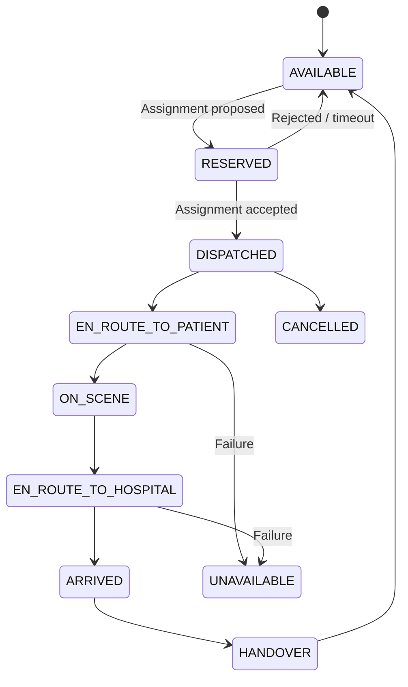
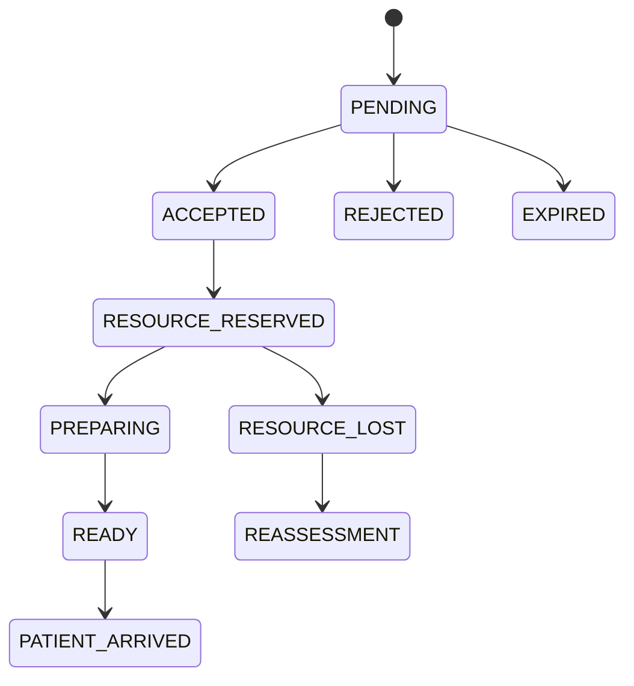
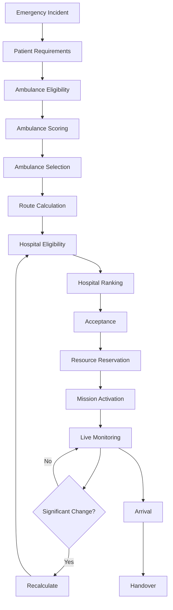
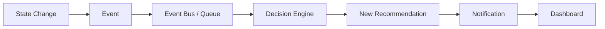
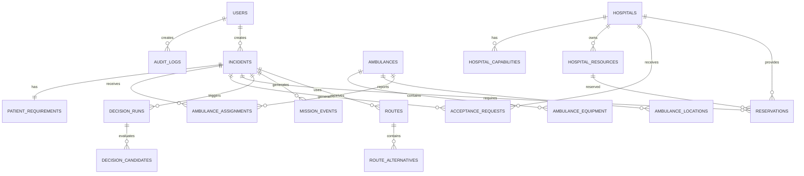
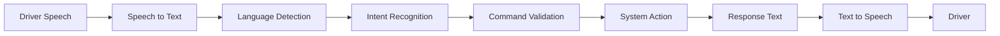
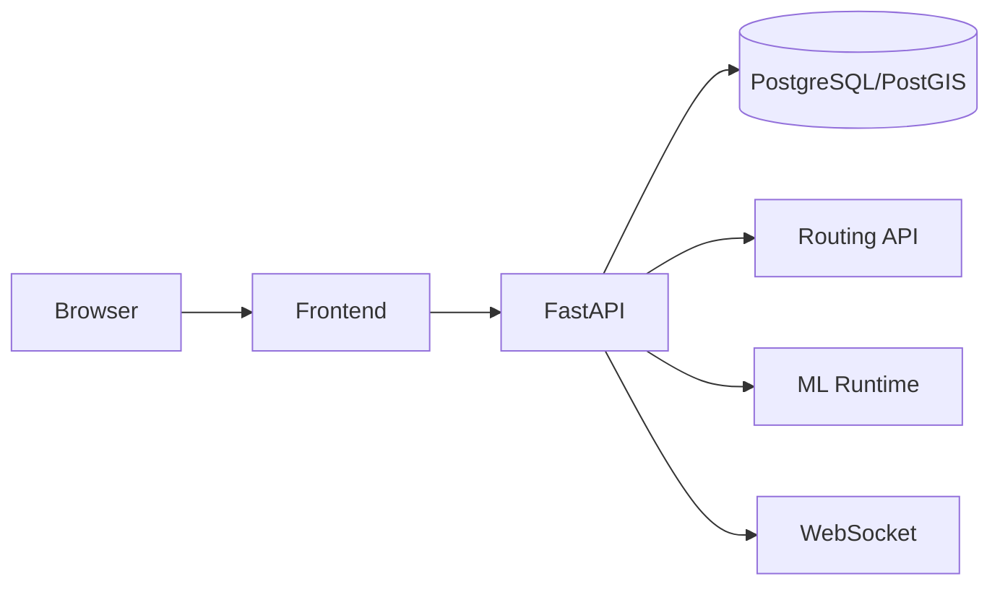
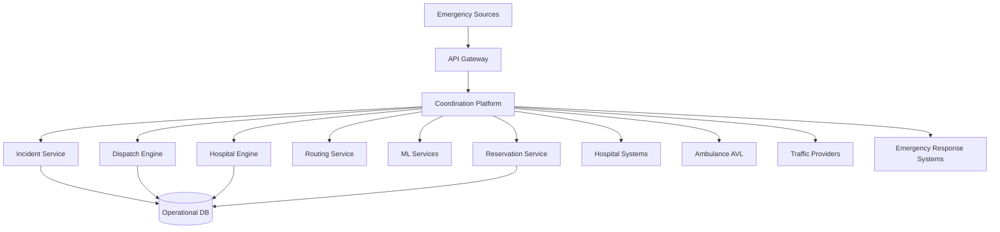
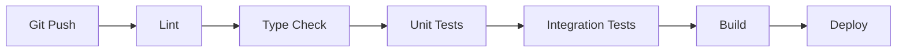
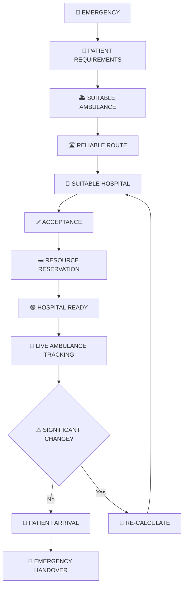

# Smart Ambulance Routing & Emergency Bed Allocation System

> Master implementation plan for a hackathon-grade, medically sensible, technically defensible emergency coordination platform.

---

## 0. Document Control

| Field | Value |
|---|---|
| Project Name | Smart Ambulance Routing & Emergency Bed Allocation System |
| Document | `plan.md` |
| Document Type | Master implementation plan |
| Primary Goal | Coordinate the complete emergency journey from incident to treatment-ready hospital |
| Target Context | Hackathon prototype with a production-oriented architecture |
| Primary Users | Emergency dispatcher, ambulance/EMT, hospital emergency department |
| Secondary Users | Hospital administrators, emergency-response authorities |
| Core Demonstration | Emergency → Suitable Ambulance → Reliable Route → Suitable Hospital → Acceptance → Resource Reservation → Hospital Ready → Patient Arrival |
| Primary Development Philosophy | Working + defensible + demonstrable |
| Data Philosophy | Real external infrastructure where practical; transparent simulation where institutional/private data is unavailable |
| AI Philosophy | Use AI only where prediction materially improves the decision |
| Safety Philosophy | Deterministic safety constraints, explainability, uncertainty, human override |
| Production Status | Prototype; not a clinically deployable system |

---

# 1. Executive Definition

## 1.1 Core Problem

Emergency response can lose critical time when ambulance assignment, route selection, hospital selection, hospital acceptance, and resource readiness are treated as separate decisions.

The project is therefore **not primarily an ambulance-tracking application**.

The project is a unified emergency coordination platform that attempts to answer, continuously:

1. Which suitable ambulance can reach the patient fastest?
2. Which route is fastest and sufficiently reliable?
3. Which hospital can actually treat the patient?
4. Which hospital is most likely to accept the case?
5. Will the required emergency resource still be available when the ambulance arrives?
6. Can that resource be reserved and prepared in advance?
7. What should happen if traffic, ambulance state, hospital capacity, or patient requirements change?

## 1.2 Core Product Statement

> **The platform coordinates the fastest viable path from an emergency incident to a treatment-ready hospital.**

## 1.3 Core Innovation

The innovation is not:

- another SOS application,
- another ambulance GPS tracker,
- another navigation system,
- another hospital directory,
- or an AI chatbot.

The core innovation is the **coordination layer** that combines:

```text
Patient Need
    +
Ambulance Capability
    +
Ambulance Availability
    +
Traffic / Route State
    +
Hospital Capability
    +
Hospital Acceptance
    +
Resource Availability
    +
Predicted Arrival-Time Readiness
    +
Resource Reservation
    =
End-to-End Emergency Decision
```

## 1.4 Core Design Principle

> **Nearest is not necessarily fastest.  
> Fastest is not necessarily suitable.  
> Suitable is not necessarily accepting.  
> Available now is not necessarily available on arrival.**

The system must therefore optimize for the **best feasible emergency chain**, not a single shortest-distance metric.

---

# 2. Project Objectives

## 2.1 Primary Objectives

The system shall:

- capture and classify emergency incidents;
- represent patient-care requirements;
- identify suitable ambulances;
- account for ambulance equipment and capability;
- calculate traffic-aware ETA;
- compare multiple possible routes;
- filter hospitals by medical capability;
- incorporate ICU/emergency/resource availability;
- support hospital acceptance;
- support emergency-resource reservation;
- continuously track an active mission;
- dynamically recalculate decisions when important conditions change;
- explain why an ambulance, route, or hospital was selected;
- operate safely when data is stale, unavailable, uncertain, or contradictory.

## 2.2 Secondary Objectives

The system should:

- provide a low-distraction ambulance interface;
- support multilingual voice commands;
- support English, Malayalam, and Hindi in the prototype;
- maintain auditability;
- provide dispatcher override;
- support future interoperability with hospital systems and national/state emergency infrastructure;
- allow simulation/replay for demonstrations and validation.

## 2.3 Explicit Non-Objectives

The MVP shall not attempt to:

- diagnose patients;
- prescribe treatment;
- autonomously make clinical treatment decisions;
- replace emergency physicians;
- replace existing national emergency systems;
- operate autonomous vehicles;
- guarantee hospital bed availability;
- claim real-time hospital data when such data is simulated;
- provide medical efficacy claims without evidence;
- build unrelated blockchain/AR/VR/IoT systems;
- create a nationwide healthcare integration during the hackathon.

---

# 3. Expected Outcomes

## 3.1 Functional Outcome

A dispatcher can create an emergency and observe:

```text
Emergency
    ↓
Patient Requirements
    ↓
Ambulance Candidates
    ↓
Suitable Ambulance Selected
    ↓
Route Calculated
    ↓
Eligible Hospitals
    ↓
Hospital Ranking
    ↓
Hospital Acceptance
    ↓
Resource Reservation
    ↓
Live Mission
    ↓
Dynamic Recalculation
    ↓
Hospital Preparation
    ↓
Arrival / Handover
```

## 3.2 Technical Outcome

The prototype should demonstrate:

- deterministic filtering;
- optimization;
- geospatial routing;
- real-time state changes;
- resource reservation;
- event-driven recalculation;
- explainable decisions;
- graceful failure.

## 3.3 Judge-Facing Outcome

A judge should understand within approximately 5–10 seconds:

> **We do not simply navigate ambulances. We coordinate the entire emergency journey.**

---

# 4. Scope Definition

## 4.1 MVP

The MVP includes:

- emergency creation;
- patient requirements;
- ambulance registry;
- ambulance capability matching;
- simulated/live ambulance location;
- routing;
- ETA;
- hospital registry;
- hospital capability matching;
- simulated hospital capacity;
- acceptance workflow;
- resource reservation;
- dispatcher dashboard;
- ambulance dashboard;
- hospital dashboard;
- dynamic re-ranking;
- explainability;
- audit events;
- demo-mode simulation.

## 4.2 Strongly Recommended

- ETA prediction;
- confidence-aware recommendations;
- event-driven updates;
- stale-data detection;
- fallback routing;
- multilingual voice commands;
- scenario replay;
- automated validation tests.

## 4.3 Optional

- hospital crowding prediction;
- demand forecasting;
- weather-aware routing;
- disaster road closures;
- advanced optimization for simultaneous incidents.

## 4.4 Future

- real hospital integrations;
- real ambulance AVL/telematics;
- ABDM-compatible interoperability;
- state emergency-system integration;
- real-time hospital capacity exchange;
- advanced demand forecasting;
- multi-city deployment;
- multi-state deployment;
- operational analytics.

---

# 5. Requirements Classification

| Priority | Meaning | Examples |
|---|---|---|
| 🔴 Mandatory | Required to prove the core idea | Ambulance matching, hospital matching |
| 🟠 Strongly Recommended | Important for a credible prototype | Dynamic reranking, explainability |
| 🟢 Optional Innovation | Differentiator if time remains | Voice, forecasting |
| ⚪ Future Scope | Do not consume hackathon time | Institutional integrations |

---

# 6. System Actors

## 6.1 Dispatcher

Responsibilities:

- create/receive emergencies;
- review patient requirements;
- view ambulance fleet;
- approve or override ambulance selection;
- view candidate hospitals;
- monitor acceptance;
- monitor resource reservation;
- observe live route;
- respond to alerts;
- trigger reassignment;
- override system recommendations.

## 6.2 Ambulance / EMT

Responsibilities:

- receive assignment;
- view patient requirements;
- view destination;
- receive navigation;
- view ETA;
- receive hospital acceptance;
- receive resource confirmation;
- receive route updates;
- confirm arrival;
- complete handover.

## 6.3 Hospital Emergency Department

Responsibilities:

- receive incoming emergency;
- review requirements;
- accept/reject;
- confirm available resources;
- accept resource reservation;
- update resource state;
- prepare emergency team;
- confirm readiness;
- receive updated ETA.

## 6.4 Hospital Administrator

Responsibilities:

- manage resources;
- review utilization;
- review incoming emergencies;
- configure hospital capabilities.

## 6.5 System Administrator

Responsibilities:

- manage users;
- manage roles;
- configure integrations;
- monitor system health;
- manage simulation datasets;
- review audit logs.

---

# 7. Functional Requirements

## FR-001 Emergency Creation

The system shall allow an authorized dispatcher to create an emergency incident.

Required fields:

```text
incident_id
created_at
location
severity
incident_type
patient_requirements
number_of_patients
notes
```

Optional:

```text
reported_by
caller_contact
estimated_patient_age
weather_context
hazard_context
```

Do not collect unnecessary personal data in the hackathon prototype.

---

## FR-002 Patient Requirement Representation

Patient requirements shall be represented as structured constraints.

Example:

```json
{
  "trauma": true,
  "icu_required": true,
  "ventilator_required": true,
  "emergency_surgery": true,
  "oxygen_required": true,
  "specialist_required": null
}
```

The system shall distinguish:

- required;
- preferred;
- unknown.

Example:

```json
{
  "icu": "required",
  "trauma": "required",
  "ventilator": "required",
  "cardiology": "preferred"
}
```

---

# 8. Patient Severity and Requirement Engine

## 8.1 Purpose

Convert incident information into operational requirements.

## 8.2 MVP Approach

Do not implement a medical diagnostic model.

Instead, use structured emergency categories.

Example:

```text
TRAUMA
CARDIAC
RESPIRATORY
NEUROLOGICAL
BURN
MATERNAL
PAEDIATRIC
GENERAL_CRITICAL
```

Then map emergency categories to logistics requirements.

Example:

```text
TRAUMA + CRITICAL

→ Trauma-capable ambulance
→ ICU
→ Emergency surgery
→ Ventilator
→ Trauma-capable hospital
```

## 8.3 Safety Boundary

The system shall not claim:

> "AI diagnosed trauma."

It should instead state:

> "Dispatcher/authorized responder selected trauma requirement."

---

# 9. Ambulance Management Module

## 9.1 Responsibilities

Store:

- ambulance identity;
- vehicle type;
- location;
- availability;
- crew capability;
- equipment;
- current mission;
- status;
- GPS freshness;
- estimated availability.

## 9.2 Ambulance State Machine



## 9.3 Ambulance Capability Model

Example:

```text
ALS
BLS
ICU_AMBULANCE
CARDIAC_SUPPORT
TRAUMA_SUPPORT
VENTILATOR
OXYGEN
DEFIBRILLATOR
PARAMEDIC
DOCTOR
```

The model must distinguish **vehicle capability** from **equipment availability**.

---

# 10. Ambulance Matching Engine

## 10.1 Inputs

```text
incident location
incident requirements
ambulance location
ambulance availability
ambulance capability
equipment
crew capability
traffic
current mission state
```

## 10.2 Hard Constraints

Examples:

```text
Ambulance must be available.
Ambulance must support mandatory equipment.
Ambulance must support mandatory capability.
Ambulance must not already be on a locked emergency mission.
```

## 10.3 Soft Features

After filtering, score candidates using:

- ETA;
- route reliability;
- equipment match;
- crew match;
- availability confidence;
- current load.

## 10.4 MVP Algorithm

```text
1. Retrieve available ambulances.
2. Filter by mandatory capability.
3. Calculate ETA to incident.
4. Normalize candidate features.
5. Calculate weighted score.
6. Sort descending.
7. Select highest-scoring candidate.
8. Expose top alternatives.
9. Allow dispatcher override.
```

## 10.5 Example Score

```text
ambulance_score =
    0.45 * eta_score
  + 0.25 * capability_score
  + 0.15 * equipment_score
  + 0.10 * crew_score
  + 0.05 * availability_confidence
```

Weights are configurable and shall not be presented as clinically validated weights.

---

# 11. Routing Module

## 11.1 Responsibilities

- calculate route;
- calculate ETA;
- retrieve alternative routes;
- compare route options;
- monitor route conditions;
- detect significant ETA change;
- trigger rerouting.

## 11.2 Routing Provider

Hackathon implementation:

**Preferred: Google Routes API or Mapbox**

Alternative:

- OSRM;
- GraphHopper;
- OpenRouteService.

## 11.3 Why Reuse

Routing is infrastructure, not the project's main intellectual contribution.

The project should consume routing data rather than spend hackathon time creating a routing engine.

## 11.4 Route Model

```json
{
  "route_id": "route_001",
  "origin": {
    "lat": 9.99,
    "lng": 76.28
  },
  "destination": {
    "lat": 10.01,
    "lng": 76.29
  },
  "distance_m": 7200,
  "duration_s": 540,
  "traffic_duration_s": 600,
  "confidence": 0.87,
  "provider": "configured_provider",
  "generated_at": "..."
}
```

## 11.5 Route Selection

Do not select purely on distance.

Use:

```text
route_score =
    ETA
    +
    reliability
    +
    congestion
    +
    hazard status
```

---

# 12. Hospital Management Module

## 12.1 Hospital Data

Each hospital should have:

```text
hospital_id
name
location
emergency_capable
icu
trauma
surgery
ventilator
specialists
emergency_beds
opening/status
acceptance_status
resource_last_updated
```

## 12.2 Hospital Capability

Represent capability as structured fields.

Example:

```json
{
  "trauma": true,
  "icu": true,
  "emergency_surgery": true,
  "ventilator": true,
  "cardiology": true,
  "neurology": true,
  "paediatric_emergency": true
}
```

## 12.3 Resource State

Every resource state should contain:

```text
resource_type
total_capacity
available_capacity
reserved_capacity
occupied_capacity
last_updated
source
confidence
```

---

# 13. Hospital Matching Engine

## 13.1 Core Principle

Hospital matching must be a two-stage process:

```text
STAGE 1
Hard clinical/operational filtering

        ↓

STAGE 2
Optimization among feasible hospitals
```

## 13.2 Hard Constraints

Example:

```text
IF ICU required
AND ICU unavailable
THEN hospital is not eligible.
```

Similarly:

```text
IF trauma required
AND trauma capability = false
THEN reject.
```

## 13.3 Soft Objectives

Among eligible hospitals, optimize:

- ETA;
- acceptance status;
- predicted resource readiness;
- route reliability;
- resource confidence;
- congestion;
- diversion risk.

## 13.4 Hospital Score

Example:

```text
hospital_score =
    0.30 * eta_score
  + 0.20 * capability_score
  + 0.20 * acceptance_score
  + 0.15 * resource_score
  + 0.10 * predicted_readiness
  + 0.05 * route_reliability
  - uncertainty_penalty
```

Weights are configuration values, not medically validated constants.

---

# 14. Acceptance Workflow

## 14.1 States



## 14.2 Acceptance Requirements

A hospital shall be able to:

- view incoming incident;
- view ETA;
- view requirements;
- accept;
- reject;
- indicate acceptance reason;
- confirm resources;
- reserve resources;
- update readiness.

## 14.3 Acceptance Timeout

The system should support configurable timeout.

Example:

```text
Acceptance timeout = 60 seconds
```

This value is a prototype configuration, not a medical standard.

---

# 15. Resource Reservation Module

## 15.1 Purpose

Avoid the logic:

> “The resource was available when we checked.”

Instead:

> “The resource has been provisionally reserved for this emergency.”

## 15.2 Resource Lifecycle

```text
AVAILABLE
    ↓
HELD
    ↓
CONFIRMED
    ↓
IN_USE
    ↓
RELEASED
```

Failure states:

```text
HELD
 ↓
EXPIRED

CONFIRMED
 ↓
RESOURCE_LOST
```

## 15.3 Reservation Rules

A reservation must:

- identify incident;
- identify hospital;
- identify resource;
- contain expiry;
- prevent invalid double allocation;
- be auditable;
- be reversible.

## 15.4 Database Constraint

Reservation operations should execute transactionally.

Example logic:

```sql
BEGIN;

SELECT available_capacity
FROM hospital_resources
WHERE hospital_id = ?
  AND resource_type = ?
FOR UPDATE;

-- Verify capacity.

UPDATE hospital_resources
SET reserved_capacity = reserved_capacity + 1,
    available_capacity = available_capacity - 1
WHERE hospital_id = ?
  AND resource_type = ?;

INSERT INTO reservations (...);

COMMIT;
```

Actual implementation must handle rollback and concurrency.

---

# 16. Arrival-Time Resource Prediction

## 16.1 Problem

Current capacity is insufficient.

Example:

```text
ICU available now = 1
Predicted ambulance arrival = 12 minutes
Expected admissions in next 12 minutes = 2
```

The system should reduce confidence.

## 16.2 MVP

Use a lightweight prediction model or deterministic simulation.

Potential output:

```json
{
  "resource": "ICU",
  "hospital_id": "H03",
  "probability_available_at_arrival": 0.78,
  "confidence": "medium"
}
```

## 16.3 Production

Potential inputs:

- current occupancy;
- historical admission rate;
- discharge rate;
- current emergency arrivals;
- time of day;
- day of week;
- ambulance pipeline;
- scheduled procedures where appropriate;
- seasonal patterns.

---

# 17. AI/ML Architecture

## 17.1 AI Principles

AI shall:

- assist rather than dominate;
- have bounded scope;
- provide confidence;
- be logged;
- not override safety constraints;
- be replaceable by a deterministic fallback;
- be validated separately.

## 17.2 ML Components

### Component A — ETA Prediction

Input:

```text
distance
base ETA
traffic
road class
time
day
speed
route
```

Output:

```text
predicted ETA
prediction interval
confidence
```

### Component B — Hospital Readiness Prediction

Input:

```text
current resource capacity
recent resource changes
historical demand
current arrivals
time
day
```

Output:

```text
probability resource available at arrival
confidence
```

### Component C — Demand Forecasting

Optional.

Predict:

```text
expected emergency demand by region/time
```

This is not required for MVP.

---

# 18. Model Selection

| Model | Use | MVP Decision |
|---|---|---|
| Linear Regression | Baseline | ✅ Useful baseline |
| Random Forest | Prediction | ✅ |
| XGBoost | ETA/capacity | ✅ Preferred |
| LightGBM | ETA/capacity | ✅ Preferred |
| LSTM | Sequential forecasting | ⚠ Optional |
| Transformer | Time-series forecasting | ❌ |
| GNN | Graph prediction | ❌ |
| Reinforcement Learning | Dynamic dispatch | ❌ MVP |

## 18.1 Why XGBoost/LightGBM

- strong tabular performance;
- relatively low training complexity;
- interpretable feature importance;
- easy deployment;
- works with moderate datasets;
- easier to benchmark than deep learning.

---

# 19. ML Pipeline


## 19.1 Model Requirements

Every model artifact should include:

```text
model_version
training_timestamp
dataset_version
features
target
evaluation_metrics
training_range
limitations
```

## 19.2 No Fabricated Accuracy

The system shall not display:

```text
95% accurate
99.2% reliable
```

unless that metric is actually measured on an appropriate validation dataset.

---

# 20. Explainability

Every recommendation must have machine-readable reasons.

Example:

```json
{
  "decision": "hospital_H03",
  "reasons": [
    "required_trauma_capability",
    "icu_available",
    "ventilator_available",
    "acceptance_confirmed",
    "lowest_reliable_eta",
    "high_arrival_time_readiness"
  ],
  "confidence": 0.86
}
```

## 20.1 UI

Show:

```text
HOSPITAL C — RECOMMENDED

✓ Trauma capable
✓ ICU available
✓ Ventilator available
✓ Emergency surgery available
✓ Acceptance confirmed
✓ ETA: 9 min
✓ Predicted readiness: High
⚠ Resource state updated 45 sec ago
```

---

# 21. Decision Engine

## 21.1 Overall Pipeline



## 21.2 Recalculation Triggers

Recalculate when:

- traffic ETA changes materially;
- selected hospital rejects;
- selected resource becomes unavailable;
- ambulance becomes unavailable;
- patient requirement changes;
- GPS becomes stale;
- route is blocked;
- confidence drops below threshold.

---

# 22. Optimization Strategy

## 22.1 MVP

Use:

```text
Hard Constraints
      ↓
Candidate Filtering
      ↓
Weighted Scoring
      ↓
Ranking
      ↓
Human Override
```

## 22.2 V2

Use:

- bipartite matching;
- min-cost flow;
- constraint programming;
- simultaneous emergency optimization.

## 22.3 Research-Level

Potentially investigate:

- stochastic optimization;
- dynamic programming;
- reinforcement learning;
- graph neural networks;
- robust optimization.

These are outside the hackathon MVP.

---

# 23. Event-Driven Architecture

The system should model meaningful operational changes as events.

## 23.1 Events

```text
EMERGENCY_CREATED
PATIENT_REQUIREMENTS_UPDATED
AMBULANCE_ASSIGNED
AMBULANCE_POSITION_UPDATED
AMBULANCE_UNAVAILABLE
ROUTE_UPDATED
TRAFFIC_CHANGED
HOSPITAL_ACCEPTANCE_REQUESTED
HOSPITAL_ACCEPTED
HOSPITAL_REJECTED
RESOURCE_RESERVED
RESOURCE_LOST
HOSPITAL_READINESS_CHANGED
GPS_STALE
MISSION_COMPLETED
```

## 23.2 Event Processing



For the hackathon, the event bus can initially be implemented using an application-level event dispatcher or lightweight queue.

A full Kafka deployment is unnecessary for the MVP.

---

# 24. Real-Time Communication

## 24.1 WebSockets

Use WebSockets for:

- ambulance location;
- ETA updates;
- hospital status;
- dispatch alerts;
- reservation state;
- route changes.

## 24.2 REST

Use REST for:

- CRUD;
- emergency creation;
- resource configuration;
- authentication;
- historical queries;
- scenario setup.

---

# 25. API Design

Base URL:

```text
/api/v1
```

---

## 25.1 Authentication

```http
POST /api/v1/auth/login
POST /api/v1/auth/logout
GET  /api/v1/auth/me
POST /api/v1/auth/refresh
```

---

# 26. Emergency APIs

```http
POST /api/v1/incidents
GET  /api/v1/incidents
GET  /api/v1/incidents/{incidentId}
PATCH /api/v1/incidents/{incidentId}
POST /api/v1/incidents/{incidentId}/requirements
POST /api/v1/incidents/{incidentId}/dispatch
POST /api/v1/incidents/{incidentId}/cancel
```

Example:

```json
{
  "type": "TRAUMA",
  "severity": "CRITICAL",
  "location": {
    "lat": 10.012,
    "lng": 76.291
  },
  "requirements": {
    "icu": true,
    "ventilator": true,
    "trauma": true,
    "emergency_surgery": true
  }
}
```

---

# 27. Ambulance APIs

```http
GET   /api/v1/ambulances
POST  /api/v1/ambulances
GET   /api/v1/ambulances/{id}
PATCH /api/v1/ambulances/{id}
POST  /api/v1/ambulances/{id}/location
POST  /api/v1/ambulances/{id}/accept-assignment
POST  /api/v1/ambulances/{id}/status
```

---

# 28. Hospital APIs

```http
GET   /api/v1/hospitals
POST  /api/v1/hospitals
GET   /api/v1/hospitals/{id}
PATCH /api/v1/hospitals/{id}
GET   /api/v1/hospitals/{id}/resources
PATCH /api/v1/hospitals/{id}/resources
POST  /api/v1/hospitals/{id}/acceptance
POST  /api/v1/hospitals/{id}/reject
POST  /api/v1/hospitals/{id}/readiness
```

---

# 29. Decision APIs

```http
POST /api/v1/decision/ambulance
POST /api/v1/decision/hospitals
POST /api/v1/decision/recalculate
GET  /api/v1/decision/{incidentId}
GET  /api/v1/decision/{incidentId}/explanation
```

---

# 30. Reservation APIs

```http
POST /api/v1/reservations
GET  /api/v1/reservations/{id}
POST /api/v1/reservations/{id}/confirm
POST /api/v1/reservations/{id}/release
POST /api/v1/reservations/{id}/expire
```

---

# 31. Routing APIs

```http
POST /api/v1/routes/calculate
POST /api/v1/routes/compare
GET  /api/v1/routes/{routeId}
POST /api/v1/routes/{routeId}/reroute
```

---

# 32. Simulation APIs

The hackathon must have explicit demo endpoints.

```http
POST /api/v1/demo/reset
POST /api/v1/demo/start
POST /api/v1/demo/scenarios/{scenarioId}
POST /api/v1/demo/traffic-change
POST /api/v1/demo/hospital-resource-failure
POST /api/v1/demo/ambulance-failure
POST /api/v1/demo/hospital-rejection
POST /api/v1/demo/patient-severity-change
```

All demo APIs shall be protected from production use.

---

# 33. WebSocket Channels

Example:

```text
/ws/dispatcher
/ws/ambulance/{ambulanceId}
/ws/hospital/{hospitalId}
/ws/incidents/{incidentId}
```

Example event:

```json
{
  "type": "HOSPITAL_RESOURCE_CHANGED",
  "incidentId": "INC-1001",
  "hospitalId": "H03",
  "resource": "ICU",
  "oldValue": 1,
  "newValue": 0,
  "timestamp": "..."
}
```

---

# 34. Database Design

## 34.1 Database

Recommended:

**PostgreSQL + PostGIS**

## 34.2 Main Tables

```text
users
roles
user_roles

incidents
patient_requirements

ambulances
ambulance_equipment
ambulance_locations
ambulance_assignments

hospitals
hospital_capabilities
hospital_resources
hospital_resource_events

routes
route_alternatives

acceptance_requests
acceptance_events

reservations

missions
mission_events

decision_runs
decision_candidates
decision_reasons

notifications

audit_logs

simulation_scenarios
simulation_events
```

---

# 35. Entity Relationship Diagram



---

# 36. Key Table Definitions

## users

```text
id
name
email
password_hash
status
created_at
updated_at
```

## roles

```text
id
name
```

Roles:

```text
DISPATCHER
AMBULANCE_CREW
HOSPITAL_STAFF
HOSPITAL_ADMIN
SYSTEM_ADMIN
```

## incidents

```text
id UUID PRIMARY KEY
incident_code
status
severity
incident_type
latitude
longitude
created_by
created_at
updated_at
```

## patient_requirements

```text
id
incident_id
icu_required
ventilator_required
trauma_required
surgery_required
oxygen_required
specialist_required
severity
notes
created_at
```

## ambulances

```text
id
vehicle_code
vehicle_type
status
crew_capability
current_lat
current_lng
gps_timestamp
equipment_summary
created_at
updated_at
```

## hospitals

```text
id
hospital_code
name
latitude
longitude
status
emergency_capable
created_at
updated_at
```

## hospital_resources

```text
id
hospital_id
resource_type
total_capacity
occupied_capacity
reserved_capacity
available_capacity
last_updated
confidence
```

## reservations

```text
id
incident_id
hospital_id
resource_type
quantity
status
expires_at
created_at
confirmed_at
released_at
```

## decision_runs

```text
id
incident_id
decision_type
algorithm_version
input_snapshot
output
confidence
created_at
```

Decision snapshots are important for auditability.

---

# 37. Reservation Concurrency

The system shall prevent:

```text
Hospital has 1 ICU slot.

Incident A reserves it.
Incident B simultaneously reserves it.
```

Use:

- DB transactions;
- row locking;
- unique constraints where applicable;
- reservation expiry;
- idempotency keys.

---

# 38. Data Freshness

Every dynamic data item should include:

```text
updated_at
source
confidence
```

Example:

```json
{
  "value": 1,
  "updated_at": "2026-09-12T10:32:40Z",
  "source": "DEMO_HOSPITAL_FEED",
  "confidence": "MEDIUM"
}
```

## Freshness levels

```text
FRESH
STALE
VERY_STALE
UNKNOWN
```

Thresholds shall be configurable.

---

# 39. Frontend Architecture

Recommended:

```text
React
TypeScript
Vite
React Router
TanStack Query
WebSocket client
Map provider SDK
Tailwind CSS
Component library
```

## 39.1 Frontend Applications / Views

```text
Dispatcher Console
Ambulance Console
Hospital Console
Admin Console
Demo Console
```

These can initially exist within one React application.

---

# 40. Frontend Folder Structure

```text
frontend/
├── src/
│   ├── app/
│   │   ├── router.tsx
│   │   ├── providers.tsx
│   │   └── app.tsx
│   │
│   ├── components/
│   │   ├── common/
│   │   ├── map/
│   │   ├── ambulance/
│   │   ├── hospital/
│   │   ├── incident/
│   │   ├── decision/
│   │   ├── reservation/
│   │   └── alerts/
│   │
│   ├── pages/
│   │   ├── dispatcher/
│   │   ├── ambulance/
│   │   ├── hospital/
│   │   ├── admin/
│   │   └── demo/
│   │
│   ├── features/
│   │   ├── incidents/
│   │   ├── dispatch/
│   │   ├── hospitals/
│   │   ├── reservations/
│   │   ├── routing/
│   │   └── missions/
│   │
│   ├── hooks/
│   ├── services/
│   ├── api/
│   ├── websocket/
│   ├── state/
│   ├── types/
│   ├── utils/
│   └── styles/
│
├── public/
├── tests/
└── package.json
```

---

# 41. Backend Architecture

Recommended:

```text
FastAPI
Python
Pydantic
SQLAlchemy
Alembic
PostgreSQL
PostGIS
Redis optional
WebSockets
scikit-learn/XGBoost
OR-Tools
```

## Backend Layers

```text
API Layer
   ↓
Application Services
   ↓
Domain Services
   ↓
Optimization / ML
   ↓
Repositories
   ↓
Database
```

---

# 42. Backend Folder Structure

```text
backend/
├── app/
│   ├── main.py
│   │
│   ├── api/
│   │   └── v1/
│   │       ├── auth.py
│   │       ├── incidents.py
│   │       ├── ambulances.py
│   │       ├── hospitals.py
│   │       ├── routes.py
│   │       ├── decisions.py
│   │       ├── reservations.py
│   │       ├── missions.py
│   │       ├── simulation.py
│   │       └── websocket.py
│   │
│   ├── core/
│   │   ├── config.py
│   │   ├── security.py
│   │   ├── logging.py
│   │   └── errors.py
│   │
│   ├── db/
│   │   ├── session.py
│   │   ├── models/
│   │   └── migrations/
│   │
│   ├── schemas/
│   │
│   ├── services/
│   │   ├── incident_service.py
│   │   ├── ambulance_service.py
│   │   ├── hospital_service.py
│   │   ├── reservation_service.py
│   │   └── notification_service.py
│   │
│   ├── decision/
│   │   ├── requirements.py
│   │   ├── ambulance_matcher.py
│   │   ├── hospital_matcher.py
│   │   ├── route_selector.py
│   │   ├── scoring.py
│   │   ├── constraints.py
│   │   └── explainability.py
│   │
│   ├── optimization/
│   │   ├── ambulance_assignment.py
│   │   ├── hospital_assignment.py
│   │   └── solvers.py
│   │
│   ├── ml/
│   │   ├── eta/
│   │   ├── capacity/
│   │   ├── features/
│   │   ├── inference/
│   │   └── training/
│   │
│   ├── routing/
│   │   ├── provider.py
│   │   ├── google.py
│   │   ├── mapbox.py
│   │   └── fallback.py
│   │
│   ├── events/
│   │   ├── publisher.py
│   │   ├── handlers.py
│   │   └── types.py
│   │
│   ├── integrations/
│   │   ├── traffic/
│   │   ├── hospital/
│   │   ├── ambulance/
│   │   └── voice/
│   │
│   └── simulation/
│       ├── scenarios.py
│       ├── replay.py
│       └── generators.py
│
├── tests/
│   ├── unit/
│   ├── integration/
│   ├── decision/
│   ├── api/
│   └── scenarios/
│
├── scripts/
├── requirements.txt
├── Dockerfile
└── README.md
```

---

# 43. Domain Services

## IncidentService

Responsibilities:

- create incident;
- validate incident;
- update requirements;
- close incident.

## AmbulanceService

Responsibilities:

- retrieve candidates;
- update location;
- update status;
- assign mission.

## HospitalService

Responsibilities:

- retrieve candidates;
- validate capabilities;
- update resource state;
- process acceptance.

## DecisionService

Responsibilities:

- evaluate candidates;
- run constraints;
- score candidates;
- return recommendation;
- generate explanation.

## ReservationService

Responsibilities:

- create reservation;
- confirm;
- expire;
- release;
- prevent double booking.

## MissionService

Responsibilities:

- start mission;
- update milestones;
- track ETA;
- handle completion.

---

# 44. Integration Architecture

Production integrations must be isolated behind adapters.

```text
HospitalIntegration
    ├── DemoHospitalAdapter
    ├── HospitalAPIAdapter
    └── FutureHMISAdapter

AmbulanceIntegration
    ├── DemoGPSAdapter
    └── AVLAdapter

RoutingIntegration
    ├── GoogleRoutingAdapter
    ├── MapboxAdapter
    └── OSRMAdapter
```

The decision engine must not directly depend on a specific provider.

---

# 45. Provider Interface Example

```python
class RoutingProvider:
    async def calculate_route(
        self,
        origin,
        destination,
        alternatives=True
    ):
        raise NotImplementedError
```

Implement:

```text
GoogleRoutingProvider
MapboxRoutingProvider
OSRMRoutingProvider
FallbackRoutingProvider
```

This keeps the architecture portable.

---

# 46. Voice Interface

## 46.1 Scope

Voice is optional after core MVP completion.

## 46.2 Supported Languages

Initial:

- English;
- Malayalam;
- Hindi.

## 46.3 Command Set

Start with a small controlled vocabulary:

```text
"What is my ETA?"
"Is the ICU confirmed?"
"Has the hospital accepted?"
"Repeat hospital information."
"Call dispatcher."
"Reroute."
```

## 46.4 Voice Pipeline



## 46.5 Safety

High-impact actions require confirmation.

Example:

```text
Driver:
Reroute.

System:
Alternative route adds 2 minutes.
Avoids heavy traffic.
Reroute?

Driver:
Yes.

System:
Rerouting now.
```

---

# 47. Authentication and Authorization

## 47.1 Roles

```text
DISPATCHER
AMBULANCE_CREW
HOSPITAL_STAFF
HOSPITAL_ADMIN
SYSTEM_ADMIN
```

## 47.2 Authorization Matrix

| Action | Dispatcher | Ambulance | Hospital | Admin |
|---|---|---|---|---|
| Create incident | ✅ | ❌ | ❌ | ✅ |
| Assign ambulance | ✅ | ❌ | ❌ | ✅ |
| Update own GPS | ❌ | ✅ | ❌ | ✅ |
| Accept hospital case | ❌ | ❌ | ✅ | ✅ |
| Reserve resource | Request | ❌ | ✅ | ✅ |
| Override decision | ✅ | ❌ | Limited | ✅ |
| Manage users | ❌ | ❌ | ❌ | ✅ |

---

# 48. Security Requirements

## MVP

- HTTPS;
- hashed passwords;
- JWT/session authentication;
- RBAC;
- input validation;
- rate limiting;
- audit logs;
- secure environment variables;
- no secrets in source code;
- no real patient data.

## Production

Additional:

- centralized identity;
- MFA;
- secure key management;
- network segmentation;
- security monitoring;
- formal privacy governance;
- penetration testing;
- incident response;
- data retention rules;
- formal interoperability security.

---

# 49. Privacy

## Data Minimization

Store only what is necessary.

Avoid storing:

- unnecessary personal details;
- real names in demo datasets;
- raw medical notes unless required;
- unnecessary caller information.

## Demo Patients

Use:

```text
Patient P-001
Patient P-002
Patient P-003
```

rather than real identities.

## Location Privacy

Historical patient coordinates should not remain publicly accessible.

---

# 50. Auditability

Every material decision should generate an audit record.

Example:

```json
{
  "timestamp": "...",
  "actor": "system",
  "action": "HOSPITAL_RECOMMENDED",
  "incident_id": "INC-001",
  "hospital_id": "H03",
  "algorithm_version": "hospital-score-v1",
  "reasons": [
    "ICU_AVAILABLE",
    "TRAUMA_AVAILABLE",
    "ACCEPTED",
    "ETA_LOW"
  ]
}
```

---

# 51. Error Handling

## 51.1 API Error Format

```json
{
  "error": {
    "code": "HOSPITAL_DATA_STALE",
    "message": "Hospital resource data is stale.",
    "severity": "WARNING",
    "retryable": true
  }
}
```

## 51.2 Error Categories

```text
VALIDATION_ERROR
AUTHENTICATION_ERROR
AUTHORIZATION_ERROR
RESOURCE_UNAVAILABLE
ROUTING_FAILURE
HOSPITAL_DATA_STALE
GPS_STALE
ACCEPTANCE_TIMEOUT
RESERVATION_CONFLICT
EXTERNAL_PROVIDER_ERROR
MODEL_UNAVAILABLE
INTERNAL_ERROR
```

---

# 52. Failure-Safe Behaviour

## GPS failure

```text
GPS update stops
    ↓
Mark location stale
    ↓
Show last known position
    ↓
Increase uncertainty
    ↓
Try fallback position source
    ↓
Notify dispatcher
```

## Hospital API failure

```text
Hospital feed fails
    ↓
Mark state UNKNOWN
    ↓
Do not treat unknown as available
    ↓
Reduce recommendation confidence
    ↓
Use alternative verified hospital
```

## Routing API failure

```text
Provider fails
    ↓
Try alternate provider
    ↓
Try cached/previous route
    ↓
Notify dispatcher
```

## ML service failure

```text
Prediction unavailable
    ↓
Use deterministic ETA
    ↓
Mark prediction unavailable
    ↓
Continue safely
```

## Voice failure

```text
Voice recognition fails
    ↓
Repeat request
    ↓
Offer visual control
```

---

# 53. Edge Cases

The system shall test at minimum:

### Edge Case 1

No ambulance satisfies requirements.

Expected:

```text
NO_FEASIBLE_AMBULANCE
```

Dispatcher receives escalation.

### Edge Case 2

All nearby hospitals lack required resources.

Expected:

- expand geographic search;
- show nearest feasible hospital;
- clearly indicate longer ETA.

### Edge Case 3

Hospital accepts then rejects.

Expected:

- release reservation;
- rerank;
- notify ambulance;
- notify dispatcher.

### Edge Case 4

ICU unavailable during travel.

Expected:

- detect;
- recalculate;
- select alternative;
- notify.

### Edge Case 5

Two incidents compete for one ambulance.

Expected:

- resolve according to configured priority/optimization;
- prevent double assignment.

### Edge Case 6

One ICU slot is requested by two ambulances.

Expected:

- transactional reservation;
- exactly one confirmed reservation.

### Edge Case 7

ETA increases significantly.

Expected:

- trigger rerouting evaluation.

### Edge Case 8

Patient requirements become more severe.

Expected:

- rerun eligibility.

### Edge Case 9

GPS jumps unrealistically.

Expected:

- detect outlier;
- mark position uncertain.

### Edge Case 10

Hospital data timestamp is too old.

Expected:

- display stale indicator;
- penalize/disable use according to configured policy.

---

# 54. Reliability Requirements

## MVP Targets

These are engineering targets, not medical claims.

| Metric | Target |
|---|---:|
| API availability during demo | >99% |
| Decision calculation | <2 seconds under demo load |
| Dashboard event propagation | <1 second on local/demo environment |
| Reservation transaction | Atomic |
| Duplicate reservation | 0 |
| Invalid capability assignment | 0 in deterministic tests |
| Critical API failure visibility | 100% |

Actual measured performance shall be reported rather than assumed.

---

# 55. Scalability

## MVP Architecture

A modular monolith is preferred.

```text
React
   ↓
FastAPI
   ↓
PostgreSQL
```

With:

```text
Routing API
ML inference
WebSocket
```

## Do Not Start With

- Kubernetes;
- microservice sprawl;
- Kafka cluster;
- service mesh;
- distributed transactions.

## Production Evolution

If load requires:

```text
API service
Decision service
Routing service
ML service
Event processing
Notification service
```

The domain boundaries should already exist in code even when deployed together.

---

# 56. Caching

Potential caches:

- hospital capability data;
- route responses where appropriate;
- static hospital metadata;
- map metadata.

Do **not** cache critical resource state without explicit freshness handling.

---

# 57. Idempotency

Mutation APIs should support idempotency where duplicate requests can create operational problems.

Examples:

```text
POST /reservations
POST /assignments
POST /acceptance
```

Use:

```text
Idempotency-Key
```

to prevent duplicate actions.

---

# 58. Monitoring

Track:

```text
API latency
API errors
decision latency
routing latency
WebSocket connections
database errors
reservation conflicts
stale hospital data
stale GPS
ML prediction failures
external provider failures
```

## Business/Operational Metrics

```text
dispatch time
ambulance ETA
hospital selection time
acceptance time
reservation time
total emergency coordination time
rerouting count
hospital rejection count
reservation failure count
```

---

# 59. Logging

## Structured Logs

Example:

```json
{
  "timestamp": "...",
  "level": "INFO",
  "service": "decision-engine",
  "event": "HOSPITAL_RERANKED",
  "incident_id": "INC-001",
  "selected_hospital": "H03",
  "algorithm_version": "v1"
}
```

Never log sensitive patient information unnecessarily.

---

# 60. Development Environment

Recommended:

```text
Node.js
Python
PostgreSQL
Docker
Git
GitHub
```

Optional:

```text
Redis
```

## Environment Files

```text
.env.example
.env.local
.env.test
```

Never commit:

```text
.env
credentials
API keys
private certificates
```

---

# 61. Environment Configuration

Example:

```env
APP_ENV=development

DATABASE_URL=postgresql://...

JWT_SECRET=...

ROUTING_PROVIDER=google

GOOGLE_MAPS_API_KEY=...

MAPBOX_TOKEN=...

ML_MODE=mock

DEMO_MODE=true

HOSPITAL_DATA_SOURCE=synthetic

GPS_SOURCE=simulator

VOICE_ENABLED=false
```

---

# 62. Demo Mode

Demo mode is mandatory.

## 62.1 Demo Characteristics

The UI must visibly state:

```text
DEMO MODE
Hospital capacity: simulated
Ambulance GPS: simulated
Acceptance: simulated
Resource reservation: simulated
```

## 62.2 Real vs Simulated

| Component | Hackathon |
|---|---|
| Map | Real |
| Routing | Real |
| Traffic | Real or replayed |
| Ambulance GPS | Simulated |
| Hospital capacity | Simulated |
| Acceptance | Simulated |
| Reservation | Real within prototype DB |
| Optimization | Real |
| ML | Real/simple or simulated prediction pipeline |

---

# 63. Simulation Engine

## Responsibilities

- move ambulances;
- modify traffic;
- change hospital capacity;
- trigger acceptance;
- trigger rejection;
- trigger resource failure;
- trigger GPS failure.

## Example

```json
{
  "scenario": "ICU_FAILURE_DURING_TRAVEL",
  "timeline": [
    {
      "time": 0,
      "event": "MISSION_STARTED"
    },
    {
      "time": 30,
      "event": "ICU_AVAILABLE"
    },
    {
      "time": 90,
      "event": "ICU_UNAVAILABLE"
    }
  ]
}
```

---

# 64. Scenario Library

Create the following scenarios:

```text
SC-001 Normal Emergency
SC-002 Traffic Congestion
SC-003 Hospital Unavailable
SC-004 ICU Failure
SC-005 Hospital Rejection
SC-006 Ambulance Failure
SC-007 Patient Severity Increase
SC-008 No Feasible Hospital
SC-009 GPS Failure
SC-010 Routing Provider Failure
```

Each scenario must have:

```text
preconditions
events
expected behaviour
pass/fail criteria
```

---

# 65. Testing Strategy

Testing must not rely only on visual demo testing.

## 65.1 Unit Tests

Test:

- requirement mapping;
- capability filtering;
- scoring;
- normalization;
- route comparison;
- reservation logic;
- state transitions;
- freshness;
- confidence handling.

## 65.2 Integration Tests

Test:

```text
Incident
→ ambulance selection
→ routing
→ hospital selection
→ acceptance
→ reservation
```

## 65.3 Scenario Tests

Replay entire emergencies.

## 65.4 Failure Tests

Inject:

- API outage;
- stale state;
- GPS loss;
- hospital rejection;
- reservation conflict.

## 65.5 Security Tests

Test:

- unauthorized endpoint access;
- role escalation;
- invalid tokens;
- injection;
- rate limits;
- secret exposure.

---

# 66. Automated Acceptance Tests

Example:

```gherkin
Feature: Capability-aware ambulance selection

Scenario: Closest ambulance is unsuitable
  Given a trauma emergency requiring a ventilator
  And Ambulance A is 2 minutes away without a ventilator
  And Ambulance B is 5 minutes away with a ventilator
  When the dispatcher requests ambulance selection
  Then Ambulance A must be excluded
  And Ambulance B must be selected
```

---

# 67. Hospital Ranking Acceptance Test

```gherkin
Feature: Hospital compatibility

Scenario: Closest hospital lacks ICU
  Given a patient requiring ICU
  And Hospital A is closest
  And Hospital A has no available ICU
  And Hospital B has ICU and accepts the patient
  When hospital ranking runs
  Then Hospital A must not be eligible
  And Hospital B must be recommended
```

---

# 68. Reservation Acceptance Test

```gherkin
Feature: Resource reservation

Scenario: Only one ICU slot exists
  Given Hospital A has one available ICU
  When Incident A reserves the ICU
  And Incident B requests the same ICU
  Then Incident A remains confirmed
  And Incident B must not receive the same slot
```

---

# 69. Dynamic Re-Ranking Acceptance Test

```gherkin
Feature: Dynamic hospital selection

Scenario: Selected hospital loses ICU
  Given Hospital A is selected
  And Hospital A has one available ICU
  When Hospital A loses the ICU
  Then Hospital A must become ineligible
  And the system must recalculate
  And another feasible hospital must be selected
```

---

# 70. Validation Metrics

## Ambulance Dispatch

```text
assignment_latency
feasible_assignment_rate
suitable_vehicle_selection_rate
```

## Routing

```text
ETA error
travel time
rerouting frequency
route completion time
```

## Hospital Selection

```text
capability-match rate
acceptance rate
diversion rate
resource-match rate
```

## Forecasting

```text
MAE
RMSE
calibration
precision
recall
```

## End-to-End

```text
incident → ambulance assignment
incident → hospital acceptance
incident → resource reservation
incident → arrival
```

Do not invent improvements.

---

# 71. Performance Testing

Load test:

```text
10 simultaneous incidents
25 ambulances
20 hospitals
```

Then:

```text
50 incidents
100 ambulances
50 hospitals
```

The exact scale is a benchmark target for prototype testing, not an assumed production capacity.

Measure:

```text
P50 latency
P95 latency
P99 latency
decision calculation time
database query latency
WebSocket latency
```

---

# 72. API Integration Strategy

## Routing

Create adapter interface.

## Hospital

Create provider abstraction:

```python
class HospitalDataProvider:
    async def get_hospital(self, hospital_id):
        ...

    async def get_resources(self, hospital_id):
        ...

    async def request_acceptance(self, incident):
        ...
```

Implement:

```text
SyntheticHospitalProvider
```

first.

Production:

```text
InstitutionalHospitalProvider
```

later.

---

# 73. Interoperability Strategy

The architecture should be prepared for standards-based healthcare interoperability.

Production integration should consider:

- facility identifiers;
- standardized resource representations;
- healthcare APIs;
- FHIR where appropriate;
- ABDM ecosystem interfaces where institutionally supported.

Do not make FHIR/ABDM a core hackathon dependency.

The MVP should work without them.

---

# 74. Deployment Architecture

## Hackathon



## Production Evolution



---

# 75. Deployment Steps

## Step 1

Create repository:

```text
smart-ambulance/
```

## Step 2

Create frontend.

## Step 3

Create backend.

## Step 4

Provision PostgreSQL.

## Step 5

Configure PostGIS.

## Step 6

Run migrations.

## Step 7

Seed demo data.

## Step 8

Configure routing provider.

## Step 9

Start backend.

## Step 10

Start frontend.

## Step 11

Run scenario tests.

## Step 12

Deploy.

## Step 13

Run production-like demo rehearsal.

---

# 76. CI/CD

Pipeline:



Minimum CI checks:

```text
Frontend lint
Frontend type check
Backend lint
Backend type check
Unit tests
Database migration validation
Build validation
```

---

# 77. Observability

The deployed application must expose:

```text
/health
/ready
/version
```

Example:

```json
{
  "status": "ok",
  "version": "0.1.0",
  "environment": "demo"
}
```

Readiness should verify:

- DB connectivity;
- required routing configuration;
- required services.

---

# 78. Configuration Management

All weights and thresholds should be configuration-driven.

Example:

```yaml
decision:
  ambulance:
    eta_weight: 0.45
    capability_weight: 0.25
    equipment_weight: 0.15
    crew_weight: 0.10
    confidence_weight: 0.05

  hospital:
    eta_weight: 0.30
    capability_weight: 0.20
    acceptance_weight: 0.20
    resource_weight: 0.15
    readiness_weight: 0.10
    reliability_weight: 0.05
```

Do not hardcode operational policy inside business logic.

---

# 79. Recommended Repository Structure

```text
smart-ambulance/
│
├── README.md
├── PLAN.md
├── ARCHITECTURE.md
├── API.md
├── SECURITY.md
├── DEMO.md
├── CONTRIBUTING.md
├── LICENSE
│
├── frontend/
│
├── backend/
│
├── ml/
│
├── data/
│   ├── demo/
│   ├── seed/
│   ├── schemas/
│   └── scenarios/
│
├── docs/
│   ├── diagrams/
│   ├── research/
│   └── decisions/
│
├── scripts/
│   ├── seed.py
│   ├── reset_demo.py
│   └── run_scenario.py
│
├── tests/
│
└── docker/
```

---

# 80. Documentation Requirements

The repository shall include:

- README;
- setup guide;
- architecture;
- API specification;
- database model;
- scenario guide;
- demo guide;
- deployment guide;
- security notes;
- known limitations.

---

# 81. Decision Records

Important architectural decisions should be documented.

Example:

```text
ADR-001
Why FastAPI?

ADR-002
Why PostgreSQL/PostGIS?

ADR-003
Why weighted optimization instead of RL?

ADR-004
Why simulated hospital capacity?

ADR-005
Why real routing + simulated emergency state?

ADR-006
Why modular monolith?
```

---

# 82. Hackathon Development Phases

## Phase 1 — Foundation

### Goal

Working application skeleton.

### Tasks

- repository;
- frontend;
- backend;
- DB;
- authentication;
- base UI.

### Output

Running application.

---

## Phase 2 — Core Data Model

### Tasks

- incidents;
- ambulances;
- hospitals;
- resources;
- reservations;
- missions.

### Output

Database + CRUD APIs.

---

## Phase 3 — Ambulance Matching

### Tasks

- capability model;
- availability;
- location;
- ETA;
- scoring;
- assignment.

### Output

Working ambulance selection.

---

## Phase 4 — Routing

### Tasks

- provider integration;
- route calculation;
- ETA;
- alternatives;
- map display.

### Output

Working map.

---

## Phase 5 — Hospital Matching

### Tasks

- capability filtering;
- resource filtering;
- scoring;
- explanation.

### Output

Hospital recommendation.

---

## Phase 6 — Acceptance

### Tasks

- hospital dashboard;
- acceptance;
- rejection;
- timeout.

### Output

Confirmed destination.

---

## Phase 7 — Reservation

### Tasks

- resource state;
- hold;
- confirm;
- release;
- expiry.

### Output

Resource reservation.

---

## Phase 8 — Real-Time Coordination

### Tasks

- WebSocket;
- live GPS;
- state changes;
- dynamic reranking.

### Output

Real-time mission.

---

## Phase 9 — Failure Simulation

### Tasks

- traffic change;
- hospital rejection;
- ICU loss;
- ambulance failure;
- GPS failure.

### Output

Live stress-test capability.

---

## Phase 10 — AI

### Tasks

- ETA baseline;
- ETA ML;
- arrival-time readiness;
- confidence.

### Output

Evidence-based prediction layer.

---

## Phase 11 — Voice

Only after all previous phases work.

---

## Phase 12 — Demo / Presentation

### Tasks

- scenario polishing;
- UI polish;
- performance checks;
- pitch;
- judge Q&A.

---

# 83. 48-Hour Implementation Plan

This schedule prioritizes working core functionality.

| Time | Work | Deliverable |
|---|---|---|
| 0–2h | Repository + architecture | Project skeleton |
| 2–5h | DB + models | Core schema |
| 5–8h | Emergency APIs | Incident workflow |
| 8–11h | Ambulance engine | Matching |
| 11–14h | Routing | Map + ETA |
| 14–18h | Hospital engine | Ranking |
| 18–21h | Acceptance | Hospital workflow |
| 21–24h | Reservation | Resource state |
| 24–28h | Dispatcher UI | Command center |
| 28–31h | Ambulance UI | Mission UI |
| 31–34h | Real-time | WebSockets |
| 34–37h | Dynamic events | Recalculation |
| 37–40h | Failure scenarios | Judge stress test |
| 40–42h | ML/voice | Optional differentiation |
| 42–45h | QA | Validation |
| 45–47h | Demo | Full scenario |
| 47–48h | Presentation | Final pitch |

---

# 84. If the Team Falls Behind

The system shall degrade in this order.

## Keep

```text
Emergency
↓
Ambulance matching
↓
Routing
↓
Hospital matching
↓
Acceptance
↓
Reservation
```

## Remove first

1. Voice;
2. hospital forecasting;
3. advanced ML;
4. multilingual expansion beyond one demonstration language;
5. advanced optimization.

The core emergency chain must never be sacrificed for novelty.

---

# 85. MVP Definition

## MUST HAVE

- [x] Emergency creation
- [x] Structured patient requirements
- [x] Ambulance registry
- [x] Ambulance capability matching
- [x] Ambulance assignment
- [x] Routing
- [x] ETA
- [x] Hospital registry
- [x] Hospital capability matching
- [x] Acceptance
- [x] Reservation
- [x] Live mission
- [x] Dynamic recalculation
- [x] Explanation
- [x] Failure handling
- [x] Demo mode

## SHOULD HAVE

- [ ] ETA ML
- [ ] Capacity prediction
- [ ] WebSocket live state
- [ ] Voice
- [ ] multilingual commands
- [ ] scenario replay
- [ ] performance dashboard

## NICE TO HAVE

- [ ] Demand forecasting
- [ ] disaster mode
- [ ] advanced matching optimization
- [ ] analytics

## DO NOT BUILD

- [ ] blockchain
- [ ] AR/VR
- [ ] robotics
- [ ] autonomous vehicle
- [ ] unnecessary IoT
- [ ] complex computer vision
- [ ] nationwide deployment
- [ ] full hospital interoperability
- [ ] research-grade RL

---

# 86. Demo Scenario Specification

## Scenario: Critical Road-Traffic Trauma

### Initial Incident

```text
Severity:
CRITICAL

Requirements:
✓ Trauma
✓ ICU
✓ Ventilator
✓ Emergency surgery
```

### Ambulances

```text
A:
ETA = 4 min
Ventilator = No
→ INELIGIBLE

B:
ETA = 7 min
Ventilator = Yes
Trauma equipment = Yes
→ ELIGIBLE

C:
ETA = 6 min
Ventilator = Yes
Current mission = ACTIVE
→ INELIGIBLE
```

### Hospitals

```text
Hospital A
ETA = 5 min
ICU = No
→ INELIGIBLE

Hospital B
ETA = 8 min
ICU = Yes
Trauma = No
→ INELIGIBLE

Hospital C
ETA = 10 min
ICU = Yes
Trauma = Yes
Ventilator = Yes
Surgery = Yes
Acceptance = Confirmed
→ SELECTED
```

### Reservation

```text
ICU:
Available = 1

Reservation:
Incident INC-001

Result:
CONFIRMED
```

---

# 87. Demo Event 1 — Traffic Change

```text
Original Route
ETA = 10 min

Traffic spike

ETA = 15 min

Alternative route
ETA = 11 min

System:
Alternative route recommended
```

The dispatcher/driver confirms.

---

# 88. Demo Event 2 — ICU Failure

```text
Hospital C ICU:
1 → 0
```

System:

```text
Release invalid reservation
↓
Hospital C becomes ineligible
↓
Hospital D evaluated
↓
Acceptance requested
↓
Hospital D accepts
↓
ICU reserved
↓
Ambulance destination updated
```

This should be the primary judge stress test.

---

# 89. Demo Event 3 — Hospital Rejection

```text
Hospital D:
REJECTED

Reason:
Emergency capacity unavailable
```

System:

```text
Hospital D removed
↓
Hospital E evaluated
↓
Hospital E selected
```

---

# 90. Demo Event 4 — Ambulance Failure

```text
Ambulance B:
UNAVAILABLE
```

System:

```text
Current assignment cancelled
↓
Eligible ambulance set recalculated
↓
Ambulance D selected
↓
Dispatcher notified
```

---

# 91. Judge Stress-Test Questions

The team shall rehearse:

1. Why isn't 112 enough?
2. What is actually innovative?
3. Where do hospital data come from?
4. Is your hospital data live?
5. What if the bed is occupied before arrival?
6. How do you validate your AI?
7. Why XGBoost?
8. Why not deep learning?
9. What if AI is wrong?
10. Can a dispatcher override the system?
11. What if the hospital rejects?
12. What if traffic changes?
13. What if GPS fails?
14. What if there is no suitable ambulance?
15. How do you prevent double reservation?
16. How does security work?
17. How would government deploy this?
18. How would a private hospital integrate?
19. Can this scale across cities?
20. What part is actually production-ready?

---

# 92. Recommended Answers

## Where do hospital data come from?

> "In the hackathon prototype, hospital capacity and acceptance are explicitly simulated. The architecture separates hospital data behind an integration interface so production deployments can connect authenticated hospital systems. We are not presenting simulated data as live."

## What is innovative?

> "The novelty is not GPS or navigation. It is the coordination logic connecting ambulance suitability, routing, hospital compatibility, acceptance and arrival-time resource readiness."

## What if AI is wrong?

> "AI does not override hard constraints. Predictions carry confidence, and low-confidence cases can be escalated to a dispatcher."

## Why not nearest hospital?

> "Because geographic proximity is only one factor. A hospital without the required capability is not a valid destination."

---

# 93. Risks

| Risk | Severity | Probability | Mitigation |
|---|---|---:|---|
| No real hospital API | 🔴 | High | Simulation + adapter architecture |
| Hospital data stale | 🔴 | High | Freshness + confidence |
| Too much scope | 🔴 | High | MVP freeze |
| Routing API failure | 🟠 | Medium | Adapter + fallback |
| ML data scarcity | 🔴 | High | Baseline + synthetic/replay |
| Voice failure | 🟡 | Medium | Buttons/text fallback |
| Reservation race | 🔴 | Medium | DB transactions |
| Weak UI | 🟠 | Medium | Dispatcher-first design |
| Judge challenges medical safety | 🔴 | High | Explicit constraints |
| Fake-data criticism | 🟠 | High | Transparent demo mode |
| Poor security | 🟠 | Medium | RBAC + audit |
| Overclaiming national deployment | 🟡 | Medium | Clear roadmap |
| Team integration issues | 🟠 | Medium | Modular ownership |

---

# 94. Biggest Technical Weakness

## Hospital-state reliability

The project should explicitly state:

> **The quality of destination selection depends on the quality, freshness and trustworthiness of hospital-state data.**

Therefore the architecture must model:

```text
value
+
timestamp
+
source
+
confidence
```

instead of assuming every resource field is permanently true.

---

# 95. Production Limitations

The hackathon prototype cannot validate:

- real clinical outcomes;
- mortality improvement;
- operational performance in real emergency traffic;
- nationwide hospital integration;
- hospital cooperation;
- real patient safety.

The team must not imply otherwise.

---

# 96. Medical Safety Boundary

The product is an **operational coordination system**, not a clinical decision support system for diagnosis or treatment.

The system may process:

```text
"ICU required"
"Trauma required"
"Ventilator required"
```

when those requirements are supplied by authorized users.

It should not independently determine:

```text
"This patient definitely has condition X."
```

---

# 97. Data Strategy

## Prototype Data

Use synthetic datasets covering:

- multiple ambulance types;
- different hospital capabilities;
- different resource levels;
- traffic patterns;
- emergency severities;
- acceptance states.

## Dataset Requirements

Minimum demo:

```text
10 ambulances
10 hospitals
50 emergency scenarios
```

These are recommended development targets, not real-world capacity assumptions.

## Data Quality

Seed data must deliberately contain:

- unsuitable ambulances;
- unavailable hospitals;
- scarce resources;
- varying ETAs;
- conflicting capacity scenarios.

This is necessary to prove decision intelligence.

---

# 98. Example Seed Ambulance Dataset

```json
[
  {
    "id": "AMB-001",
    "type": "BLS",
    "status": "AVAILABLE",
    "equipment": ["OXYGEN"],
    "lat": 10.01,
    "lng": 76.28
  },
  {
    "id": "AMB-002",
    "type": "ALS",
    "status": "AVAILABLE",
    "equipment": [
      "OXYGEN",
      "VENTILATOR",
      "DEFIBRILLATOR"
    ],
    "lat": 10.02,
    "lng": 76.29
  }
]
```

---

# 99. Example Seed Hospital Dataset

```json
[
  {
    "id": "H-001",
    "name": "Hospital A",
    "capabilities": {
      "trauma": true,
      "icu": false,
      "ventilator": true,
      "emergency_surgery": true
    }
  },
  {
    "id": "H-002",
    "name": "Hospital B",
    "capabilities": {
      "trauma": true,
      "icu": true,
      "ventilator": true,
      "emergency_surgery": true
    }
  }
]
```

Use fictitious names for the demo unless authorized real institutional data is available.

---

# 100. Decision Trace

For every decision, preserve:

```text
decision_id
incident_id
timestamp
algorithm_version
candidate_set
filtered_candidates
scores
selected_candidate
reasons
confidence
human_override
```

Example:

```text
DECISION-003

Filtered:
AMB-001 → lacks ventilator
AMB-002 → eligible
AMB-003 → currently unavailable

Selected:
AMB-002

Reason:
Required equipment + lowest feasible ETA
```

This is important for debugging and judge questions.

---

# 101. Human Override

The dispatcher must be able to:

- reject system recommendation;
- choose another ambulance;
- choose another hospital;
- request re-evaluation;
- override route recommendation.

Every override must be logged.

Example:

```text
System:
Hospital C selected.

Dispatcher:
Override → Hospital D.

Reason:
Clinical specialist requested.
```

---

# 102. Confidence Model

Confidence should combine:

```text
data freshness
+
source reliability
+
model confidence
+
candidate stability
```

Example:

```text
Recommendation:
Hospital C

Overall confidence:
HIGH

Reasons:
✓ Resource feed fresh
✓ Acceptance confirmed
✓ ETA confidence high
✓ All mandatory capabilities matched
```

---

# 103. Recommendation Status

Use:

```text
RECOMMENDED
REQUIRES_CONFIRMATION
LOW_CONFIDENCE
UNAVAILABLE
STALE_DATA
MANUAL_REVIEW
```

Never display uncertain output with the same visual treatment as high-confidence output.

---

# 104. Accessibility and UX

## Dispatcher

Information dense but structured.

## Ambulance

Minimal visual complexity.

Priority:

1. destination;
2. ETA;
3. acceptance;
4. route;
5. major alerts.

## Hospital

Priority:

1. incoming emergency;
2. ETA;
3. requirements;
4. resources;
5. accept/reject;
6. readiness.

---

# 105. Color Semantics

Use consistent status semantics:

```text
GREEN  = ready / confirmed
AMBER  = pending / stale / warning
RED    = failure / unavailable / critical alert
BLUE   = active mission / informational
GRAY   = inactive / unknown
```

The UI should not depend on color alone; include text/icons.

---

# 106. Main Dispatcher Screen Requirements

Top bar:

```text
Active Emergencies
Ambulances
Hospitals
Alerts
System Status
```

Main area:

```text
                 LIVE MAP
```

Right panel:

```text
ACTIVE INCIDENT
Patient requirements

AMBULANCE
ETA
Capability

HOSPITAL
Capability
Acceptance
Resources
Reservation
```

Bottom timeline:

```text
12:00 Emergency
12:01 Ambulance assigned
12:02 Hospital requested
12:03 Hospital accepted
12:04 ICU reserved
12:05 Ambulance en route
```

---

# 107. Ambulance Screen

Display only:

```text
MISSION
TRAUMA / CRITICAL

DESTINATION
Hospital C

ETA
09:20

ACCEPTANCE
CONFIRMED

RESOURCE
ICU RESERVED

NEXT ACTION
Continue route

VOICE
Available
```

Avoid unnecessary analytics.

---

# 108. Hospital Screen

```text
INCOMING EMERGENCY

ETA: 09 min

REQUIREMENTS:
✓ Trauma
✓ ICU
✓ Ventilator
✓ Surgery

RESOURCES:
ICU 1 Available
Ventilator 1 Available

[ ACCEPT ]
[ REJECT ]
```

After acceptance:

```text
ICU RESERVED
EMERGENCY TEAM ALERTED
```

---

# 109. Admin Dashboard

Optional.

Show:

- ambulance utilization;
- hospital utilization;
- emergency volume;
- average dispatch time;
- acceptance time;
- resource reservations;
- failure events.

Do not prioritize this over the live emergency workflow.

---

# 110. Presentation Architecture

Recommended slide flow:

```text
1. Emergency Story
2. Problem
3. Why Current Fragmented Systems Fail
4. Our Unified Approach
5. Core Workflow
6. Ambulance Intelligence
7. Hospital Intelligence
8. Decision Engine
9. Live Demo
10. Failure / Rerouting Demo
11. Architecture
12. Validation
13. Security + Limitations
14. Scalability
15. Impact
```

The architecture slide must not be overloaded.

---

# 111. Core Visual Message

Use:

```text
             EMERGENCY
                 ↓
           PATIENT NEED
                 ↓
          🚑 WHO RESPONDS?
                 ↓
            🛣 WHICH ROUTE?
                 ↓
           🏥 WHICH HOSPITAL?
                 ↓
          ✅ CAN THEY ACCEPT?
                 ↓
           🛏 CAN WE RESERVE?
                 ↓
          🟢 ARE THEY READY?
                 ↓
            PATIENT ARRIVES
```

---

# 112. What Judges Must See

The demo must prove these five claims:

### Claim 1

The system understands that not every ambulance is suitable.

### Claim 2

The system understands that not every hospital is suitable.

### Claim 3

The system considers more than distance.

### Claim 4

The system responds to changes.

### Claim 5

The recommendation can be explained.

---

# 113. What Judges Should Not See

Avoid:

- fabricated statistics;
- fake logos implying partnerships;
- unverified hospital capacity;
- "AI magic";
- unexplained scores;
- impossible deployment claims;
- hundreds of UI elements;
- unrelated technologies.

---

# 114. Engineering Definition of Done

A feature is not done because the UI exists.

A feature is done when:

```text
[ ] API exists
[ ] Database state exists
[ ] Validation exists
[ ] Authorization exists
[ ] Error handling exists
[ ] UI exists
[ ] Test exists
[ ] Audit/event exists
[ ] Demo scenario works
[ ] Failure scenario works where applicable
```

---

# 115. MVP Acceptance Criteria

## Emergency

- [ ] Dispatcher can create emergency.
- [ ] Requirements are stored.
- [ ] Emergency status is visible.

## Ambulance

- [ ] Candidates are filtered.
- [ ] Unsuitable ambulances cannot be selected.
- [ ] ETA is calculated.
- [ ] Assignment can be accepted.
- [ ] Assignment is auditable.

## Routing

- [ ] Route displayed.
- [ ] ETA displayed.
- [ ] Alternative route supported.
- [ ] Rerouting supported.

## Hospital

- [ ] Candidate hospitals filtered.
- [ ] Capability mismatch rejected.
- [ ] Ranking generated.
- [ ] Explanation generated.

## Acceptance

- [ ] Hospital accepts/rejects.
- [ ] Acceptance state is visible.
- [ ] Rejection triggers reranking.

## Reservation

- [ ] Resource can be reserved.
- [ ] Double reservation prevented.
- [ ] Reservation can be released.
- [ ] Resource failure triggers reevaluation.

## Real-Time

- [ ] GPS changes visible.
- [ ] Hospital state changes visible.
- [ ] Important changes trigger recalculation.

## Safety

- [ ] AI cannot override hard constraints.
- [ ] Stale data is marked.
- [ ] Human override exists.

---

# 116. Production Acceptance Criteria

Production deployment must additionally establish:

- authenticated institutional data feeds;
- actual ambulance telemetry;
- real hospital acceptance workflow;
- real resource semantics;
- clinical governance;
- security assessment;
- privacy controls;
- disaster recovery;
- monitoring;
- audit retention;
- operational support;
- interoperability testing.

The hackathon prototype must not claim these are complete.

---

# 117. Future Enhancements

## Phase 2

- real hospital APIs;
- real ambulance GPS;
- improved capacity prediction;
- city-level deployment.

## Phase 3

- simultaneous incident optimization;
- fleet balancing;
- demand prediction;
- predictive resource allocation.

## Phase 4

- state emergency infrastructure integration;
- advanced interoperability;
- cross-hospital resource exchange.

## Optional Disaster Mode

- road closures;
- flooding;
- cyclone;
- mass-casualty event;
- emergency shelter routing.

These remain extensions to the core system.

---

# 118. Future Optimization Research

Possible research directions:

```text
Time-dependent shortest path
Multi-objective optimization
Min-cost flow
CP-SAT
Stochastic optimization
Queueing models
Bayesian uncertainty
Dynamic fleet repositioning
Reinforcement learning
Graph neural networks
```

These should only be pursued after the deterministic MVP is strong.

---

# 119. Production Architecture Evolution

## MVP

```text
Modular Monolith
```

## Growth

```text
Modular Services
```

## Large Deployment

```text
API Gateway
     ↓
Emergency Coordination
     ├── Dispatch
     ├── Routing
     ├── Hospital
     ├── Reservation
     ├── Notification
     └── ML
```

Scale horizontally only when measured load requires it.

---

# 120. Operational Governance

A production system needs defined ownership for:

```text
ambulance data
hospital data
resource data
model changes
routing provider
security
incident management
audit records
```

The hackathon implementation may use system administrators for these functions.

---

# 121. Model Governance

Every deployed ML model should have:

```text
model version
training dataset
feature list
evaluation dataset
performance metrics
known limitations
rollback version
```

The decision engine should support disabling ML predictions.

Example:

```env
ETA_MODEL_ENABLED=false
CAPACITY_MODEL_ENABLED=false
```

Then the system falls back to deterministic methods.

---

# 122. Rollback Strategy

If ML causes unexpected behavior:

```text
Disable model
     ↓
Switch to baseline
     ↓
Continue emergency coordination
```

No ML model should be a single point of failure.

---

# 123. Dependency List

## Required

- Node.js
- Python
- PostgreSQL
- PostGIS
- Git
- routing API key
- frontend hosting
- backend hosting

## Optional

- Redis
- ML service
- voice model/API
- external notification service

---

# 124. Secrets

Secrets include:

```text
DATABASE_URL
JWT_SECRET
ROUTING_API_KEY
MAP_TOKEN
VOICE_API_KEY
SMTP/notification credentials
```

Store through platform secret management.

Never:

```text
commit secrets
place keys in frontend source
log secrets
```

---

# 125. Build Order in Code

Implement in this exact order:

```text
1. Database
2. Authentication
3. Incident CRUD
4. Ambulance CRUD
5. Hospital CRUD
6. Resource CRUD
7. Ambulance matching
8. Routing
9. Hospital ranking
10. Acceptance
11. Reservation
12. Mission state
13. WebSocket
14. Dynamic recalculation
15. Explainability
16. Demo simulation
17. Tests
18. ML
19. Voice
20. Analytics
```

This order minimizes wasted work.

---

# 126. First Vertical Slice

Before building the whole platform, create one fully working path:

```text
Create Incident
     ↓
Find Ambulance
     ↓
Assign Ambulance
     ↓
Calculate Route
     ↓
Find Hospital
     ↓
Accept
     ↓
Reserve ICU
```

Once this succeeds end-to-end, build all optional functionality around it.

---

# 127. Coding Standards

## Python

Use:

- type hints;
- Pydantic models;
- async where useful;
- service/repository separation;
- structured errors.

## TypeScript

Use:

- strict mode;
- typed API models;
- reusable components;
- no `any` unless justified.

## Database

Use:

- migrations;
- foreign keys;
- indexes;
- constraints;
- transactional updates.

---

# 128. Database Indexes

Recommended indexes:

```text
incidents(status)
incidents(created_at)

ambulances(status)
ambulances(current_location)
ambulance_locations(ambulance_id, timestamp)

hospitals(location)
hospitals(status)

hospital_resources(hospital_id, resource_type)

reservations(incident_id)
reservations(hospital_id, status)

mission_events(incident_id, created_at)
audit_logs(created_at)
```

Use spatial indexes for geographic searches with PostGIS.

---

# 129. Geospatial Queries

Candidate ambulance search:

```sql
SELECT *
FROM ambulances
WHERE status = 'AVAILABLE'
ORDER BY ST_Distance(
    current_location,
    ST_SetSRID(ST_Point(:lng, :lat), 4326)::geography
)
LIMIT 20;
```

This is only an initial candidate filter.

Actual assignment must still use routing ETA and capability constraints.

---

# 130. Hospital Candidate Search

Initial filter:

```sql
SELECT *
FROM hospitals
WHERE emergency_capable = TRUE
  AND ST_DWithin(
      location::geography,
      ST_SetSRID(ST_Point(:lng, :lat), 4326)::geography,
      :radius_m
  );
```

Then apply medical constraints and routing.

Do not select hospitals solely from this geographic query.

---

# 131. Decision Pipeline Pseudocode

```python
def make_emergency_decision(incident):
    requirements = derive_requirements(incident)

    ambulances = get_available_ambulances()

    eligible_ambulances = [
        ambulance
        for ambulance in ambulances
        if satisfies_ambulance_constraints(
            ambulance,
            requirements
        )
    ]

    ambulance_candidates = score_ambulances(
        eligible_ambulances,
        incident.location
    )

    selected_ambulance = ambulance_candidates.best()

    routes = calculate_routes(
        selected_ambulance.location,
        incident.location
    )

    hospitals = get_hospital_candidates(
        incident.location
    )

    eligible_hospitals = [
        hospital
        for hospital in hospitals
        if satisfies_hospital_constraints(
            hospital,
            requirements
        )
    ]

    hospital_candidates = score_hospitals(
        eligible_hospitals,
        incident,
        routes
    )

    selected_hospital = hospital_candidates.best()

    return {
        "ambulance": selected_ambulance,
        "hospital": selected_hospital,
        "routes": routes,
        "explanation": build_explanation(...)
    }
```

This is conceptual logic; implementation must include error handling, concurrency, authorization and transaction management.

---

# 132. Recalculation Pseudocode

```python
def handle_event(event):

    if event.type in {
        "TRAFFIC_CHANGED",
        "HOSPITAL_REJECTED",
        "RESOURCE_LOST",
        "AMBULANCE_UNAVAILABLE",
        "PATIENT_REQUIREMENTS_UPDATED",
        "GPS_STALE"
    }:
        decision = recalculate(event.incident_id)

        publish_decision(decision)

        notify_relevant_users(decision)
```

---

# 133. Human Override Pseudocode

```python
def override_hospital(
    incident_id,
    hospital_id,
    dispatcher_id,
    reason
):
    verify_dispatcher(dispatcher_id)

    validate_hospital_is_feasible(
        incident_id,
        hospital_id
    )

    create_override_audit_log(
        incident_id=incident_id,
        actor=dispatcher_id,
        selection=hospital_id,
        reason=reason
    )

    execute_hospital_selection(
        incident_id,
        hospital_id
    )
```

Do not allow an override that violates mandatory safety constraints without an explicit escalation policy.

---

# 134. Notifications

Notification types:

```text
AMBULANCE_ASSIGNED
HOSPITAL_ACCEPTED
HOSPITAL_REJECTED
RESOURCE_RESERVED
RESOURCE_LOST
ROUTE_CHANGED
ETA_CHANGED
URGENT_REASSESSMENT
MISSION_COMPLETED
```

Channels:

MVP:

- dashboard;
- WebSocket;
- visual alerts.

Optional:

- SMS;
- push;
- email.

---

# 135. Notification Priority

```text
CRITICAL
HIGH
NORMAL
LOW
```

Examples:

```text
RESOURCE_LOST → CRITICAL
HOSPITAL_REJECTED → CRITICAL
ROUTE_CHANGED → HIGH
ETA_CHANGED → HIGH
MISSION_COMPLETED → NORMAL
```

---

# 136. State Consistency

The system must maintain one authoritative mission state.

Do not allow:

```text
Dispatcher says hospital A
Ambulance says hospital B
Hospital says hospital C
```

without conflict detection.

Use centralized mission state:

```text
mission.destination_hospital_id
mission.assigned_ambulance_id
mission.route_id
mission.resource_reservation_id
```

---

# 137. Conflict Resolution

If state conflicts occur:

```text
AUTHORITATIVE SOURCE
    ↓
Hospital resource state
    ↓
Dispatch assignment
    ↓
Mission state
```

The exact production hierarchy must be determined with domain stakeholders.

For the hackathon, establish and document a single deterministic source of truth.

---

# 138. Data Source Classification

Every value should optionally expose:

```text
REAL
REPLAYED
SYNTHETIC
SIMULATED
UNKNOWN
```

UI example:

```text
ICU: 1
Source: DEMO_SIMULATION
```

This significantly reduces accusations of fake real-time data.

---

# 139. Demo Data Generator

Generate:

```text
hospitals
ambulances
resources
incidents
routes
traffic states
acceptance states
reservation states
```

Provide deterministic seed:

```text
SEED=2026
```

so the same scenario can be reproduced.

---

# 140. Reproducibility

Every demo run should be reproducible.

Store:

```text
scenario_id
data_seed
algorithm_version
configuration_version
timestamp
```

This helps explain results to judges.

---

# 141. Benchmark Suite

Create benchmark scenarios:

```text
B001 — Nearest unsuitable ambulance
B002 — Nearest unsuitable hospital
B003 — Traffic reroute
B004 — Hospital rejection
B005 — ICU failure
B006 — Ambulance failure
B007 — No feasible hospital
B008 — Multiple simultaneous emergencies
```

For each benchmark:

```text
expected decision
expected rejected candidates
expected fallback
```

---

# 142. Project Milestones

## M1 — Running Skeleton

Definition of done:

- frontend runs;
- backend runs;
- database runs;
- auth works.

## M2 — Dispatch

- incident created;
- ambulance selected.

## M3 — Hospital

- hospital ranked;
- acceptance works.

## M4 — Reservation

- resource reserved transactionally.

## M5 — Live Coordination

- WebSocket updates;
- dynamic reranking.

## M6 — Demo Complete

- full scenario works.

## M7 — Hardened

- tests;
- error handling;
- audit;
- security.

## M8 — Presentation Ready

- final UI;
- pitch;
- stress test.

---

# 143. Definition of Prototype Success

The prototype succeeds if a judge can modify an important condition and the system responds correctly.

Example:

> "Hospital Y has just lost its ICU."

System should visibly:

```text
1. Receive state change
2. Mark ICU unavailable
3. Invalidate reservation if applicable
4. Remove hospital from feasible set
5. Recalculate alternatives
6. Recommend new hospital
7. Request/confirm acceptance
8. Reserve replacement resource
9. Update ambulance
10. Explain why
```

That is the strongest proof of the architecture.

---

# 144. Definition of Scientific Defensibility

The project must:

- state assumptions;
- identify simulated data;
- distinguish prediction from fact;
- measure performance;
- avoid fabricated accuracy;
- explain algorithms;
- document limitations;
- allow deterministic fallback;
- avoid unsupported clinical claims.

---

# 145. Definition of Medical Sensibility

The project must:

- avoid autonomous diagnosis;
- respect capability constraints;
- avoid recommending medically unsuitable destinations;
- expose uncertainty;
- allow authorized override;
- fail safely;
- treat stale information as uncertain;
- avoid representing simulated capacity as live capacity.

---

# 146. Definition of Judge Resistance

The system should survive questions about:

```text
Data
AI
Hospital cooperation
Security
Privacy
Routing
Scaling
Failures
Medical safety
Government integration
```

A convincing answer should acknowledge limitations instead of pretending they do not exist.

---

# 147. Strategic Positioning

## Do not say

> "We are the first system to use AI for ambulance routing."

## Say

> "We combine emergency-resource constraints, ambulance capability, dynamic routing, hospital acceptance and arrival-time resource readiness into one continuously recalculated emergency coordination loop."

## Do not say

> "We provide live hospital ICU data."

## Say

> "Our prototype demonstrates the integration contract using simulated hospital state; production deployment requires authenticated hospital resource integration."

## Do not say

> "Our AI saves lives."

## Say

> "The system is designed to reduce coordination delays; clinical outcome impact requires real-world validation."

---

# 148. Feature Priority Matrix

| Feature | Impact | Effort | Priority |
|---|---:|---:|---|
| Incident creation | High | Low | P0 |
| Ambulance matching | Very high | Medium | P0 |
| Hospital matching | Very high | Medium | P0 |
| Acceptance | Very high | Medium | P0 |
| Reservation | Very high | Medium | P0 |
| Routing | Very high | Medium | P0 |
| Dynamic reranking | Very high | Medium | P0 |
| Explainability | High | Low | P0 |
| Demo simulation | Very high | Medium | P0 |
| ETA ML | Medium | Medium | P1 |
| Capacity prediction | High | High | P1 |
| Voice | Medium | Medium | P1 |
| Demand forecasting | Low | High | P2 |
| RL | Low | Very high | P3 |
| Blockchain | None | High | Reject |

---

# 149. Recommended Team Ownership

## Backend Lead

Own:

- APIs;
- DB;
- authentication;
- reservations.

## Optimization/AI Lead

Own:

- ambulance scoring;
- hospital scoring;
- ML;
- confidence;
- evaluation.

## Frontend Lead

Own:

- dispatcher;
- ambulance;
- hospital views;
- map.

## GIS/Integration Lead

Own:

- routing;
- map;
- WebSockets;
- simulation.

## Domain/Pitch Lead

Own:

- emergency workflow;
- requirements;
- safety review;
- demo;
- judge questions.

---

# 150. Final Engineering Principles

The entire implementation must follow these principles:

### Principle 1

**Clinical/operational constraints before optimization.**

### Principle 2

**Optimization before unnecessary AI.**

### Principle 3

**Prediction must contain uncertainty.**

### Principle 4

**Unknown does not mean available.**

### Principle 5

**Simulation must always be labelled.**

### Principle 6

**Human override must exist.**

### Principle 7

**Every operational decision should be explainable.**

### Principle 8

**External providers must be replaceable.**

### Principle 9

**The system must fail safely.**

### Principle 10

**The smallest working system is better than a large fragile system.**

---

# 151. Final Implementation Checklist

## Architecture

- [ ] Modular monolith created
- [ ] Domain boundaries documented
- [ ] API contracts defined
- [ ] Event types defined

## Database

- [ ] PostgreSQL configured
- [ ] PostGIS configured
- [ ] migrations created
- [ ] indexes created
- [ ] constraints created

## Authentication

- [ ] login
- [ ] logout
- [ ] RBAC
- [ ] protected routes

## Emergency

- [ ] incident creation
- [ ] requirement model
- [ ] severity
- [ ] location

## Ambulance

- [ ] registry
- [ ] capabilities
- [ ] availability
- [ ] simulated GPS
- [ ] matching
- [ ] assignment

## Routing

- [ ] provider integration
- [ ] route
- [ ] ETA
- [ ] alternatives
- [ ] rerouting

## Hospital

- [ ] registry
- [ ] capability model
- [ ] resources
- [ ] acceptance
- [ ] readiness

## Reservation

- [ ] hold
- [ ] confirm
- [ ] release
- [ ] expiry
- [ ] conflict prevention

## Real-Time

- [ ] WebSocket
- [ ] location updates
- [ ] hospital state updates
- [ ] event processing

## Decision

- [ ] hard constraints
- [ ] scoring
- [ ] confidence
- [ ] explanation
- [ ] human override

## Failure

- [ ] GPS failure
- [ ] routing failure
- [ ] hospital rejection
- [ ] resource loss
- [ ] stale data
- [ ] ambulance failure
- [ ] network failure

## ML

- [ ] baseline
- [ ] model
- [ ] evaluation
- [ ] confidence
- [ ] fallback

## Voice

- [ ] STT
- [ ] intent
- [ ] confirmation
- [ ] TTS
- [ ] fallback

## Security

- [ ] RBAC
- [ ] audit log
- [ ] secrets
- [ ] validation
- [ ] rate limiting

## Testing

- [ ] unit
- [ ] API
- [ ] integration
- [ ] scenario
- [ ] failure
- [ ] security

## Demo

- [ ] normal scenario
- [ ] traffic scenario
- [ ] hospital rejection
- [ ] ICU failure
- [ ] ambulance failure
- [ ] final end-to-end flow

---

# 152. Final Acceptance Criteria

The project shall be considered **hackathon MVP complete** only when all of the following are true:

1. A dispatcher can create a critical emergency.
2. Patient requirements are represented structurally.
3. The system can eliminate unsuitable ambulances.
4. The system can select a suitable ambulance.
5. A route and ETA are generated.
6. Multiple hospitals can be evaluated.
7. Hospitals that fail mandatory requirements are excluded.
8. A hospital can accept/reject the emergency.
9. An emergency resource can be reserved.
10. Reservation conflicts are prevented.
11. The ambulance mission can be tracked.
12. A route change can trigger reassessment.
13. A hospital resource failure can trigger reassessment.
14. A hospital rejection can trigger reassessment.
15. The recommendation explains why it was selected.
16. The dispatcher can override the recommendation where allowed.
17. Simulated data is visibly labelled.
18. The system handles missing/stale data safely.
19. The main workflow is covered by automated tests.
20. The complete emergency scenario can be demonstrated without manual database manipulation.

---

# 153. Final Project Definition

The completed hackathon system should demonstrate:



---

# 154. Final Project Rule

> **Never optimize an invalid option.**

First determine:

```text
Is this ambulance medically/operationally suitable?
Is this hospital capable?
Is the resource available?
Is acceptance possible?
```

Only then optimize:

```text
ETA
route reliability
resource readiness
confidence
```

---

# 155. Final Success Definition

The project succeeds when it can convincingly demonstrate:

> **A critical emergency enters the system.  
> An unsuitable ambulance is rejected.  
> A capable ambulance is selected.  
> A reliable route is calculated.  
> An unsuitable hospital is rejected.  
> A suitable hospital accepts.  
> A critical resource is reserved.  
> Traffic or resource conditions change.  
> The system detects the change.  
> The system recalculates.  
> The ambulance and hospital receive updated instructions.  
> The hospital prepares before arrival.  
> The patient reaches a treatment-ready destination.**

That is the complete proof of the project's core innovation.

---

# 156. Master Implementation Principle

The final implementation should optimize for:

```text
                    WORKING
                       +
                  DEFENSIBLE
                       +
                 EXPLAINABLE
                       +
                  TESTABLE
                       +
               DEMONSTRABLE
```

not:

```text
                MASSIVE
                    +
              OVERENGINEERED
                    +
               AI EVERYWHERE
                    +
             FAKE REAL-TIME DATA
```

The system should remain focused on one central engineering goal:

> **Reduce critical emergency coordination delay by intelligently connecting the patient, suitable ambulance, reliable route, suitable hospital, acceptance, resource reservation, hospital readiness and patient arrival into one continuously coordinated emergency journey.**

---