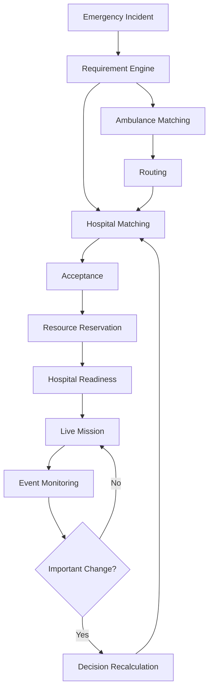

# Smart Ambulance Routing & Emergency Bed Allocation System

# `prd.md`

> Product Requirements Document for a real-time emergency coordination platform that connects patient requirements, ambulance capability, reliable routing, hospital capability, acceptance, emergency-resource reservation, and hospital readiness.

---

# 1. Document Overview

| Field | Specification |
|---|---|
| Product | Smart Ambulance Routing & Emergency Bed Allocation System |
| Document | `prd.md` |
| Product Category | Emergency Healthcare Coordination Platform |
| Primary Users | Emergency dispatchers, ambulance/EMT teams, hospital emergency departments |
| Secondary Users | Hospital administrators, emergency-response authorities, system administrators |
| Primary Problem | Fragmented ambulance, routing, hospital and resource decisions during critical emergencies |
| Primary Outcome | Reduce emergency coordination delay |
| Primary Innovation | End-to-end emergency coordination rather than standalone ambulance navigation |
| Deployment Stage | Hackathon prototype with production-oriented architecture |
| Core Data Mode | Simulated/synthetic where real institutional data is unavailable |
| Production Boundary | Real hospital, ambulance and emergency-system integrations require institutional access |
| Safety Model | Deterministic constraints + optimization + optional prediction + human override |

---

# 2. Product Definition

## 2.1 Product Statement

> **Coordinate the fastest viable path from an emergency incident to a treatment-ready hospital.**

The product combines:

```text
Patient Need
+
Suitable Ambulance
+
Reliable Route
+
Suitable Hospital
+
Hospital Acceptance
+
Resource Availability
+
Arrival-Time Readiness
+
Resource Reservation
+
Live Coordination
```

into one emergency decision loop.

---

# 3. Problem Statement

During critical emergencies, valuable time may be lost because:

- ambulance assignment is delayed;
- ambulance capability is not matched to patient requirements;
- the nearest ambulance may be unsuitable;
- routes may be affected by congestion;
- ETA may change during transport;
- hospitals may lack required clinical capabilities;
- hospital capacity may change;
- hospitals may not accept the incoming patient;
- required emergency resources may not be reserved;
- ambulance and hospital teams may lack synchronized information.

The product therefore treats the emergency journey as a single coordination problem rather than a collection of independent tools.

The source project brief explicitly identifies the core chain as:

```text id="z6a2m0"
Patient Need
→ Suitable Ambulance
→ Fastest Reliable Route
→ Suitable Hospital
→ Real-Time Capacity
→ Hospital Acceptance
→ Resource Readiness
```

---

# 4. Product Vision

## Vision

Create an intelligent emergency coordination layer that continuously determines:

> **Who should respond, which route should be used, which hospital should receive the patient, whether the hospital can accept the case, whether required resources can be reserved, and what should happen when any of those conditions change.**

---

# 5. Product Mission

The system exists to reduce **critical emergency coordination delay**.

It is not intended to replace:

- emergency physicians;
- hospital staff;
- ambulance personnel;
- existing emergency-response networks;
- clinical judgment;
- hospital information systems.

It is a coordination and decision-support platform.

---

# 6. Product Goals

## 6.1 Primary Goals

### Goal G1 — Intelligent ambulance assignment

Select a suitable ambulance based on:

- location;
- ETA;
- availability;
- vehicle type;
- equipment;
- crew capability;
- current mission state.

### Goal G2 — Reliable routing

Provide:

- route;
- traffic-aware ETA;
- alternative routes;
- dynamic rerouting.

### Goal G3 — Capability-aware hospital matching

Select hospitals based on:

- clinical requirements;
- hospital capability;
- ICU;
- ventilator;
- trauma;
- surgery;
- specialist availability where applicable;
- acceptance;
- resource availability;
- predicted readiness;
- ETA.

### Goal G4 — Hospital acceptance

Allow hospitals to:

- accept;
- reject;
- confirm readiness;
- update resource state.

### Goal G5 — Resource reservation

Allow emergency resources to move through:

```text id="cvwucq"
AVAILABLE
→ HELD
→ CONFIRMED
→ IN_USE
→ RELEASED
```

### Goal G6 — Continuous coordination

Recalculate when:

- traffic changes;
- hospital rejects;
- resource becomes unavailable;
- ambulance fails;
- patient requirements change;
- GPS becomes stale;
- route becomes unavailable.

### Goal G7 — Explainability

Every recommendation must answer:

> **Why was this ambulance/hospital/route selected?**

---

# 7. Non-Goals

The following are explicitly outside the MVP.

## 7.1 Medical diagnosis

The application shall not independently diagnose a patient.

## 7.2 Autonomous treatment

The platform shall not prescribe or initiate medical treatment.

## 7.3 Autonomous driving

The platform shall not control the ambulance.

## 7.4 Nationwide deployment

The hackathon prototype shall not claim nationwide operational deployment.

## 7.5 Guaranteed hospital capacity

The system shall not claim that a resource is guaranteed merely because a data source reports it.

## 7.6 Unnecessary technologies

The MVP shall not introduce:

- blockchain;
- AR/VR;
- robotics;
- unnecessary IoT;
- cryptocurrency;
- unrelated computer vision;
- generic chatbot functionality.

---

# 8. Product Principles

## P1 — Feasibility before optimization

Do not optimize an ambulance or hospital that fails a mandatory constraint.

## P2 — Explain every recommendation

Recommendations must expose meaningful reasons.

## P3 — Unknown is not available

Missing or stale data must not be interpreted as confirmed availability.

## P4 — Human override

Authorized operators retain control.

## P5 — AI is bounded

AI is used primarily for prediction, not where deterministic constraints are safer.

## P6 — Fail safely

External API or ML failure must not create false certainty.

## P7 — Simulation is transparent

The prototype must visibly distinguish simulated data from real data.

## P8 — Build the core journey first

The product must prioritize:

```text
Emergency
→ Ambulance
→ Route
→ Hospital
→ Acceptance
→ Reservation
→ Ready
→ Arrival
```

---

# 9. Users and Personas

# 9.1 Emergency Dispatcher

## Responsibilities

- receive/create emergency;
- review patient requirements;
- assign ambulance;
- monitor fleet;
- select/review hospitals;
- monitor acceptance;
- monitor resource reservation;
- respond to alerts;
- override recommendations.

## Primary Pain Points

- fragmented information;
- delayed coordination;
- uncertain hospital status;
- manual calls;
- changing road conditions;
- multiple emergencies competing for resources.

## Product Needs

- one command center;
- explainable recommendations;
- live map;
- hospital status;
- ambulance status;
- critical alerts.

---

# 9.2 Ambulance Driver / EMT

## Responsibilities

- accept assignment;
- travel to patient;
- transport patient;
- follow destination;
- respond to rerouting;
- complete handover.

## Pain Points

- distraction;
- changing ETA;
- changing hospital destination;
- communication overhead;
- uncertain hospital readiness.

## Product Needs

- low-distraction interface;
- destination;
- ETA;
- route;
- acceptance;
- resource confirmation;
- voice commands.

---

# 9.3 Hospital Emergency Staff

## Responsibilities

- receive incoming emergency;
- determine acceptance;
- confirm resources;
- prepare emergency team;
- receive patient;
- complete handover.

## Pain Points

- unexpected arrivals;
- unavailable resources;
- incomplete information;
- delayed notification.

## Product Needs

- patient requirements;
- ETA;
- acceptance workflow;
- resource reservation;
- readiness checklist.

---

# 9.4 Hospital Administrator

Needs:

- resource visibility;
- resource updates;
- capability configuration;
- utilization information.

---

# 9.5 System Administrator

Needs:

- user management;
- role management;
- configuration;
- audit;
- system health.

---

# 9.6 Demo Controller

Hackathon-specific role.

Needs:

- start scenarios;
- simulate traffic;
- simulate resource failure;
- simulate hospital rejection;
- simulate ambulance failure;
- reset environment.

---

# 10. User Journey

## Primary journey

```text id="kcpv3a"
Emergency Received
      ↓
Patient Requirements
      ↓
Ambulance Candidates
      ↓
Ambulance Selection
      ↓
Route Selection
      ↓
Hospital Candidates
      ↓
Hospital Ranking
      ↓
Hospital Acceptance
      ↓
Resource Reservation
      ↓
Hospital Preparation
      ↓
Ambulance Transport
      ↓
Live Monitoring
      ↓
Reassessment if Needed
      ↓
Hospital Arrival
      ↓
Handover
      ↓
Mission Completion
```

---

# 11. Product Modules

| Module | Priority | Purpose |
|---|---|---|
| Authentication | P0 | Secure role access |
| Emergency Management | P0 | Create/manage emergency |
| Patient Requirement Engine | P0 | Convert emergency to requirements |
| Ambulance Fleet | P0 | Manage available vehicles |
| Ambulance Matching | P0 | Select suitable ambulance |
| Routing | P0 | Route + ETA |
| Hospital Network | P0 | Manage candidate hospitals |
| Hospital Matching | P0 | Select suitable hospital |
| Acceptance | P0 | Confirm/reject incoming case |
| Resource Reservation | P0 | Reserve critical resources |
| Mission Tracking | P0 | Track complete emergency |
| Real-Time Events | P0 | Synchronize mission state |
| Explainability | P0 | Explain decisions |
| Failure Handling | P0 | Safe fallback |
| Demo Simulation | P0 | Transparent hackathon simulation |
| ETA ML | P1 | Predict ETA |
| Capacity Prediction | P1 | Predict future availability |
| Voice | P1 | Hands-free interaction |
| Analytics | P2 | Operational reporting |
| Demand Forecasting | P2 | Future planning |

---

# 12. Functional Requirements

# FR-001 — Authentication

The system shall allow authorized users to authenticate.

### Acceptance criteria

- valid credentials grant access;
- invalid credentials are rejected;
- user role is loaded;
- unauthorized pages are blocked;
- logout invalidates session.

---

# FR-002 — Role-Based Access Control

Roles:

```text
DISPATCHER
AMBULANCE_CREW
HOSPITAL_STAFF
HOSPITAL_ADMIN
SYSTEM_ADMIN
DEMO_CONTROLLER
```

### Acceptance criteria

A user can only access permitted functionality.

---

# FR-003 — Create Emergency

A dispatcher shall be able to create an emergency.

Required:

- emergency type;
- severity;
- location;
- requirements;
- patient count.

Optional:

- notes;
- hazard information.

---

# FR-004 — Emergency Severity

Supported levels:

```text
CRITICAL
HIGH
MEDIUM
LOW
```

The exact medical prioritization policy must be validated with domain experts before production use.

---

# FR-005 — Patient Requirements

System shall support structured requirements:

```text
ICU
TRAUMA
VENTILATOR
EMERGENCY_SURGERY
OXYGEN
SPECIALIST
```

Each requirement may be:

```text
REQUIRED
PREFERRED
UNKNOWN
```

---

# FR-006 — Ambulance Registry

System shall maintain:

- ambulance ID;
- vehicle type;
- capabilities;
- equipment;
- crew capability;
- status;
- location;
- GPS freshness;
- current mission.

---

# FR-007 — Ambulance Availability

Ambulance states:

```text
AVAILABLE
RESERVED
DISPATCHED
EN_ROUTE_TO_PATIENT
ON_SCENE
EN_ROUTE_TO_HOSPITAL
ARRIVED
HANDOVER
UNAVAILABLE
```

---

# FR-008 — Ambulance Capability Matching

The system must filter unsuitable ambulances before scoring.

### Example

If:

```text
ventilator_required = true
```

then an ambulance without a ventilator cannot be selected.

---

# FR-009 — Ambulance Recommendation

The system should rank eligible ambulances using:

- ETA;
- capability;
- equipment;
- crew;
- availability confidence.

The system must show alternatives.

---

# FR-010 — Ambulance Assignment

A dispatcher shall be able to:

- view recommendation;
- inspect reasons;
- assign ambulance;
- override recommendation.

---

# FR-011 — Ambulance Acceptance

An ambulance/EMT must be able to:

- accept;
- reject;
- provide rejection reason.

If rejected, the system shall re-evaluate candidates.

---

# FR-012 — Route Calculation

System shall calculate:

- distance;
- ETA;
- route geometry;
- alternatives where supported;
- traffic state.

---

# FR-013 — Route Reliability

The route decision should consider more than shortest distance.

Inputs may include:

- ETA;
- congestion;
- reliability;
- hazards;
- road closure.

---

# FR-014 — Dynamic Routing

The system shall reassess routes when:

- ETA changes materially;
- traffic changes;
- road closure occurs;
- selected route becomes infeasible.

---

# FR-015 — Hospital Registry

Hospital information shall include:

```text
hospital_id
name
location
emergency capability
ICU
trauma
ventilator
surgery
specialists
resource states
acceptance state
data freshness
```

---

# FR-016 — Hospital Capability Filtering

Hospital candidates must first pass hard requirements.

Example:

```text
Patient requires ICU.

Hospital:
ICU = false.

Result:
INELIGIBLE.
```

---

# FR-017 — Hospital Ranking

Eligible hospitals shall be ranked using:

- ETA;
- capability;
- acceptance;
- resource availability;
- predicted readiness;
- route reliability;
- uncertainty.

---

# FR-018 — Hospital Acceptance

Hospital staff shall be able to:

- accept;
- reject;
- indicate reason;
- confirm resource readiness.

---

# FR-019 — Hospital Rejection

Hospital rejection shall:

1. record rejection;
2. remove the hospital from current feasible candidates;
3. trigger re-ranking;
4. request acceptance from next candidate;
5. notify relevant users.

---

# FR-020 — Hospital Resource Management

Resources include:

```text
ICU
EMERGENCY_BED
VENTILATOR
TRAUMA_TEAM
EMERGENCY_SURGERY
SPECIALIST
```

The exact resource list may evolve according to demonstration requirements.

---

# FR-021 — Resource State

Supported states:

```text
AVAILABLE
HELD
CONFIRMED
IN_USE
RELEASED
EXPIRED
UNAVAILABLE
UNKNOWN
```

---

# FR-022 — Resource Reservation

The system shall:

- reserve a resource;
- prevent conflicting reservation;
- confirm reservation;
- release reservation;
- expire reservation;
- audit the entire lifecycle.

---

# FR-023 — Arrival-Time Readiness

Where prediction is available, the system may estimate:

```text
Probability(resource available at arrival)
```

This is advisory.

It must not override hard constraints.

---

# FR-024 — Mission Tracking

Mission state must include:

- incident;
- assigned ambulance;
- current location;
- route;
- destination hospital;
- acceptance;
- resource reservation;
- current mission state;
- event timeline.

---

# FR-025 — Real-Time Updates

The platform shall support real-time updates for:

- ambulance location;
- ETA;
- route;
- acceptance;
- hospital resource state;
- reservation;
- alerts;
- recommendation changes.

---

# FR-026 — Dynamic Reassessment

The system shall trigger reassessment for:

```text
TRAFFIC_CHANGED
HOSPITAL_REJECTED
RESOURCE_LOST
AMBULANCE_UNAVAILABLE
PATIENT_REQUIREMENTS_CHANGED
GPS_STALE
ROUTE_BLOCKED
```

---

# FR-027 — Recommendation Explainability

For every recommendation the system shall provide:

- feasibility reasons;
- score factors;
- important data;
- confidence;
- timestamp;
- algorithm version.

---

# FR-028 — Human Override

Dispatcher shall be able to override recommendations when permitted.

The system must:

- validate override;
- require reason;
- log actor;
- log time;
- store previous recommendation.

---

# FR-029 — Data Freshness

All dynamic information shall contain:

```text
timestamp
source
confidence
```

The UI shall differentiate:

```text
FRESH
STALE
UNKNOWN
```

---

# FR-030 — Demo Mode

The application shall explicitly support a demo environment.

Demo mode may simulate:

- ambulance location;
- hospital capacity;
- acceptance;
- traffic changes;
- resource failures.

The UI must clearly label simulation.

---

# FR-031 — Failure Handling

System must have fallback behavior for:

- routing provider failure;
- hospital feed failure;
- ambulance GPS failure;
- ML failure;
- network failure;
- hospital rejection;
- resource failure.

---

# FR-032 — Voice Commands

Optional P1 feature.

Supported initial commands:

```text
What is my ETA?
Is the ICU confirmed?
Has the hospital accepted?
Repeat hospital information.
Call the dispatcher.
Reroute.
```

High-impact commands must require confirmation.

---

# 13. Non-Functional Requirements

# NFR-001 Performance

The prototype should target:

- decision computation under a few seconds;
- responsive dashboard;
- live event propagation with low latency.

Actual performance must be measured.

---

# NFR-002 Reliability

Failure of one optional service must not collapse the complete application.

Example:

```text
ML failure
→ deterministic fallback.
```

---

# NFR-003 Availability

The deployed hackathon demo should remain available throughout presentation/testing.

---

# NFR-004 Scalability

The architecture should support future evolution from:

```text
single hospital
→ hospital cluster
→ city
→ district
→ state
→ national network
```

Actual nationwide deployment requires separate institutional and infrastructure work.

---

# NFR-005 Security

Must include:

- authentication;
- authorization;
- secure sessions;
- input validation;
- audit logs;
- secret management;
- secure transport.

---

# NFR-006 Privacy

Prototype should use synthetic patient data.

Real personal/medical information should not be used without appropriate authorization.

---

# NFR-007 Accessibility

Critical information should:

- not rely solely on color;
- have readable text;
- support keyboard navigation;
- have adequate touch targets;
- support responsive layouts.

---

# NFR-008 Explainability

Critical recommendations should be understandable to a non-technical dispatcher.

---

# NFR-009 Auditability

Every critical decision/action must be traceable.

---

# NFR-010 Interoperability

The architecture should support future integration with:

- hospital systems;
- ambulance telemetry;
- routing providers;
- healthcare interoperability systems.

The hackathon implementation does not require full institutional integration.

---

# 14. Product State Model

## Emergency

```text
CREATED
↓
ANALYZING
↓
DISPATCHED
↓
PICKUP
↓
HOSPITAL_SELECTED
↓
ACCEPTED
↓
RESOURCE_RESERVED
↓
IN_TRANSIT
↓
ARRIVED
↓
HANDOVER
↓
COMPLETED
```

Failure states:

```text
CANCELLED
FAILED
ESCALATED
```

---

# 15. Business Rules

# BR-001

A mandatory clinical requirement must never be ignored by optimization.

---

# BR-002

A hospital with an unavailable required resource is ineligible.

---

# BR-003

A hospital with unknown critical resource state must not be treated as fully confirmed.

---

# BR-004

An ambulance without mandatory equipment is ineligible.

---

# BR-005

An ambulance already committed to a protected emergency cannot be reassigned without authorized override logic.

---

# BR-006

Hospital acceptance must be recorded before a hospital becomes the confirmed destination.

---

# BR-007

A critical reservation must be transactionally protected against double booking.

---

# BR-008

If a confirmed hospital loses a mandatory resource, the mission must enter reassessment.

---

# BR-009

If a hospital rejects a patient, it must be excluded from current selection unless explicitly re-enabled.

---

# BR-010

Every manual override must require a reason.

---

# BR-011

Low-confidence AI output must not override deterministic safety rules.

---

# BR-012

Simulation data must be identifiable as simulation.

---

# BR-013

The system should not repeatedly switch between nearly equivalent candidates because of insignificant score changes.

---

# BR-014

Critical events must trigger immediate visible notification.

---

# BR-015

The system must never fabricate an available hospital/resource when no valid information exists.

---

# 16. Decision Engine Product Requirements

The decision engine is the core intelligence layer.

---

# 16.1 Ambulance Decision

## Input

```text
Incident location
Patient requirements
Ambulance location
Ambulance status
Ambulance capability
Equipment
Crew
Traffic
Current assignment
```

## Processing

```text
Filter
→ ETA
→ Score
→ Rank
→ Explain
```

## Output

```json
{
  "selected_ambulance": "AMB-002",
  "alternatives": [
    "AMB-003"
  ],
  "confidence": "HIGH",
  "reasons": [
    "required_equipment",
    "capability_match",
    "lowest_feasible_eta"
  ]
}
```

---

# 16.2 Hospital Decision

## Input

```text
Patient requirements
Hospital capabilities
Current resources
Acceptance
ETA
Traffic
Predicted readiness
Data freshness
```

## Processing

```text
Hard constraint filter
→ candidate generation
→ scoring
→ uncertainty
→ recommendation
```

## Output

```json
{
  "selected_hospital": "H-003",
  "alternatives": [
    "H-004",
    "H-005"
  ],
  "confidence": "HIGH",
  "reasons": [
    "all_required_capabilities",
    "acceptance_confirmed",
    "resource_available",
    "reliable_eta"
  ]
}
```

---

# 17. Optimization Product Requirements

## MVP

Use:

```text
Hard Constraints
+
Weighted Scoring
```

## Future

Potential:

- bipartite matching;
- Hungarian algorithm;
- min-cost flow;
- CP-SAT;
- multi-objective optimization.

## Explicit Non-Requirement

Reinforcement learning is not required for the MVP.

---

# 18. AI/ML Product Requirements

AI is optional in the decision loop and should not become a single point of failure.

---

# 18.1 ETA Prediction

## Objective

Estimate actual travel time more accurately than a static baseline where sufficient data exists.

## Inputs

```text
distance
routing ETA
traffic
time of day
day of week
road class
speed
route characteristics
```

## Output

```text
predicted ETA
uncertainty/confidence
```

---

# 18.2 Hospital Readiness Prediction

## Objective

Estimate:

> probability required resource remains available at ambulance arrival.

## Inputs

```text
current resource state
historical demand
recent admissions
recent changes
time
day
estimated arrival
```

## Output

```text
probability
confidence
```

This feature requires credible historical data. If such data is unavailable, the prototype should use a transparent simulation/fallback rather than pretending to have a validated model.

---

# 18.3 AI Fallback

If ML is unavailable:

```text
Predicted ETA
→ Routing ETA

Predicted resource readiness
→ Current verified resource state
```

The system continues operating.

---

# 19. Voice AI Requirements

Voice is secondary to the core coordination workflow.

## Supported languages

Initial target:

- English;
- Malayalam;
- Hindi.

## Commands

### Informational

```text
What is my ETA?
Is ICU confirmed?
Has the hospital accepted?
Repeat destination.
```

### High impact

```text
Reroute.
Change hospital.
Cancel mission.
```

High-impact commands require confirmation.

---

# 20. Hospital Data Product Requirements

The hospital model must distinguish:

### Capability

What the hospital can provide.

Example:

```text
Trauma = TRUE
ICU = TRUE
```

### Availability

What is currently available.

Example:

```text
ICU available = 1
```

### Acceptance

Whether the hospital accepts this particular case.

Example:

```text
Accepted = TRUE
```

### Readiness

Whether the hospital has prepared for arrival.

Example:

```text
Ready = TRUE
```

These must remain separate fields.

---

# 21. Data Freshness Requirements

Dynamic values should include:

```text
value
timestamp
source
confidence
```

Example:

```json
{
  "resource": "ICU",
  "available": 1,
  "updated_at": "2026-09-12T12:10:00Z",
  "source": "DEMO_HOSPITAL_FEED",
  "confidence": "MEDIUM"
}
```

---

# 22. Product Treatment of Simulated Data

The product must explicitly support:

```text
LIVE
REPLAY
SYNTHETIC
SIMULATED
UNKNOWN
```

Example:

```text
ICU
1 available
SIMULATED
```

The demo must never imply that simulated hospital capacity is real.

---

# 23. User Stories

# US-001 — Create Emergency

**As a dispatcher**, I want to create an emergency incident so that the system can begin coordination.

### Acceptance criteria

- incident can be created;
- location is valid;
- severity is selected;
- requirements are stored;
- incident gets unique ID.

---

# US-002 — See Suitable Ambulances

**As a dispatcher**, I want to see ambulances that can satisfy the patient's requirements.

### Acceptance criteria

- unsuitable vehicles are filtered;
- ETA is displayed;
- capability is displayed;
- availability is displayed.

---

# US-003 — Assign Ambulance

**As a dispatcher**, I want to assign the best suitable ambulance.

### Acceptance criteria

- recommendation is shown;
- reasons are shown;
- dispatcher can assign;
- ambulance receives assignment.

---

# US-004 — Accept Mission

**As an EMT**, I want to accept an assigned mission.

### Acceptance criteria

- assignment details are visible;
- acceptance changes mission state;
- dispatcher receives update.

---

# US-005 — Navigate

**As an EMT**, I want clear navigation and ETA.

### Acceptance criteria

- destination visible;
- route visible;
- ETA visible;
- route updates visible.

---

# US-006 — Match Hospital

**As a dispatcher**, I want hospitals ranked by medical and operational suitability.

### Acceptance criteria

- unsuitable hospitals filtered;
- suitable hospitals ranked;
- ETA visible;
- capability visible;
- acceptance state visible.

---

# US-007 — Accept Patient

**As hospital staff**, I want to accept a patient based on requirements and capacity.

### Acceptance criteria

- incoming case visible;
- requirements visible;
- ETA visible;
- accept/reject available.

---

# US-008 — Reserve ICU

**As hospital staff**, I want to reserve an ICU resource for an accepted patient.

### Acceptance criteria

- available capacity is checked;
- reservation is atomic;
- reservation is visible;
- duplicate reservation is prevented.

---

# US-009 — Detect Resource Failure

**As a dispatcher**, I want the system to alert me when a required hospital resource becomes unavailable.

### Acceptance criteria

- resource event detected;
- alert shown;
- hospital marked invalid if requirement is mandatory;
- new recommendation generated.

---

# US-010 — Dynamic Rerouting

**As an EMT**, I want to receive route changes when traffic changes significantly.

### Acceptance criteria

- traffic change detected;
- alternative route calculated;
- recommendation displayed;
- high-impact change requires confirmation.

---

# US-011 — Hospital Rejection

**As a dispatcher**, I want the system to find another hospital if the selected hospital rejects the case.

### Acceptance criteria

- rejection logged;
- hospital removed;
- alternatives ranked;
- next acceptance requested.

---

# US-012 — Explain Decision

**As a dispatcher**, I want to understand why the system selected an ambulance or hospital.

### Acceptance criteria

- reasons visible;
- hard constraints visible;
- confidence visible;
- decision timestamp visible.

---

# US-013 — Manual Override

**As a dispatcher**, I want to override the recommendation.

### Acceptance criteria

- override is possible;
- reason is required;
- action is audited.

---

# US-014 — Work During ML Failure

**As a dispatcher**, I want the system to continue operating if the AI service fails.

### Acceptance criteria

- deterministic fallback works;
- ML failure is visible;
- emergency workflow continues.

---

# US-015 — Work During Routing Failure

**As a dispatcher**, I want a fallback if the routing service fails.

### Acceptance criteria

- fallback provider or previous route used;
- uncertainty shown;
- operator notified.

---

# 24. Epic Structure

## Epic 1 — Authentication

Stories:

- login;
- logout;
- role routing;
- session restoration.

## Epic 2 — Emergency Management

Stories:

- create;
- edit;
- view;
- cancel;
- history.

## Epic 3 — Ambulance Intelligence

Stories:

- fleet;
- capability;
- matching;
- assignment.

## Epic 4 — Routing

Stories:

- route;
- ETA;
- alternatives;
- rerouting.

## Epic 5 — Hospital Intelligence

Stories:

- hospital capability;
- resource state;
- ranking;
- acceptance.

## Epic 6 — Reservation

Stories:

- hold;
- confirm;
- release;
- expire.

## Epic 7 — Live Coordination

Stories:

- GPS;
- WebSockets;
- events;
- alerts;
- reassessment.

## Epic 8 — AI

Stories:

- ETA;
- readiness prediction;
- confidence.

## Epic 9 — Voice

Stories:

- STT;
- intent;
- confirmation;
- TTS.

## Epic 10 — Demo

Stories:

- scenarios;
- event simulation;
- reset;
- playback.

---

# 25. Acceptance Criteria by Epic

## Authentication

- [ ] Authorized users can log in.
- [ ] Unauthorized users cannot access protected routes.
- [ ] Role is correctly detected.

## Emergency

- [ ] Emergency creation works.
- [ ] Requirements are structured.
- [ ] Emergency state is persisted.

## Ambulance

- [ ] Mandatory requirements are respected.
- [ ] Suitable ambulance is selected.
- [ ] Assignment is delivered.

## Routing

- [ ] Valid route returned.
- [ ] ETA shown.
- [ ] Alternative route can be evaluated.

## Hospital

- [ ] Mandatory capabilities filtered.
- [ ] Hospital ranking works.
- [ ] Acceptance workflow works.

## Reservation

- [ ] Resource reservation succeeds if capacity exists.
- [ ] Double booking is prevented.
- [ ] Reservation failure triggers fallback.

## Live Coordination

- [ ] Events update clients.
- [ ] Critical changes trigger reassessment.

## Explainability

- [ ] Reasons visible.
- [ ] Data freshness visible.
- [ ] Confidence visible.

## Demo

- [ ] All primary scenarios reproducible.
- [ ] Demo data clearly labelled.

---

# 26. Product Workflow Requirements

The system must support the following canonical workflow:

```text
1. Emergency created.
2. Requirements generated.
3. Ambulances filtered.
4. Ambulance selected.
5. Route generated.
6. Hospital candidates filtered.
7. Hospital ranked.
8. Acceptance requested.
9. Acceptance confirmed.
10. Resource reserved.
11. Hospital prepares.
12. Ambulance transports.
13. System monitors changes.
14. System reassesses if necessary.
15. Patient arrives.
16. Handover completed.
```

---

# 27. Alternate Workflow — No Suitable Ambulance

```text
Emergency
→ Requirements
→ Ambulance filter
→ No eligible ambulance
→ Expand search
→ Recalculate
→ Still none
→ Dispatcher escalation
```

The system must not fabricate an assignment.

---

# 28. Alternate Workflow — No Suitable Hospital

```text
Hospital filter
→ No eligible hospital
→ Expand geographic search
→ Recalculate
→ No feasible destination
→ Manual escalation
```

---

# 29. Alternate Workflow — Hospital Rejection

```text
Hospital selected
→ Acceptance requested
→ Rejected
→ Remove candidate
→ Recalculate
→ Next hospital
→ Acceptance
→ Reservation
```

---

# 30. Alternate Workflow — Resource Failure

```text
Reservation confirmed
→ Resource becomes unavailable
→ Critical alert
→ Reservation invalidated
→ Hospital becomes infeasible
→ Recalculate
→ Alternative hospital
→ Acceptance
→ New reservation
```

---

# 31. Alternate Workflow — Traffic Change

```text
Mission active
→ Traffic change
→ ETA recalculated
→ Significant change
→ Alternatives evaluated
→ Reroute recommendation
→ Confirmation
→ New route
```

---

# 32. Alternate Workflow — Ambulance Failure

```text
Mission active
→ Ambulance unavailable
→ Current assignment invalidated
→ Find suitable ambulances
→ Select replacement
→ New mission assignment
```

---

# 33. Alternate Workflow — GPS Failure

```text
GPS updates stop
→ GPS stale
→ Dispatcher alert
→ Last known position
→ Alternative location if available
→ Increase uncertainty
→ Manual monitoring if necessary
```

---

# 34. Product Notifications

Required notifications:

```text
AMBULANCE_ASSIGNED
AMBULANCE_ACCEPTED
AMBULANCE_REJECTED
HOSPITAL_ACCEPTED
HOSPITAL_REJECTED
RESOURCE_RESERVED
RESOURCE_FAILED
ROUTE_CHANGED
ETA_CHANGED
GPS_STALE
MISSION_REASSIGNED
HOSPITAL_READY
PATIENT_ARRIVED
HANDOVER_COMPLETED
```

---

# 35. Notification Priority

| Notification | Priority |
|---|---|
| Resource failed | Critical |
| Hospital rejected | Critical |
| Ambulance failed | Critical |
| Patient severity increased | Critical |
| Route blocked | High |
| ETA increased significantly | High |
| GPS stale | High |
| Hospital accepted | Normal |
| Mission completed | Normal |

---

# 36. Data Requirements

# Ambulance

Required:

```text
ID
type
status
location
GPS timestamp
capability
equipment
crew capability
current mission
```

# Hospital

Required:

```text
ID
name
location
emergency capability
ICU
trauma
ventilator
surgery
specialists
resource state
acceptance
timestamp
confidence
```

# Incident

Required:

```text
ID
location
severity
type
requirements
created_at
status
```

---

# 37. Product Data Relationships

```text
Incident
  │
  ├── Patient Requirements
  │
  ├── Ambulance Assignment
  │
  ├── Route
  │
  ├── Hospital Selection
  │
  ├── Acceptance
  │
  ├── Reservation
  │
  └── Mission Events
```

---

# 38. Data Quality Rules

The application should validate:

- coordinates;
- status;
- timestamps;
- capability values;
- resource counts;
- reservation quantities;
- resource state transitions.

Invalid values must be rejected.

---

# 39. API Product Requirements

The backend must provide:

```text
Authentication APIs
Emergency APIs
Ambulance APIs
Hospital APIs
Resource APIs
Reservation APIs
Route APIs
Decision APIs
Mission APIs
Simulation APIs
```

The exact endpoint definitions belong to `plan.md` / `API.md`.

---

# 40. Real-Time Product Requirements

Use WebSockets or equivalent real-time transport for:

- active mission updates;
- ambulance location;
- hospital state;
- ETA;
- alerts;
- recommendation changes.

Fallback:

- periodic refresh;
- manual refresh;
- cached state.

---

# 41. Product Security Requirements

## Mandatory

- secure authentication;
- RBAC;
- input validation;
- secure transport;
- audit logs;
- secrets outside source;
- no real patient data in demo.

## Future Production

- MFA;
- institutional identity;
- advanced security monitoring;
- penetration testing;
- formal privacy governance;
- security incident management.

---

# 42. Audit Requirements

Audit:

```text
Emergency created
Ambulance assigned
Hospital selected
Hospital accepted
Hospital rejected
Resource reserved
Resource released
Recommendation changed
Manual override
Mission reassigned
```

Each event should contain:

```text
actor
timestamp
incident
action
before
after
reason
```

---

# 43. Accessibility Requirements

Minimum:

- keyboard navigation;
- focus states;
- readable labels;
- status text;
- semantic HTML;
- adequate contrast;
- 44px+ touch targets;
- reduced motion.

---

# 44. Responsive Requirements

## Dispatcher

Optimized for:

- desktop;
- laptop.

## Ambulance

Optimized for:

- mobile;
- tablet.

## Hospital

Optimized for:

- tablet;
- desktop.

---

# 45. Analytics Requirements

Optional.

Track actual system metrics:

```text
assignment latency
acceptance latency
reservation latency
ETA error
route changes
hospital rejection rate
resource failure rate
decision latency
```

Do not include invented values.

---

# 46. Product Metrics

## Primary

### M1 — Emergency Coordination Time

Time from:

```text
Emergency created
→ confirmed hospital/resource
```

### M2 — Suitable Assignment Rate

Percentage of assignments meeting all mandatory requirements.

### M3 — Hospital Acceptance Rate

Percentage of destination requests accepted.

### M4 — Resource Reservation Success Rate

Percentage of reservation attempts successfully confirmed.

### M5 — Diversion Rate

Percentage of missions requiring destination change.

### M6 — Decision Latency

Time required to generate recommendation.

---

# 47. AI Metrics

## ETA

- MAE;
- RMSE;
- calibration.

## Capacity prediction

- MAE/RMSE for numerical forecasts;
- calibration for probability;
- precision/recall if framing as classification.

---

# 48. UX Metrics

Measure during testing:

- time to create emergency;
- time to understand recommendation;
- time to accept hospital;
- time to identify critical alert;
- number of screens required to complete golden path.

---

# 49. Demo Metrics

The presentation team should demonstrate:

```text
1. Time to ambulance recommendation
2. Time to hospital recommendation
3. Time to resource reservation
4. Time to react to ICU failure
5. Time to reroute
```

These should be measured from the actual prototype rather than claimed beforehand.

---

# 50. Product Quality Gates

## Gate 1 — Core Flow

Must pass:

```text
Emergency
→ Ambulance
→ Hospital
→ Reservation
```

## Gate 2 — Failure Flow

Must pass:

```text
Hospital rejection
→ Reassessment
```

## Gate 3 — Dynamic Flow

Must pass:

```text
Traffic/resource event
→ Recalculation
```

## Gate 4 — Safety

Must pass:

```text
Invalid resource
→ No invalid recommendation
```

## Gate 5 — Demo

Must pass full end-to-end scenario without manual DB intervention.

---

# 51. Hackathon MVP Requirements

## Must Have

```text
Authentication
Emergency creation
Patient requirements
Ambulance matching
Routing
Hospital matching
Acceptance
Reservation
Live tracking
Dynamic reassessment
Explainability
Failure handling
Demo simulation
```

## Should Have

```text
ETA prediction
Arrival-time readiness prediction
Voice
Multilingual support
Advanced analytics
```

## Not Required

```text
Reinforcement learning
Graph neural networks
Blockchain
IoT hardware
AR/VR
Autonomous driving
Full ABDM integration
Real hospital API integration
```

---

# 52. MVP Release Definition

Version:

```text
v0.1.0-hackathon
```

must support:

```text
One complete emergency journey
+
At least three dynamic failure scenarios
```

Required scenarios:

1. normal emergency;
2. traffic change;
3. hospital/resource failure.

---

# 53. Version 0.2

Potential:

- ETA model;
- capacity prediction;
- multilingual voice;
- improved simulation;
- more robust multi-incident optimization.

---

# 54. Version 1.0 Production Candidate

Requires:

- actual ambulance integration;
- hospital system integration;
- verified resource state;
- production identity;
- security assessment;
- privacy governance;
- operational monitoring;
- clinical/operational stakeholder validation.

---

# 55. Design Requirements Reference

The UI shall follow `design.md`.

Key requirement:

> Critical information must be visible without unnecessary navigation.

The primary emergency panel must expose:

```text
severity
requirements
ambulance
ETA
hospital
acceptance
resource
route
alerts
```

---

# 56. Application Flow Reference

The product must follow `appflow.md`.

Canonical:

```text
Emergency
→ Requirements
→ Ambulance
→ Route
→ Hospital
→ Acceptance
→ Reservation
→ Readiness
→ Live Mission
→ Reassessment
→ Arrival
→ Handover
```

---

# 57. Implementation Reference

`plan.md` governs:

- architecture;
- technologies;
- database;
- APIs;
- implementation phases;
- deployment;
- testing.

`appflow.md` governs:

- application behavior;
- screen flow;
- state transitions;
- user journeys.

`design.md` governs:

- visual design;
- UI;
- UX;
- responsive behavior.

`prd.md` governs:

- product requirements;
- expected behavior;
- feature scope;
- acceptance criteria;
- user needs.

---

# 58. Product Architecture from a PRD Perspective



---

# 59. Core Product Differentiation

The product should be positioned as:

> **An end-to-end emergency coordination engine.**

Not:

> Ambulance app.

Not:

> Navigation app.

Not:

> Hospital directory.

Not:

> AI chatbot.

Not:

> Bed management system.

The central differentiation is the connection between these existing capabilities.

---

# 60. Competitive Product Principle

The product should not claim:

> "No existing system does this."

Instead:

> "Existing emergency-response, navigation, ambulance-management and hospital systems solve different parts of the emergency journey. This product focuses on coordinating those parts into one decision loop."

---

# 61. Critical Product Assumptions

The following assumptions are explicitly recognized.

## A1 — Hospital Data

Real-time hospital resource data may not be publicly available.

### Product response

Use transparent simulated data in MVP.

---

## A2 — Ambulance GPS

Real ambulance AVL may not be available.

### Product response

Use GPS simulation/replay.

---

## A3 — Historical ML Data

Sufficient validated hospital data may not exist.

### Product response

Do not fabricate training results.

Use:

- baseline;
- synthetic/replayed data;
- clearly labelled prototype model.

---

## A4 — Hospital Cooperation

Production acceptance/reservation requires participating hospitals.

### Product response

Build integration interfaces, not fake production claims.

---

# 62. Product Risks

| Risk | Severity | Mitigation |
|---|---|---|
| Hospital data unavailable | Critical | Simulation + adapter |
| Data becomes stale | Critical | Timestamp/confidence |
| AI hallucination/incorrect prediction | Critical | Deterministic safety constraints |
| Too much scope | Critical | P0/P1/P2 separation |
| Routing API failure | Major | Fallback provider |
| GPS failure | Major | Last known + manual mode |
| Reservation race | Critical | DB transaction |
| Poor UX | Major | Dispatcher-first testing |
| Fake-data perception | Major | Visible DEMO labels |
| Security gaps | Major | RBAC + audit |
| Overclaiming medical impact | Critical | No unsupported claims |

---

# 63. Product Safety Requirements

The system shall:

- never override mandatory medical requirements silently;
- expose stale data;
- expose uncertainty;
- preserve human override;
- avoid autonomous clinical decisions;
- avoid treating simulation as production data;
- prevent invalid resource reservation;
- prevent duplicate assignment.

---

# 64. Production Safety Boundary

Production deployment requires additional validation beyond this PRD.

The following are **not established by this hackathon PRD**:

- clinical efficacy;
- mortality reduction;
- patient safety outcomes;
- nationwide interoperability;
- hospital operational compliance;
- institutional regulatory approval.

These require separate real-world validation.

---

# 65. Future Product Extensions

Potential future features:

## Disaster Coordination

- flooding;
- road closures;
- mass casualty;
- cyclone;
- earthquake.

## Fleet Optimization

- ambulance repositioning;
- fleet balancing;
- demand hotspots.

## Hospital Operations

- demand prediction;
- emergency-department congestion prediction;
- staff preparedness.

## Interoperability

- authenticated hospital APIs;
- healthcare interoperability;
- emergency response integration.

---

# 66. Product Roadmap

```text
PHASE 1
Core emergency journey

PHASE 2
Dynamic coordination

PHASE 3
Prediction

PHASE 4
Voice + multilingual

PHASE 5
Real institutional integration

PHASE 6
City deployment

PHASE 7
Regional/state deployment
```

---

# 67. Final Product Acceptance Checklist

## Core Emergency

- [ ] Emergency can be created.
- [ ] Location can be captured.
- [ ] Severity can be selected.
- [ ] Patient requirements can be entered.

## Ambulance

- [ ] Available ambulances shown.
- [ ] Capability filtering works.
- [ ] ETA shown.
- [ ] Best candidate recommended.
- [ ] Assignment works.

## Route

- [ ] Route displayed.
- [ ] ETA displayed.
- [ ] Traffic state visible.
- [ ] Rerouting supported.

## Hospital

- [ ] Hospital candidates displayed.
- [ ] Mandatory capabilities filtered.
- [ ] Ranking generated.
- [ ] Acceptance supported.

## Resources

- [ ] ICU/resource availability displayed.
- [ ] Reservation works.
- [ ] Duplicate reservation blocked.
- [ ] Reservation release works.

## Live Mission

- [ ] Ambulance tracked.
- [ ] ETA updates.
- [ ] Destination visible.
- [ ] Hospital readiness visible.

## Dynamic Reassessment

- [ ] Traffic event supported.
- [ ] Hospital rejection supported.
- [ ] Resource failure supported.
- [ ] Ambulance failure supported.

## Explainability

- [ ] Selection reasons visible.
- [ ] Confidence visible.
- [ ] Data freshness visible.
- [ ] Manual override visible.

## Safety

- [ ] No invalid ambulance assignment.
- [ ] No invalid hospital recommendation.
- [ ] Unknown != available.
- [ ] Simulated data labelled.

---

# 68. Product Definition of Done

The product is considered **MVP complete** when:

```text
A dispatcher creates a critical emergency.

↓

The system converts the incident into
structured patient requirements.

↓

Unsuitable ambulances are automatically filtered.

↓

A suitable ambulance is selected.

↓

A traffic-aware route and ETA are generated.

↓

Hospitals are filtered by mandatory capabilities.

↓

The best feasible hospital is recommended.

↓

The hospital receives the emergency.

↓

The hospital accepts the case.

↓

Required resource is reserved.

↓

The ambulance receives destination confirmation.

↓

The hospital prepares.

↓

The ambulance is tracked.

↓

Traffic/resource conditions can change.

↓

The system detects the change.

↓

The decision is recalculated when required.

↓

A new route/hospital/ambulance can be selected.

↓

The patient arrives.

↓

The hospital confirms handover.

↓

The mission is completed.

↓

The complete decision timeline remains auditable.
```

---

# 69. Golden Product Scenario

The strongest demonstration should be:

```text
CRITICAL ROAD TRAFFIC TRAUMA

Patient:
ICU + Trauma + Ventilator + Surgery

        ↓

AMBULANCES

A — closer but no ventilator ❌
B — capable and available ✓
C — capable but already active ❌

        ↓

AMBULANCE B SELECTED

        ↓

HOSPITALS

A — no ICU ❌
B — no trauma capability ❌
C — all capabilities + acceptance ✓

        ↓

ICU RESERVED

        ↓

AMBULANCE EN ROUTE

        ↓

TRAFFIC CHANGES

        ↓

SYSTEM RECOMMENDS NEW ROUTE

        ↓

ICU BECOMES UNAVAILABLE

        ↓

HOSPITAL C INVALIDATED

        ↓

HOSPITAL D SELECTED

        ↓

NEW ICU RESERVED

        ↓

AMBULANCE UPDATED

        ↓

HOSPITAL READY

        ↓

PATIENT ARRIVES

        ↓

HANDOVER
```

This single scenario should prove the majority of the product requirements.

---

# 70. Final Product Principle

The product should always optimize for:

```text
WORKING
+
SAFE
+
EXPLAINABLE
+
RESPONSIVE
+
DEMONSTRABLE
```

rather than:

```text
MORE FEATURES
+
MORE AI
+
MORE SCREENS
+
MORE TECHNOLOGY
```

---

# 71. Final Product Statement

> **Smart Ambulance Routing & Emergency Bed Allocation System is a real-time emergency coordination platform that matches patient requirements with suitable ambulance capabilities, identifies reliable routes, ranks medically suitable hospitals, obtains hospital acceptance, reserves required emergency resources, monitors the active mission, and dynamically re-coordinates the emergency journey when conditions change.**

---

# 72. Final Product North Star

Every product decision must support this sequence:

```text
🚨 EMERGENCY
      ↓
👤 WHAT DOES THE PATIENT NEED?
      ↓
🚑 WHO CAN RESPOND?
      ↓
🛣 WHICH ROUTE IS RELIABLE?
      ↓
🏥 WHO CAN TREAT THE PATIENT?
      ↓
✅ WHO WILL ACCEPT THEM?
      ↓
🛏 CAN THE REQUIRED RESOURCE BE RESERVED?
      ↓
🟢 WILL THE HOSPITAL BE READY?
      ↓
🔄 WHAT CHANGES DURING TRANSPORT?
      ↓
🏥 CAN THE PATIENT ARRIVE READY FOR TREATMENT?
```

The product is successful when it can answer these questions continuously and transparently for one emergency mission.